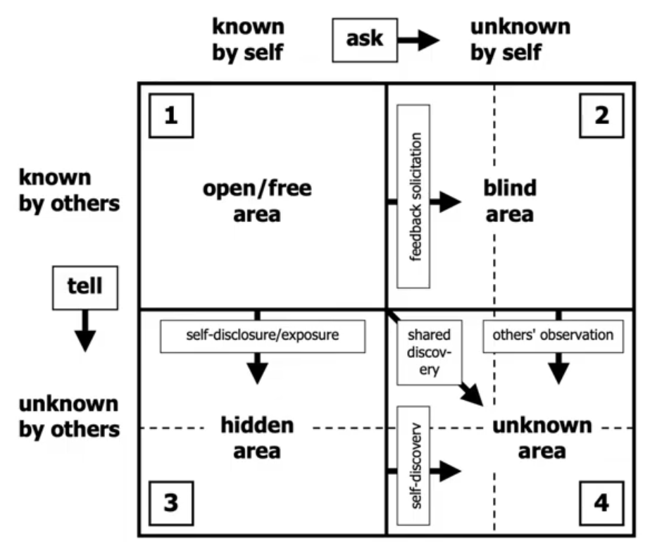

- Known threats - have signatures
- Unknown threats - don't
- Signature detection is not enough anymore
	- Lots of complexity and sophistication
	- We have to look at **behaviour** - observe what the piece of malware is actually trying to do
	- This isn't instead of signatures, but in addition to them - even though sigs don't work against unknown threats
		- Malware can be advanced enough to look like legit traffic
		- Or it can hide really well - scanning engines can't find it
		- Or it's just a 0-day (**EXAM**: both a vulnerability and an exploit can be a 0-day)

### The Johari Window

- What **we** know vs what **others** know

- Known knowns - we know the threat, we understand it, we know what to do about it
- Known unknowns - we know about the threat, but we don't understand it completely, and therefore we don't have a clear course of action
- Unknown knows - things we could understand, but unfortunately we're not aware of them (e.g. a 0-day that someone discovers)
- Unknown unknowns - we don't even know how much we don't know (e.g. attacks/0-days that exist, but no one's aware of them yet)

### Bug bounties

- Rewards for finding and reporting vulnerabilities
- Companies offer money and authorize other people - anybody - to find vulnerabilities within a specified scope
	- Addressing the unknown unknowns

### Threat actors

- We can use threat intelligence to find out more about them
	- **APT**
		- Advanced tools, coordinated group
		- Persistent, undetected
		- Threat, malicious actors
		- Custom tools/attack methods
		- Really good at removing their traces
		- May not be discovered for many months or even years
		- **EXAM**: CompTIA thinks that all APT's are **well-funded**
			- But basically just think persistent malware
	- **Organized crime / crime syndicates**
		- Focused on fraud and **financial gain**
		- Can be motivated by some sort of revenge, but mostly just money
		- Subgroup: cyberterrorists
			- Doing harm without financial gain
			- *"Some men just want to watch the world burn."*
	- **Hacktivists**
		- Do not seek financial gain
		- Politically motivated, driven by moral justice
		- Use their capabilities to make statements that go against governments/policies
		- Digital protest
		- Stealing and publishing sensitive data, defacing websites. DoS attacks
	- **Nation-states**
		- State-sponsored, many countries use them
		- Military/technological advantage, IP theft, sometimes commercial gain
		- Strongly connected with APT's as far as CompTIA is concerned
			- Well-funded, have government support
		- People who do this think they're patriots and that they're justified in their actions
	- **Script kiddies**
		- Barely any skills
		- Download and use exploits without any knowledge
		- Not necessarily kids
		- Green hat hackers, aka n00bz
		- Just for lulz
		- Still dangerous because they mess around with tools that are used by True H4xx0rz out there
	- **Recreational hackers**
		- Just for fun as long as they stay within the law
		- CTF competitions, hackathons
		- Have real skills, can be a potential danger if they turn to the dark side
	- **Professional hackers**
		- Work as pentesters
		- No malicious intent
		- White hats
	- **Suicide hackers**
		- Has nothing to lose
		- Does not care
		- Desperate
	- **Insider threats**
		- Very dangerous - already has access to all systems
		- If they decide to do damage, barely anything can stop them
		- Companies must watch out for this
		- Trust but verify
		- Can be **intentional or unintentional**
		- Disgruntled employees, can act for financial gain, make bribes, blackmail
		- Shadow IT - unsupervised by the company's IT department
		- Former employees fall under this if they retain any access
		- **EXAM**: insider threats can easily be the right answer!

### Commodity malware

- Developed as a product - you can go buy it
- RaaS - ransomware as a service
- It can be easily detected
- Very very common - 95% of malware out there is a commodity
- It's **known** - signatures exist - but anyone not taking their cybersecurity seriously is a potential victim
- [Go check it out, at your own risk](https://github.com/ytisf/theZoo)
- [Go create your own malware - Empire Project](https://github.com/EmpireProject/Empire/wiki/Quickstart) (it uses templates, though, so mostly it'll be known)
- Buy it from the dark web
- APT groups begin their attacks (in recon phase for instance) using commodity malware, before moving on to cool custom stuff

### Exam

Know about different threat actor types, their motivations; understand how APT groups and insider threats operate, why they're dangerous, don't forget about commodity malware