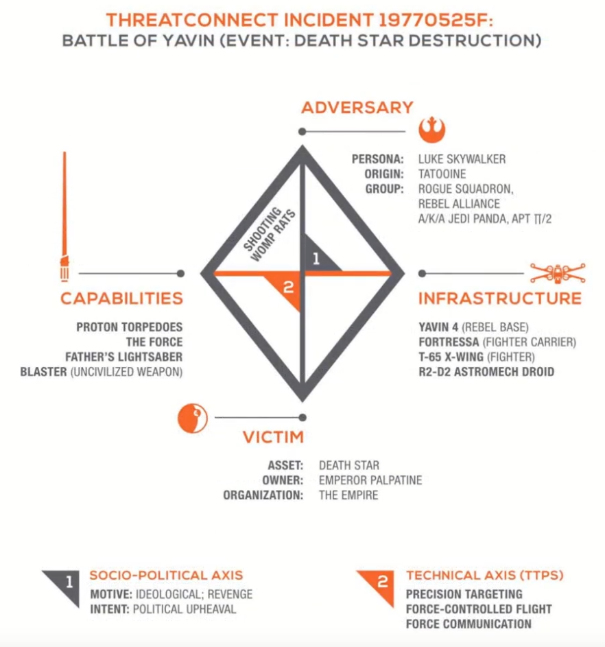

### Attack Frameworks

- Used to describe what happens before, during, and after an attack
	- Who is the attacker?
	- What resources they have?
	- How did they conduct the attack?
- It helps us with threat modeling
- Take one attack and split it into stages, zero in on details for each stage

### Cyber Kill Chain

- Introduced by Lockheed Martin
- Defines 7 attack phases
- Mainly related to APTs
- The same whitepaper talks about IOCs, TTPs, mitigation methods
- How to reconstruct an attack after it went down 
- **Exam**: be able to describe each phase!
- [Great visual representation and lots more info](https://www.lockheedmartin.com/en-us/capabilities/cyber/cyber-kill-chain.html)

- **Reconnaisance**: where the attacker gets to know you (a bit too well). What are your weaknesses and what are your defenses like? Usually done in a stealthy manner.
	- Based on all this, attacker decides how to ruin your day
- **Weaponization**: when recon is successful and weaknesses were discovered, attacker chooses an exploit and/or starts developing their own tools to wreck you
- **Delivery**: choosing and preparing a delivery method. How exactly can a weakness be exploited?
- **Exploitation**: gaining first access to the system, executing the exploit code once it has been set in place, can happen automatically or in a remotely controlled fashion depending on the delivery method. 
	- Can be an unaware employee, or it can be an insider threat!
- **Installation**: gaining persistence and direct access (no need to deliver malware anymore); backdoor is the keyword
- **C2**: establishing a data channel back to the attacker. Malware calls back home. Attacker can send commands and remotely control the compromised system. Connections are usually initiated from inside the company (which is usually allowed by firewalls)
	- On the defensive side, identifying evidence of C2 in network/DNS logs is the first proof that indicates compromised systems; one of the first methods of detecting an APT
- **Actions on objectives**: whatever the attacker was planning, they're now doing. Data exfiltration/corruption/destruction, causing an outage, breaking someone out of prison - you name it

#### Some disadvantages

- The Cyber Kill Chain mainly focuses on outside threats and pretty much ignores insider issues
- Or what if they exploit and then just cover their tracks and remain hidden for many months? APT's operate this way. 
	- Or they perform their actions on objectives immediately and erase all trace
- The Cyber Kill Chain is therefore not a one-size-fits-all solution
- Other Kill Chains are there!
	- [Alienvault (AT&T) Cyber Kill Chain](https://cybersecurity.att.com/blogs/security-essentials/the-internal-cyber-kill-chain-model)
		- Addresses and pays close attention to insider threats, separating a "classic" kill chain from an internally initiated one
	- [Unified Kill Chain](https://www.unifiedkillchain.com/)

### Defending at each phase of the CKC

- This is all about controls we can implement at each step of the way
- At each step of the way, assume you're under attack, assume data exfiltration
- **Reconnaisance**
	- Reduce attack surface
	- Don't overshare information - OPSEC! Only communicate what is absolutely necessary (this includes company website, job postings, etc - don't give away the tech stack)
	- Train your employees on anti-OSINT - keep work-related social media posts to a mininum, be aware of phishing
- **Weaponization**
	- Scan for vulns
	- Update, patch, fix
	- Install some new technical controls as necessary - detective, preventive
- **Delivery**
	- Restrict the use of mass storage devices
	- Filter internet traffic
	- IDPS
	- User training - humans are always the weakest link
		- Specifically, train employees to **always** be suspicious of random USB devices anywhere on premises
		- And always suspicious of any links received from anyone - when in doubt, just don't open it
- **Exploitation**
	- Update, patch, fix - again
	- Minimize attack surface - least privilege, least function
	- Get rid of any unnecessary services, close unnecessary ports
		- Especially if accessible from the outside!
- **Installation**
	- Endpoint security solutions
	- Detecting abnormal activity
	- Secure administrative accounts, make sure no unprivileged users can install anything at all
	- Monitor processes and network connections
	- User awareness - a well-trained employee will notice irregularities and report them!
	- Motivate employees to work alongside the security team
- **C2**
	- Endpoint security
	- Scan outbound connections - proactively!
	- Perimeter security (blocking outbound connections at FW level)
	- Don't resolve domain names that look sus (C2 endpoints can be randomly generated)
- **Actions on objectives**
	- If the attacker got to this phase, we're in trouble :(
	- Detection has likely failed
	- Have DLP solutions in place
	- Access control to sensitive data, read-only access, prevent any kind of copying
	- Offsite backups - especially against ransomware!

### MITRE ATT&CK

- Adversary Tactics, Techniques, & Common Knowledge
- Massive database of cyber attack TTPs used to develop threat models
- Great alternative to the CKC
- Not all phases/techniques apply, but your model can be very granular due to the sheer amount of stuff described there
- Analyze an attack that has happened, check what happened in your specific case
- No specific order in which things have to happen (CKC sorta imposes that)
- The whole database is based on real observations

### [The Diamond Model](https://www.activeresponse.org/wp-content/uploads/2013/07/diamond_summary.pdf)

- Can be pretty difficult to follow
- Focuses on a single intrusion event
- Describes **relationships** between 4 features:
	- **Adversary**
	- Capabilities
	- Victim
	- Infrastructure
- Relationship chain example:
	1. Victim discovers malware
	2. Malware points to malicious domain
	3. Domain points to an IP address
	4. Network logs indicate multiple victims
	5. IP owner reveals attacker
- Assumes additional information is available
	- The more visibility for each feature, the more conclusions we can draw
- Each event has meta-features as well
	- Timestamp (when did it happen)
	- Phase (of the kill chain)
	- Result (successful or not)
	- Direction (initiated from the victim or from the outside)
	- Method (what was the attack?)
	- Resources (required for the attacker to complete the event, such as recon info, password hashes attacker might've recovered, etc)
	- Confidence levels assigned to each feature (based on an assumption)
- **One diamond per event!**
- So we would need at least two for a malicious outcome (a recon phase + attack/exploit phase)
- Which is why the Diamond Model is used to describe...
- Example (by ThreatConnect): the destruction of the Death Star:

### Activity threads

- Threads connect events to show how an attacker behaves during an attack
- Made up of multiple phases/diamonds
- Becomes very similar to the cyber kill chain
- Multiple threads possible
	- for multiple attackers
	- for multiple victims
- Really good for describing pivoting!

- Hard to follow? That's because this model was designed for automatic processing by software security solutions designed for threat modeling
	- E.g. ThreatConnect for Splunk

### Exam

Remember attack frameworks, be able to discuss them in detail: CKC, Diamond Model, MITRE ATT&CK. Be able to talk about defenses at each phase of the CKC.