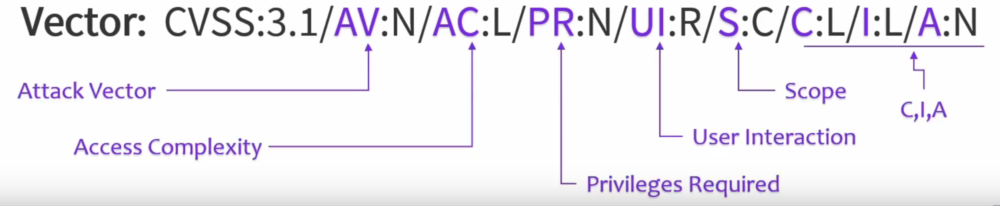

### Vulnerability databases

- For a vuln scanner to work and produce usable results, it needs to know what to look for
- A scanner is only as good as its database
	- Some tools get info dynamically as more info becomes available, others have a static/pre-defined database
	- This is where paid subscriptions come into play - paid products generally have much better vuln DBs
		- But beware of small vendors that repackage open-source data and sell it to you!

>**SCAP**

**Security Content Automation Protocol**

- Method of standardizing and automating vuln management and policy compliance in an org
- Protocol used by a vuln scanner to automatically determine if a host meets some sort of config baseline
	- Does it pass certain tests?
	- Is it secure enough?
- MITRE developed a lot of SCAP components
- Defines a number of open standards used for enumeration
- In order to have a baseline, SCAP defines some identifiers to describe specific platforms/vulns. Some of them are:
	- [**CVE** (Common Vulnerabilities and Exposures)](https://cve.mitre.org)
		- A CVE number (e.g. CVE-2019-1827) denotes it's a CVE and uses the year the record was created and the number of the vulnerability for that year in order of discovery
	- [**CPE** (Common Platform Enumeration)](https://nvd.nist.gov/products/cpe)
		- A standard that describes platforms to which vulnerabilities apply
		- OS's, apps, hardware devices - anything that can have a vuln and is considered to be a platform
		- Used whenever `nmap` tries to identify services running on a scanned host
		- Example: `cpe:2.3:a:microsoft:internet_explorer:8.0.6001:beta:*:*:*:*:*:*`
		- Format: `cpe:<cpe_version>:<part>:<vendor>:<product>:<version>:<update>:<edition>:<language>:<sw_edition>:<target_sw>:<target_hw>:<other>`
		- Part can be `a` (applications), `h` (hardware), or `o` (OS's)
		- `sw` is software, `hw` is hardware, `*` is the wildcard (i.e. "any")
	- [**CCE** (Common Configuration Enumeration)](https://ncp.nist.gov/cce)
		- A collection of best practices for configuring hardware and software
	- [**CWE** (Common Weakness Enumeration)](https://cwe.mitre.org/)
		- A collection of flaws in the design of software that *could potentially lead to vulnerabilities*, but aren't actually vulnerabilities yet
		- Shows how a certain weakness can affect our software and how it can be mitigated
		- Lists CVE's in which a specific weakness played a part
	- [**CAPEC** (Common Attack Pattern Enumeration and Classification)](https://capec.mitre.org)
		- Very similar to the ATT&CK framework, but focuses on applications and exploits (whereas ATT&CK focuses on the attacker and how they do the dirt)
		- Links to TTP's listed in ATT&CK
	- [**OVAL** (Open Vulnerability and Assessment Language)](https://oval.mitre.org)
		- Mainly used for reporting 
		- Describes the state of a system using XML
		- I.e. a security assessment report
	- [**XCCDF** (eXtensible Configuration Checklist Description Format)](https://csrc.nist.gov/projects/security-content-automation-protocol/specifications/xccdf)
		- Uses XML
		- Purpose is to develop and audit security checklists (for configuration best practices) within an org

### Vulnerability scan reports

- Usually includes chains such as **asset - vulnerability - CVSS score**

>**CVSS**

**Common Vulnerability Scoring System**

- A unified metric used for comparing and prioritizing vulnerabilities, based on several factors
	- Determining how critical a specific vuln is, so it helps us decide where to focus our efforts first, which comes in handy in a situation with a lot of vulns to manage
- **Exam** (and something to keep in mind in general): be careful when prioritizing because the CVSS score on its own is not the single best factor. Sometimes a medium/low vuln that can be fixed very quickly might take priority! This is also based on your overall experience at the company and what's considered important by consensus.

### CVSS versions

#### CVSSv1

The US National Infrastructure Advisory Council (NIAP) worked through 2003/2004 to come up with a framework that would provide a standard for severity ratings of vulnerabilities in software. The result, CVSSv1, was first released in 2005 and handed off to the Forum of Incident Response and Security Teams to maintain moving forward. CVSSv1 was widely viewed as having significant issues, and work began immediately on its successor, CVSSv2.

#### CVSSv2

CVSSv2 launched in 2007, and was widely adopted by vendors and enterprises as a common language by which to compare software vulnerabilities. Despite wide adoption, v2 also had significant issues to be addressed, so after 5 years of use, work began on CVSSv3.

#### CVSSv3

Work on CVSSv3 began in 2012, with the 3.0 revision being released in 2015. The most recent revision, CVSSv3.1, was released in mid-2019.

**[All version info here](https://www.balbix.com/insights/cvss-v2-vs-cvss-v3/)**

### Avoiding false results

- A vulnerability may not be discovered, but is that because it doesn't exist in our infrastructure, or is it because it doesn't exist in the vuln database (or there's another issue - such as scanner sensitivity)? In the latter case, that's a **false negative**, and we really don't want those.
	- Follow diversity principles, use various scanning methods if possible
- **False positives** aren't as bad, but they can waste your valuable time when you investigate a vuln but it's not really there
- How to avoid as many of these as possible:
	- Make sure scanning traffic is allowed on all networks, make sure all hosts are up, firewalls aren't blocking what they shouldn't, and all inventory is reachable. Allow the scanning to happen!
	- **Credentialed**/**non-credentialed** - decide what you're gonna run, expect non-credentialed scans to produce much more false positives (**Exam**: very important topic) - this is because they don't have as much visibility as credentialed scans
	- Reconfigure/fine-tune the scanner if the number of false positives is too high
		- Fine-tuning may also be required for the scanner to learn what a false positive/negative is
	- How's your baseline? Heuristic-based scanning can throw an alert when a valid event happens
	- Make sure the scanner only looks for things that apply to your specific org's environment. Don't scan for stuff that can't possibly be there
	- Vulns that are very difficult to exploit - decide if they're worth considering (likelihood comes into play)
	- Trust but verify
	- Make sure everything you *expect* to find is in your scan results
- **True positive**: yes it's a vuln, go fix it or install compensating controls
- **True negative**: no it's not a vuln, go look for other vulns :)

### CVSS scores and CVE

- Overall numeric value associated with a specific vuln
- How critical is a vuln? How bad is the impact? Helps with prioritization (but again it's not the best/only metric to go by)
- Not to be confused with CVE - it's just a database of vulns we know about
- The CVSS score isn't reported in CVE listings
- To find out the score, head over to NIST NVD (National Vulnerability Database) and [run a search for a CVE using a number (CVE-XXXX-XXXX)](https://nvd.nist.gov/vuln/search)

### CVE example

>CVE-2021-1879

- 2021 is the year
- 1879 is the ID number for that year

### CVSS score example

>Base Score: 6.1 MEDIUM
>Vector: CVSS:3.1/**AV**:N/**AC**:L/**PR**:N/**UI**:R/**S**:C/**C**:L/**I**:L/**A**:N

- How severe is the vuln considered to be
- **Exam**: know CVSS score thresholds
	- **0: None**
	- **0.1 - 3.9: Low** - 4 integers included (0, 1, 2, 3)
	- **4.0 - 6.9: Medium** - 3 integers
	- **7.0 - 8.9: High** - two integers
	- **9.0 - 10.0: Critical** - two, but pretend it's one :)
- **Exam**: know what everything means in the vector
	- Vectors are shorthand notations for some parameters that help us characterize a CVE
	- Score is calculated from a number of metrics
		- Base metrics + temporal metrics + environmental metrics
		- Latter two are optional
			- Temporal: how available is the exploit right now, workarounds, confidence in the description - all of this can change at any moment
			- Environmental: relevant from a tine-tuning perspective depending on a specific user's environment; this metric can be increased because that environment's configuration state makes it more vulnerable to the corresponding CVE's exploit
		- For base metrics, assume the attacker already has advance knowledge of the system and of the weakness, including general defense mechanisms

#### Base metrics

- **Exploitability metrics**
	- **Attack Vector (AV)**: reflects the context necessary for the exploitation to become possible, e.g. where should the attacker be located for the exploit to succeed? 
		- The more remote, the larger the score - because being remote means there's a larger number of potential attackers that can exploit the vuln, whereas if it can only be exploited locally, very few of them can do it
		- **N**: Network (*worst* - can be exploited across multiple networks or the internet)
		- **A**: Adjacent (same network or same subnet, or securely administered VPN)
		- **L**: Local (only if attacker has r/w/x rights on the device, logged into the actual machine or SSH'd into it; OR relies on user interactions of some other person to exploit the vuln, e.g. social engineering)
		- **P**: Physical (*best* - can only be exploited if the attacker themselves can physically interact with the vulnerable component)
	- **Attack complexity (AC)**: reflects all conditions that are outside the attacker's control or those the attacker must overcome in order to be able to perform a successful attack. Attacker can lower the complexity by gathering more and more info about the vuln and how it can be attacked
		- **L**: Low (not a very complex attack, not a lot standing in the way, high success rate)
		- **H**: High (any number of things can be beyond the attacker's control, lots of stars have to align for it to be successful; lots of obstacles to overcome; a situation in which the attacker must somehow prepare the environment in order to succeed)
	- **Privileges required (PR)**: privileges an attacker must have before they attempt exploitation with any degree of success
		- **N**: None (*worst* - no privileges needed, such as a guest account)
		- **L**: Low (regular user account or service account)
		- **H**: High (*best* - admin, DC admin, root, etc.)
	- **User Interaction (UI)**: does the attacker require an accomplice, i.e. someone else on the inside or outside, in order to compromise the vulnerable component?
		- **N**: None (going it alone)
		- **R**: Required (need a friendly helping hand)
- **Scope (S)**: can a vulnerability of one component affect resources outside of that component's security scope (e.g. a web app that relies on a database, and that DB is only accessed by the web app and nothing else - this DB belongs to the web app's security scope)
	- **U**: Unchanged (attacker is able to compromise something else in addition to primary target, but that something else is within the security scope)
	- **C**: Changed (attacker is able to pivot into a whole different system that's outside the primary target's security scope)
- **Impact metrics** (based on the CIA triad - you already know this!)
	- Can be **H**igh (complete loss - *worst*), **L**ow (partial loss), and **N**one (*best*) for each of the aspects (C, I, A)

### Temporal metrics - change as time passes

- **Exploit code maturity (E)** - how well does exploit code perform? How available is it?
	- Not defined (**X**) - *worst*, insufficient info about the exploit, or there's no exploit required at all and the system can be compromised, for instance, if a user enters a bunch of commands in a specific order
	- High (**H**) - exploit will work every time; can be delivered automatically (e.g. a worm)
	- Functional (**F**) - exploit works, but there's no automation possible
	- PoC (**P**) - successful in a specific controlled environment, but may not work in the wild; may not be practical/feasible for other systems
	- Unproven (**U**) - no exploit code available or it's just a theoretical exploit
- **Remediation Level (RL)** - very important when it comes to prioritization! Is there currently a solution for the vuln? Can we get rid of the vuln right away?
	- Not defined (**X**) - no sufficient info to determine if there is or isn't a fix/patch
	- Unavailable (**U**) - definitely no patch, impossible to create one
	- Workaround (**W**) - no vendor support
	- Temporary Fix (**T**) - often relies on disabling some necessary functionality
	- Official Fix (**O**) - self-evident
- **Report Confidence (RC)** - how confident can we be that the vuln actually exists? 
	- Not defined (**X**) - we may not know what the root cause is, or the vuln was discovered by code analysis and hasn't been replicated yet
	- Confirmed (**C**) - we can test for it
	- Reasonable (**R**) - we have some details, but no confidence in the root cause, no validated method of confirmation
	- Unknown (**U**) - some reports that suggest the vuln might exist, but we don't know the cause, reports may not be in sync

### Environmental metric

- **Security Requirements (CR, IR, AR, aka CIA Requirements)** - allows the cybersecurity analyst to customize their own CVSS scores to reflect the importance of the affected IT asset within their specific environment, measured in terms of CIA
	- Not defined (**X**), High (**H**), Medium (**M**), Low (**L**)

### Ok, so how do we get a CVSS score from a vector?

- There are formulas to calculate it
- No need to know this for the exam! :D
- [Feel free to nerd out regardless](https://www.first.org/cvss/v3.1/specification-document)
- [Run some calculations](https://www.first.org/cvss/calculator/3.1)

---

### Exam

Recognize SCAP identifiers, understand types of results provided by scanners, true/false positives/negatives, be able to navigate a CVE DB, understand the CVSS score components and what kind of information goes into calculating a score.