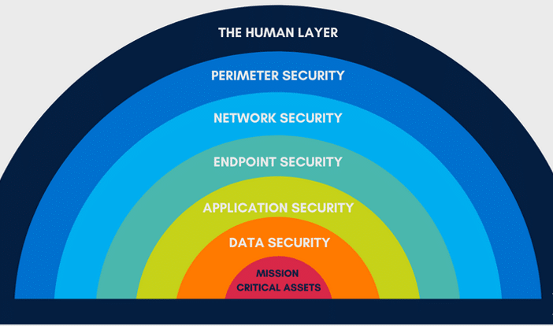

- How would an attacker try and break into our office? 
	- Scope out security guards, figure out personnel schedules
	- Look for ways to override alarms, avoid security cameras and other forms of detection
- All these things are defense layers an attacker has to overcome to gain access
- This is what defense in depth is all about

# Defense in depth and its levels

- Designing our physical and cyber security to have all sorts of layers working together
- Minimizing the number of SPF's
- Addressing every aspect of the CIA
- If one layer is bypassed, the next one might succeed in protecting us from the attacker
	- Example: multiple firewalls at different levels
- **Vendor diversity**: if one vendor's solution gets exploited, it won't affect others
- **Device diversity**: when possible and feasible, look for different solutions that can help achieve one specific goal
- Assume compromise while designing your security solutions
- "If this particular control gets bypassed, what's our next line of defense?"
- Security at every layer:

### Personnel

- Once again, people first
- Layers of security for personnel:
	- Training and awareness
	- MFA
	- Separation of duties 
		- At least 2 people involved in performing a task that has critical impact (e.g. one initiates, the other approves/reviews); no single person has too much power
		- Be careful with third parties and what level of access they have, watch it closely, audit, follow least privilege/function
	- Mandatory vacations
		- Critical to avoid fraud and misuse of resources
		- Every once in a while a specific worker **must** go on vacation
		- Replaced by someone temporarily
		- Great for detecting any nefarious activity, insider threat prevention
	- Succession planning
		- Plan for situations when a key employee is gone, for whatever reason
		- This is basically "personnel backup" - for instance, there shouldn't be just one sysadmin with access to everything; if something happens to them, it becomes a huge problem
	- Job rotation
	- Secure job descriptions

### Three directions

- Business processes
	- How the data flows within the company
	- Which people are involved in how data is stored, transported, and secured
	- Learn from trends
	- Continuous search for weaknesses, continuous improvement
- Technology
	- What specific software/hardware can be improved/upgraded to strengthen our security posture?
	- Security as a Service - outsourcing the security effort (not responsibility or liability as that's still on your org!) 
- Network
	- Constantly review the network design
	- Come up with a clear layout of the network: which departments need to communicate with each other, what traffic flows are required
	- Segmentation - separate anything that requires extra care into a different segment, which sets up another line of defense. Use VLANs, access rules, firewall rules, dedicated firewall devices, what users need access to what devices
	- Always be in control of how the traffic is flowing within the org
	- In case of an incident, a well-designed network will help isolate what's compromised and stop the attacker 
	- Consider SDN - best way to design a segmented network
		- On-the-go reconfiguration, quick deployment, same outcome every time
		- Automation
	- Consider an air-gapped network for extra security if something needs to be kept offline. Pretty extreme, but may be necessary
	- Don't overcomplicate your network design! The more complex, the harder to manage, the easier for an attacker to hide somewhere

### Configuration baselines

- Baseline: your own definition of what is "normal"
- Know exactly what your normal operations look like, use it to discover illicit activity
- Use the baseline to:
	- Detect misconfigurations in your infrastructure
	- Detect anomalies
	- Detect attacks before they succeed
	- Prove something is incorrect because you know what the correct way is
- Don't overcomplicate it, start with a simple inventory
	- List IPs and MACs in use on the network
	- List services that are expected to be running at any point in time during operation
	- Average CPU/memory/network usage
	- Usual processes that run every day
	- Whitelisted apps

### System hardening

- Reducing the attack surface as much as possible
	- Disabling devices/services that are no longer needed
	- Securing what's left running, especially if exposed to the outside
- Keep in mind that not all systems can actualy be updated/patched - EOL, EOSL, custom software
	- Take other precautions if not possible (think compensating controls)
- Configuration hardening
	- Deactivate non-critical components, services running by default that you don't need
	- Change default credentials
	- Disable unused accounts
	- Least function
	- Patch, update
	- Restrict access to peripherals
	- User permissions - least privilege
	- ACL on resources (file servers, databases)
	- Install security suites, network- or host-based (IDPS)

### Patching

- #1 solution for most remediations
- A lot of exploits target known vulns that should've been patched since patches are available
	- All you had to do was patch it! Don't let these things slide
	- Example of how the human factor creates the biggest vulnerabilities
- Patch management should be an integrated configuration management process in every single company
	- Regression testing - make sure your shiny new patch hasn't broken something else!
	- In a company with a large network, include a separate regression testing environment
- **Exam**: know automated patching solutions
	- Windows Update
	- [Windows Server Update Services (WSUS)](https://learn.microsoft.com/en-us/windows-server/administration/windows-server-update-services/get-started/windows-server-update-services-wsus)
		- Automated patch installation method
		- Repository for patch information, especially useful for larger networks
	- Linux package managers: `apt`, `yum`
- Patch management solutions
	- Monitor the state of your system
	- Throw alerts when noncompliance or outdated components are detected
	- Dedicated solutions include:
		- [Microsoft Endpoint Confugiration Manager](https://learn.microsoft.com/en-us/mem/configmgr/core/understand/introduction)
		- [Solarwinds Network Configuration Manager](https://www.solarwinds.com/network-configuration-manager)

### Verification of mitigation

- Patched your vulns? Reduced your risks? Good job! Now make sure you didn't forget anything.
- Confirming that steps taken to mitigate or reduce the risk of a security threat or vuln have been successfully implemented and are effective
- In the context of IR (more in [53](https://github.com/ordsec/cysa-notes/blob/master/53%20Incident%20response%20phases%20and%20communication.md)), once a vuln or a threat has been detected and dealt with, it's essential to verify that all measures taken are working as as intended
- It's a multi-step process:
	- Testing is carried out to make ensure that the vuln has been properly addressed (pentesting, further vuln scanning, etc.)
	- Review: looking over system logs, network traffic data, other relevant info to confirm that mitigation measures are functioning properly
	- Monitoring: keeping an eye on all relevant systems and networks, making sure the vuln doesn't re-appear / threat doesn't re-emerge
	- Documentation of the mitigation process, its verification, any new controls in place - everything involved in mitigation as it may come in handy later on, particularly in an audit

---

### Exam

Understand the importance of configuration baselines - how are they important for the security posture, how do they help detect anomalies/attacks before anything bad happens? Be able to discuss the importance of configuration hardening, with examples of steps taken in this process, particularly regarding desktops and servers.

---

# From the Sybex book

### Zero trust

- **Exam**: not on the objectives list, but it might come up, so be familiar
- No trust by default
- Much more strict than the "trust but verify" model
- Each action requested and allowed must be verified and validated before it can occur
- More than a strong perimeter - deeply layered security model where devices, apps, and user accounts are part of the security design
- Addresses the increasingly blurry concept of perimeters
- Continuous monitoring, management, assessment, and maintenance in a complex environment

### Segmentation - all types

- Aka separation
- **Physical segmentation**: running systems on separate infrastructure or networks
- **System isolation**: ensuring that infrastructure is separated, up to using an air gap
	- Air gapping is only as effective as the humans responsible for maintaining the security
- **Virtual segmentation**: using virtualization capabilities to separate functions to virtual machines and containers, can involve separate physical hosts for VM's as well
- **Network segmentation**: common element of network design that uses VLAN's and subnets to split a network up. 
	- Advantages:
		- Reducing the attack surface - fewer systems exposed to attackers at once
		- Limiting the scope of regulatory compliance - if everything that has to be compliant is separated from the rest of the systems (and then split up within that separated unit for better organization and security), then the rest doesn't need to be audited
		- Helps increase availability by limiting the impact in case of an attack
		- Increases network efficiency, reduces congestion by using network segments with fewer endpoints in each
- See [25](https://github.com/ordsec/cysa-notes/blob/master/25%20Network%20architecture%20and%20segmentation.md) for secure network design and segmentation, DMZ's, jumpboxes and all that fun stuff

### Analyzing security architecture

- Identify where defenses are weak, or where an attacker may be able to exploit flaws
	- Non-technical: architectural design, processes, procedures
	- Technical: vulnerabilities, misconfigurations
- Security architecture analysis can also be performed by pentesters - thinking like an attacker always helps
- Analyzing security requirements
	- Reviewing the security model, ensuring it meets a specific requirement
	- Example scenario: reviewing a workstation security design that uses antimalware, in order to determine whether it'll prevent unwanted software from being installed
		- Three possible scenarios: 
			- Success (installation prevented if it's known malware or behaves in such a way that antimalware catches it)
			- Failure (not detecting software that's not permitted by the org but also isn't malware)
			- Failure (not preventing unknown malware or malware that doesn't act all sus)
	- Attribute-based testing is as part of a risk or control assessments
	- Can be applied to each control by determining its goal and reviewing whether the goal is met
- Reviewing architecture
	- Formal architectural models relying on views aka viewpoints from which architecture and controls can be reviewed
	- Common views:
		- Operational: how a function is performed, what it accomplishes. Shows information flow, but doesn't capture technical details about how data is transmitted, stored, and captured
		- Technical aka service-oriented aka systems-based: technologies, settings, configurations in an architecture. Helps identify incorrect configs and insecure design decisions. Example: looking at the TLS version used in a connection, looking at password policies
		- Logical: describes how systems interconnect. Less technically detailed, but gives broader info about how a system or service connects and works. Network diagrams are an example
- Design issues encountered in architecture analysis:
	- SPF's: potential single weaknesses that, if exploited, bring the whole thing down
		- Remediated through redundancy at every level, ideally
		- Create, update, and use network diagrams to identify SPF's quite easily
		- Use a similar approach (data flows for instance) to analyse apps, processes, and control architectures. This can identify points where separation of duties (or separation of concerns for apps) might be needed, for instance.
		- Depending on the org's risk profile and functional requirements, certain SPF's might be ok
		- On the other hand, redundancy isn't a bulletproof guarantee against failures. It can be negatively impacted by updates and other factors
	- Data validation and trust problems: we have to be able to rely on data; it's often assumed to be valid, so when it's incorrect or falsified, it's bad news
		- Enhance the ability to rely on data:
			- Protect data at rest - encryption
			- Validate integrity - hashing
			- Implement processes to verify data in an automated or manual fashion
			- Profile and boundary-check data based on its known attributes
		- For any kind of app development, **input validation** is crucial - see 17
		- For data flows, storage, and usage, look for places where data issues could cause high-impact failures - not all of these places are the same
	- User issues: human error can cause many bad things, whether accidental or deliberate
		- Mistakes, malfeasance, social engineering attacks all jeopardize security designs
		- Never forget the human when designing your security layers, keep in mind people can make mistakes
		- To limit these issues:
			- Use automated monitoring and alerting systems to detect human error
			- Constrain interfaces to only allow permitted activities
			- Implement procedural checks and balances - see 51
			- Put together employee training and awareness programs
			- Proactively look for gaps in monitoring, think about where else issues can occur
	- Authentication/authorization security and process issues: concerns user credentials and privileges as a potential source of security design issues
		- Common problems:
			- Inappropriate or overly broad sets of privileges - use least privilege, conduct privilege audits, prevent privilege creep, monitor privilege creep
			- Poor credential security and management - use centralized solutions
			- Embedded/stored secrets - just don't do that
			- Reliance on passwords as a single factor to protect critical systems - use MFA
		- A lot of these can be remediated by effective user training activities
		- Always know exactly where authentication occurs, how authorization is performed, and what privileges are needed and granted to users
		- More on this in 31
- Security designs are even more complex in the cloud
	- [NIST SP 800-145](https://csrc.nist.gov/publications/detail/sp/800-145/final)
- Reviewing a security architecture requires a step-by-step analysis of security needs that influenced that design and of controls that are in place
	- This is done for every larger network segment and for every critical asset
	- Look for flaws at every step of the way
- Maintaining a security design means that our org has to be fully in touch with the treat landscape, be aware of emerging threats, and be flexible enough to adjust to them quickly
	- **Proactive** is the word here
	- Scanning, auditing, reviewing, thinking outside the box, adopting an attacker's perspective
	- Scheduled reviews
	- Recording the last change date for a security design, track when reviews are done and what they focused on
	- Continual improvement processes (CIP) - incremental improvements over time
	- Retirement of processes - know when something needs to be retired
		- A process or policy is no longer relevant
		- It's been superseded by a newer policy
		- Org no longer wants to use it
		- Document all retirement processes clearly