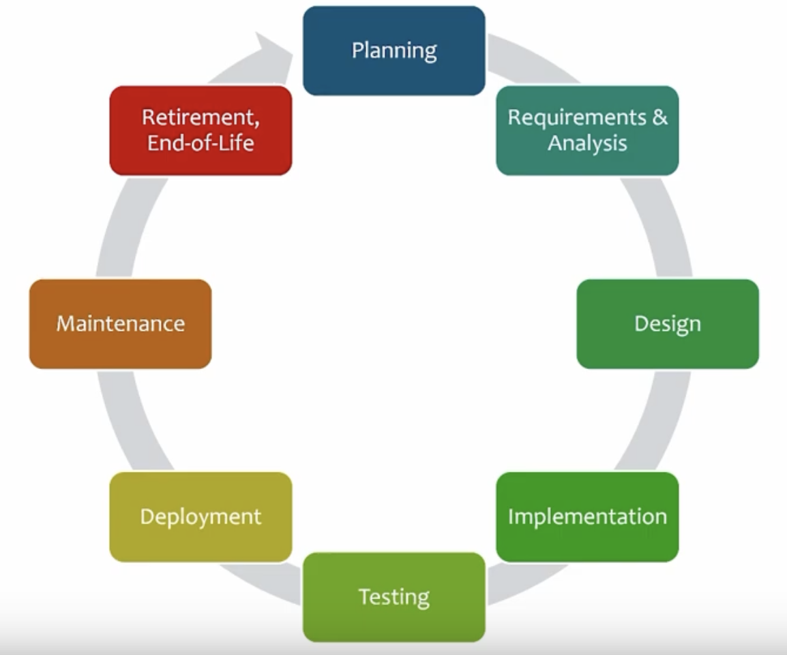
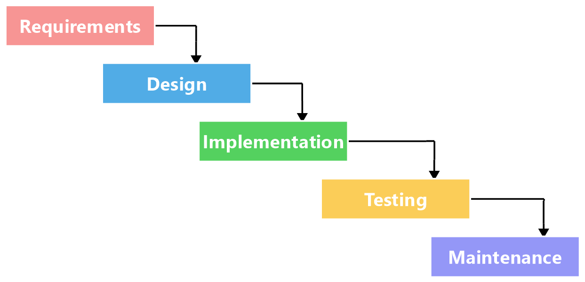
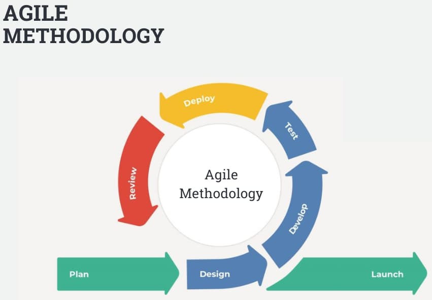
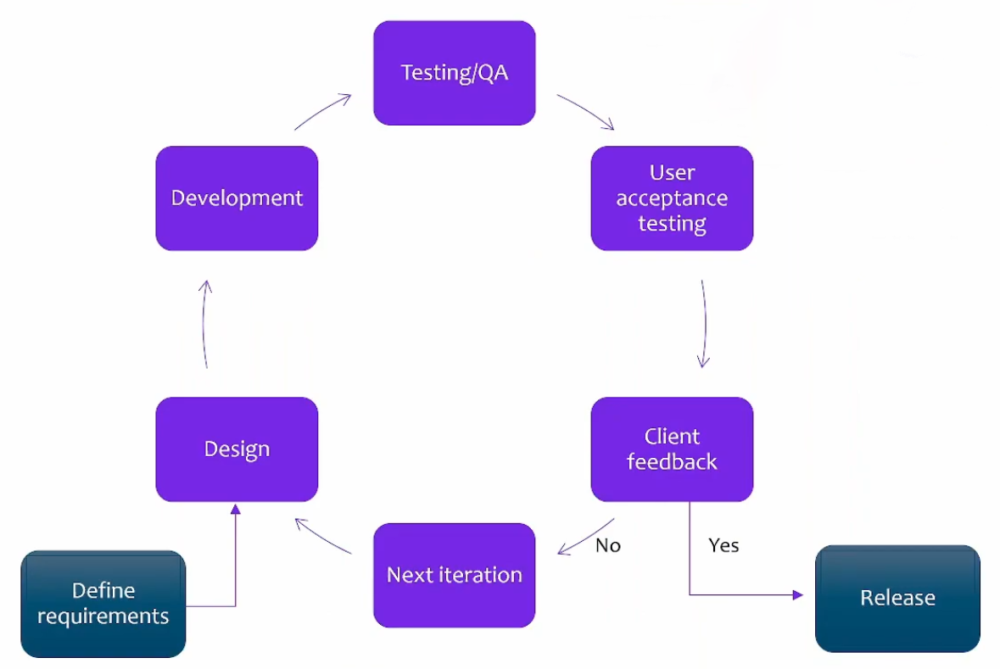
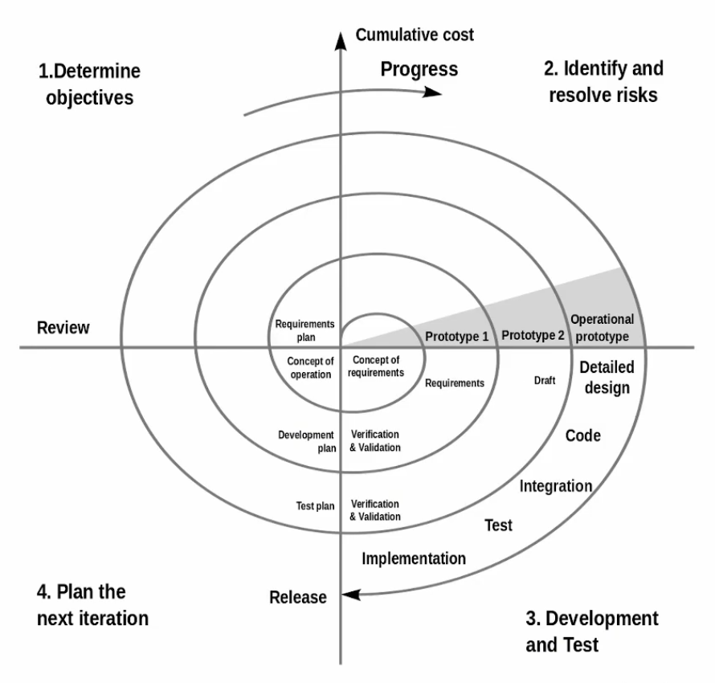

- Probably one of the most important parts
- Software is everywhere - we can't use or run anything without it
- This is where everything begins and ends - all the problems and solutions in cybersecurity

# SDLC

**Software Development LifeCycle**

- What if we could build all software in such a secure manner that cyber attacks would be rendered pointless?
	- Alas, this isn't possible. Any app, starting from pretty low levels of complexity, will have bugs and innate vulnerabilities - each one is a potential attack vector.
- However, we can employ a set of methodologies and tactics to end up with a piece of software that's as close as possible to the Goldilocks zone of being impenetrable for attackers
- This set of techniques and methodologies is what SDLC presents
- SDLC is what allows our apps to be truly reliable

### The problem

- Company has a revolutionary idea for an app
- Application is developed and starts growing
- Customers want more features
	- For instance, we now want to allow users to create profiles and store their data somewhere in the cloud
		- So we need functionality that allows and secures cloud connections
	- Then customers want to be able to import their data from a different app
		- So now we need a process to achieve that, also securely
	- Same goes for adding features to share content, post to social media, use the app in the car, voice control, locations services, it goes on
- As a result, **our attack surface grows almost exponentially**
- We need a way to manage adding all this new functionality while maintaining best security practices

### The solution: SDLC

- One way of doing it is to tell the developer: we need this new feature, make it secure as you go, just look it up on stackoverflow or something
- A much better way is to use SDLC's phases of development for an organized approach
- Who's involved in SDLC?
	- Developers
	- Testers
	- Software architects
	- Security artchitects
	- Project managers
	- DevOps -> DevSecOps
	- Clients, to a certain degree

### Why use SDLC?

- "Traditional" approach (aka Waterfall):
	- Design -> Code -> Test -> Deploy
	- "We're already doing it this way, why change anything?"
	- Problem: it's a **reactive** approach, and there's no high-level overview of what everybody's doing at a given time
	- Things just happen to work - this is fine for smaller projects with 1-2 devs and not a lot of code, but this isn't a good approach for more complex projects 
- Agile approach (below)
	- Different approach, allowing us to go back, change our mind, test some more, streamline feature development, etc
		- This is also a reactive approach
- We need some **structure**
- And, as security professionals, we're concerned with cybersecurity at every step of the way

- Security is not something that "just happens" to be implemented - it's very intentional, and it needs a very clear direction/overview/process
- There are documented practices for secure development:
	- [Microsoft](https://www.microsoft.com/en-us/securityengineering/sdl)
	- [OWASP](https://wiki.owasp.org/index.php/OWASP_Software_Security_Assurance_Process)
	- Main purpose: embedding security in the SDLC

# SDLC in detail

- **Know every phase, from the security persepctive, for the exam!**

### Planning

- Feasibility
- This is the big picture. What's the target market? 
- Surveys
- Conversing with domain experts
- Addressing to-be users
- Look at the competition - who has already thought of it and how are we different?
- **Security**:
	- Training developers and testers in best practices relating to security
	- They need to know what to look for and how to approach every new feature from the security standpoint

### Requirements and analysis

- Coming up with a more specific development plan, though still high-level
- What are the business requirements? What are the goals?
	- Make sure planned features address these business requirements
	- Be able to show that implementing and deploying the app will show quantifiable improvement
- What are the software requirements?
	- Internal: libraries, storage
	- External connections
	- Hardware the app will run on, what the specs are
	- How do we store data? Where? Do we let users access the data or do we manage it directly?
	- How will the traffic flow to and from the app? 
- **Security**:
	- How will the data be secured while at rest/in transit/in use?
	- How do we manage users and permissions?
		- How are users created, what are the default permissions?
		- How are these upgraded and changed?

### Design

- At this stage, developers are 100% involved
- Decide on dependencies
- Figure out specific features, connections, API endpoints if applicable
- Functional requirements
	- Usability
	- Scenarios and workflows
	- This is all pretty specific
- **Security**:
	- Perform risk analysis
	- Figure out what threats we might face - yes, we haven't even written any code, but we're already thinking about this!
	- This needs to be done for every connection/API endpoint/opened port because it's a potential attack surface expansion
	- Analyse 3rd-party code you will use - is it secure? What vulnerabilities are we introducing? 
	- Functional requirements have to be very granular - again, what libraries are we using, how much access are we allowing, what encryption/hashing/digital signature algorithms will be employed
	- Design audit and debug functionality
		- Have a way to identify and store what users are doing in the app (for debugging/investigation/performance purposes)

### Implementation

- Let's write some code!
- Code review sessions
- Unit testing - testing minimum functionality (methods, classes, etc.)
- **Security**:
	- Testing needs to be performed with security in mind
	- Error handling! Make sure the app doesn't simply crash when an error is encountered (this gives up too much information about the inner workings of the app)
	- White-box testing - we have the code, we can follow the execution flow line by line
	- Look for places where vulnerabilities and unsafe behaviours might exist

### Testing

- Get the code from devs, run it through a bunch of automated tests
- All functionality must be thoroughly tested
- Think of all possible edge cases, make sure they're covered
- Fuzz it, throw unexpected inputs at it
- **Security**:
	- Start looking at the app from an attacker's point of view
	- When (not if) you break your code, figure out why, make sure it fails properly
	- Static analysis
	- Dynamic analysis
	- Gray-box/black-box testing: use partial knowledge or no knowledge when testing the app - how can we break it from these standpoints?
		- Hire outside testers if necessary (securely of course - NDA's and whatnot)

### Deployment

- It's going into production!
- App starts to reach the end user
- Delivery vs deployment (this is DevOps)
	- Delivery: getting to the final state where the app is built, compiled, and ready to be used, but it's not just yet in the hands of users
	- Deployment: making the app fully available to users
- **Security**:
	- Giving access to the final product to users? Do it right!
	- How do we deploy in a secure manner?
	- Code signing: the customer always has to be confident that the app they're about to use under the name of your app is in fact your app and not something that comes from an attacker or has malicious code injected
	- How do we package the app? Auto-download? Virtual appliance? Container? SaaS?
	- DRM
	- Licensing

### Maintenance

- Ongoing monitoring of the app's performance and security
- Something's broken? Don't wait and fix it!
- Incident response type of approach - fully reactive
- Developing patches, updates, hotfixes
- Reacting to changing OS landscape - maintain compatibility
- Same goes for external dependencies
- **Security**:
	- A lot of patches are security-related
	- Monitor for any type of data breach, address it immediately
	- New vulns are introduced every single day - be vigilant!

### Retirement, EOL

- End of maintenance, no more additional features
- EOL vs EOSL - the latter is when support for the app completely stops
- Maybe the app got purchased by a bigger player? Now we focus on something else
- Not a simple process, we don't just pull the plug
- It's still in use - should retire gracefully
- Think about external services and active user accounts

---

# Software development methodologies

- Introducing order to the madness of software development

### Chaos!

- Not much of a methodology
- You just start coding
- Fix stuff whenever possible
- What are the specs? Who knows!
- When do we even stop?
- Not well-documented, not measurable, not thoroughly tested, can't evaluate the quality
- Security? We don't know, it may or may not be there
- Might be good for small projects, but **terrible** for everything else
	- And even small projects can benefit from some planning

### Waterfall

- We have a plan
- It's a very strict plan!
- We focus on one phase at a time
- Move on to next phase only when the current one is 100% complete
- Pros:
	- Simple to understand and focus on each phase
	- Everybody knows what they're doing and what tasks are assigned, clear goals are defined
	- Well-documented: who did what and why
	- Works if perfectly planned
	- Works for smaller projects
	- **Security can be thoroughly checked and implemented at every phase**
- Cons:
	- Difficult to implement in real life
	- Works ONLY if perfectly planned!
	- Hard to decide when a phase should end, especially development
		- Introduces quite a bit of anxiety
	- Not good for projects that might require changes after the initial design was established
		- Which pretty much descibes every single medium+ sized project out there
	- Major code changes are next to impossible - a big enough changes triggers the entire process to start over
- Due to these cons, it remains more of a theoretical model
- In the world of software development, it's extremely difficult to follow a specific plan step by step - surprises can happen at any point
- In the real world, even under this model, we should assume that we can go back at least one step
	- For instance, we begin testing, but if a large chunk of code is completely broken, it's ok to go back to the implementation phase and improve it
	- But by definition, this model doesn't allow this

### Agile

- Not really a model per se, more like a style
- Focused on values and principles
	- People and interactions
	- Ensuring customer satisfaction through early and continuous delivery
	- Working software (MVP: Minimum Viable Product) - get at least something working, show it to the customer, see what they think, make improvements based on that
	- Actual working software is the main metric we use
	- Lots of customer collaboration
	- Welcomes change
	- Rapid response to change: quickly develop and test new functionality, bring it straight back to the customer
	- Deliver working software frequently
	- Technical excellence, good design
- Work is broken up into short sessions called *sprints*, lasting from a few days to a few weeks at most. The development effort is completed when developers and the customer agree that the task is finished
- Pros:
	- Focuses on teamwork
	- Very flexible
	- Allows for cross-training between different dev teams
	- Realistic approach - devs are always in contact with the customer, deciding together on what still needs to be done/improved
	- No fake expectations, no reporting false success
- Cons:
	- Not great for large projects
	- We might lose track of the big picture while focusing on small improvements
		- Especially without clearly defined high-level goals
	- May be unclear where the end of development even is
	- Not a whole lot of documentation happening

### Iterative

- Doesn't generally focus on the big picture
- Instead it focuses on a specific feature or part of the app
- Based on iterations: we iterate through development of a feature until it reaches a desired state and is ready to be released
- Pros:
	- Good for projects that have clearly defined pre-established requirements
	- Unlike other models, some functionality is requested later in the process of developing a feature - has room for a change of heart (as long as there aren't too many of those)
	- Therefore, this model adapts quicker than other models
	- Easy to measure progress and know where we are at every step of the way
	- Risk analysis is improved also: if risks are found at any point, we can run another iteration and take care of them
- Cons:
	- Needs more resources than other models
	- Good for adding new requirements, but not great for changing previous requirements
	- Plenty of overhead that's not necessary for smaller projects, making this model not ideal for those

### Spiral

- Combines waterfall and iterative
- Relies on incremental releases of software
- Does NOT rely on a linear path: we can revisit the same phase(s) as many times as necessary, determine new objectives or change existing ones
	- And also identify and resolve any security risks that may arise at any point
- Pros:
	- Good for large, long-term projects
	- More freedom and flexibility in terms of requirements - allows for change along the way
	- Adding features on the fly
	- Development can happen in smaller iteration, which allows for better risk mitigation
- Cons:
	- Becomes difficult to manage - lots of little iterations happening, lots to keep in mind, flexibility in terms of requirements can be a blessing or a curse
	- No way to know how many cycles/iterations it'll take for a final result
	- Requires a lot of structure and documentation - not a problem if you can properly handle that (therefore requires resources for that)
	- Requires someone to decide beforehand when the development should stop so it doesn't go on indefinitely
	- Many in-between phases

### Exam

Be able to explain all phases of SDLC and talk about every single methodology listed above, in detail, with comparisons, knowing which one would apply better than others to a given scenario.