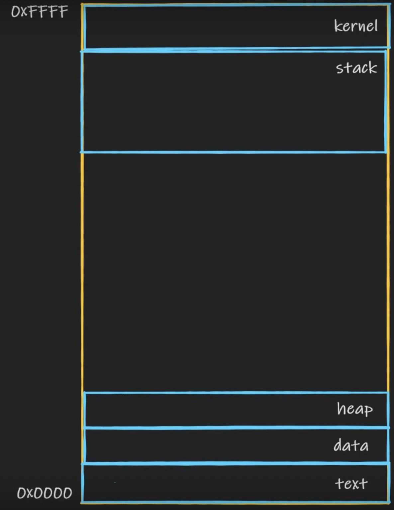

# Buffer overflows

- A buffer is a placeholder in memory for storing whatever the user sends to the app
- An overflow is what happens when you pour too much water in a glass
	- Or try to store more data than the buffer can handle

### How memory works



- Memory is a linear space - every position has a specific address
	- In this example, the range is between `0x0000` and `0xFFFF`
- Two reasons why hex is used for memory addresses
	- Fewer characters for larger numbers (decimal)
	- Hex allows us to use two digits to represent one byte
		- `0..9` and `A..F` (16 digits total)
		- $16 \times 16 = 256$
		- A byte is $8$ bits
		- $2^ 8 = 256$
		- $256$ is the maximum value of 1 byte
- Memory regions:
	- `text` stores actual program code/instructions, they're read only
	- `kernel` isn't the OS kernel. This is an area that stores program arguments and environment variables
	- `data` stores variables, whether initialized or not
	- `heap` stores the "big stuff": files you load in memory, e.g. a document you're editing in Word or a level you're currently playing in a game
		- Anything that's not a variable or a simple data structure - needs a lot of space
		- Also global variables
	- `stack` is where *it's happening*. More below
	- And the big unpopulated area in the middle is empty by default, but the stack and the heap constantly compete for it
		- That's because both are elastic and need to grow when it's necessary, and they'll take up space from that uncharted area in order to load more stuff into it

##### More on the stack

```c
void mycopy(char *name) {
	char buf[10];
	strcpy(buf, name);
	// do stuff
}

int main(int argc, char *argv[]) {
	mycopy(argv[1]); // mycopy function gets called
	return 0;
}
```

- `main` gets executed first
- The first instruction is to call `mycopy`, which also takes an argument
	- Execution jumps to where `mycopy` is so that instructions within that function can be executed
	- Then it comes back to `main` to execute the following instruction
- What happens in the stack:
	0. A space is created in the uncharted memory space to store the arguments from `mycopy`
	1. Another space is created for the return address - the program needs a "bookmark" to remember where it previously was before executing a function. In other words, when the program execution leaves the `main` function to execute `mycopy`, it needs to know how to get back to the function that it left from - that's what the return address is for
	2. One more stack space is allocated for any local variables within the scope of `mycopy` - in this case, the `buf` variable
	3. Once `mycopy` finishes execution (it may do more stuff) and we get back to `main`, everything pertaining to `mycopy` is erased from memory
- Observations about what's happening in the stack:
	- Things are only added to the **top of the stack**
	- Think of a stack of papers on your desk. You can only see what's on top. You just added one more paper, then you looked at it and discarded it so you can move on to the next paper
		- **Push**: add to a stack
		- **Pop**: remove from a stack
		- **Peek**: read the first element of the stack without removing it
	- This is **LIFO**: Last In First Out
	- The stack grows **from higher to lower memory values**
	- But the way things are stored in the stack is **from lower values to higher values**

##### Wait a minute...

- The `strcpy` function is from C's standard library - it copies one string into another
	- It's an **unsafe** function as it only receives two parameters
		- The first one is where something is copied **to**
		- The second is where the data to be copied comes **from**
		- It reads the context of the 2nd argument (`name` in our case) and copies it to the 1st argument, which is our pre-defined `buf` with only 10 bytes of space
		- If the length of `name` is less than or equal to 10 bytes, everything is fine, and it gets stored in the stack during execution
		- **UH OH**: what if `name` is bigger than 10 bytes?
		- `strcpy` doesn't actually check whether source data is bigger than the buffer!
			- This is because the two arguments are pointers to where the string starts from, so copying will start from the first byte and until a null-terminating byte is reached - which can be anywhere, and there's nothing to tell this process to stop once the capacity of the buffer is reached
			- **And this is where a buffer overflow happens**

### So what actually happens?

- A buffer overflow in a stack is a nasty thing
- The space we had allocated in memory for `buf` is depleted
- Copying from `name` to `buf` will continue, and it'll start using next available memory addresses in the stack
- Now remember: writing into the stack happens from lower to higher addresses, so if we have this:

```
0x0004: args* name // the `name` argument of mycopy
0x0003: return address // to get back to `main`
0x0002: local vars: buf[10]
```

- Then once we run out of memory at `0x0002`, we'll start writing to what's in `0x0003`
- The return address is therefore **overwritten**
- And then the program tries to read from that space in order to get back to `main` - except there's now some gibberish data that the program treats as a memory address
	- In most cases, this is a **segmentation fault**, and the program will crash with an error
	- But if an attacker is doing this and if they can find the exact point where the overwriting begins, they'll include an actual return address there
		- Except that return address points to some malicious instructions that the attacker provides!
		- Like a reverse shell, for instance!
		- Oh no.
- Unchecked boundaries/buffers are a very common type of exploit
- What if the attacker doesn't know exactly where to jump?
	- They'll fill the uncharted memory space with do-nothing operations (aka NOP's)
	- And put malicious code at the end
	- Now it doesn't matter where to jump
	- This is known as a **NOP sled** (execution "slides down" all the NOP's until it arrives at malicious instructions)
- An attacker can do pretty much anything once this is successful: privesc (but only up to the privileges the app is running under), stealing credentials, DoS, etc.

### How do we not let this happen?

- Write better code!
- Use safe functions and programming languages if possible
- If using unsafe functions, perform checks to make sure incoming input is truncated or simply disallowed if too long
	- aka boundary checking
- If using "risky" languages like C/C++, which leave memory management in the programmer's hands, remember that with great power comes great responsibility
	- Be aware of memory usage - at all times
- **ASLR**
	- **Address Space Layout Randomization**
	- A way of confusing the attacker by positioning memory blocks (stack, heap, etc.) randomly - same goes for libraries that are loaded in by the program
- Stack Canary
	- Detects a stack buffer overflow before execution of anything malicious can occur
	- This is another way of error handling
- **DEP**
	- **Data Execution Prevention**
	- Only available on Windows
	- Marking specific memory regions as non-executable
	- We can mark a space that would be filled up with NOP's as NX, and nothing in there would be run as code
- But mostly just validate inputs. This way we won't even have to worry about what's gonna happen if there's a buffer overflow

---

# Race conditions

- A design flaw that allows a system to reach an inconsistent state due to the timing of its own operations
- Computers are designed to be predictable and deterministic
- So it's not a good thing when the outcome of a sequence of operations can't be predicted
- Example: multiple threads attempting to write data at the same memory location, at once
	- No way to know what's gonna end up being written
- Race conditions can be exploited by attackers
- Example: [Dirty COW](https://www.makeuseof.com/tag/dirty-cow-vulnerability-everything-know/)
	- COW stands for Copy-On-Write
		- Exploit relies on it being badly implemented
		- Resulting in a race condition attempting to modify what should be a read-only root-owned executable
	- PrivEsc vuln allowing any app or malicious code to gain root access to the machine
	- The vuln was present in the Linux kernel for many years! This type of thing can be very hard to notice
	- Affected Android devices also
- Another example: cache files
	- A certain value stored on the user's end for future use or to speed up some aspects of performance
	- If an attacker manages to change that value between when it's stored and when it's fetched from the cache by the app, it's a race condition

>**TOC/TOU**

**Time-of-Check / Time-of-Use**

- When a program tries to modify a resource, but it checks the corresponding memory address and modifies what's written there in two different operations
- We fail to connect the check and use operations - both should be executed in the same function, otherwise the app's state is misrepresented
- Leads to corrupted execution, crashes, exploitable vulns

### Mitigation

- Design code properly
- Implement locking mechanisms for resources so they can only be checked/used by one procedure/thread/process/user at a time
- Implement operations in such a way that they either execute in their entirety or not at all
- No sequential independent operations when they can be performed together

---

# Other software design issues

### (Im)proper error handling

- First of all, make sure you actually handle errors, don't just let the app crash into an unknown state
- **Exception handling**: the act of catching errors
	- And writing code that will execute in the event of an error
	- This code will allow the app to carry on
- We can't handle or predict every single error scenario
	- Have a certain catch-all chunk of code that is generic enough
	- Deallocate memory when exception occurs, hide sensitive info, don't provide debug info or stack traces, don't fall back to a default configuration
- Think like an attacker: how can they use error info?
	- If you provide more than needed, it's basically like teaching them how to attack you correctly
	- The amount of error info that's relevant to the user is just above zero (all they need to know is there's an error)
- The main point: a crash is unpredictable and bad for the security of the app - too much info can be given away

### Using insecure components

- Developers don't like to reinvent the wheel, and the vast majority of apps rely on code written by other people
- This code may not have been thoroughly analyzed for vulns - so be careful using it
- Make sure libraries and services your app relies on are up to date, review their security
- For web apps, use a WAF, which would be an extra preventive/compensating control in case some code your web app relies upon is insecure and you don't know about it

### Insufficient logging and monitoring

- A lot of incidents are detected via logs
- Can't investigate if you don't have records that answer questions of who, what, where, and when
- But also don't log too much - otherwise it's not usable
- Don't expose any sensitive info in logs
- Store input validation errors in logs (for when someone tries to circumvent input validation)
- Store attempts to access/modify files or restricted regions of the app, attempts to connect to invalid session IDs
- Store anything pertaining to admin usage, make sure it's the actual admin running these commands
- Restrict access to logs - users cannot and should not access them
- Continuous monitoring is extremely important! Especially when your security posture isn't all that.

### Weak/default configuration

- Misconfigured permissions in an app, exposing stuff that's meant for admins to the world
- Default configs
	- Username: `admin`, password: `password`
	- BAD! Change these immediately
	- Especially important for IoT
	- There are automated tools out there that search for these things
	- Rename admin accounts

### Broken authentication

- Authentication and authorization are performed, but badly
	- Application accepts very weak passwords
	- Poorly implemented or weak password reset mechanism
		- Sending a new password to just any email
		- Resetting passwords to some default value
	- Exposing sensitive session info
	- Hardcoding secrets into the app
	- Storing/transmitting creds in cleartext
- [OWASP Authentication Cheat Sheet](https://cheatsheetseries.owasp.org/cheatsheets/Authentication_Cheat_Sheet.html)

### Dereferencing

- Accessing data stored at a specific memory address, which may be stored in a pointer (**dereferencing a pointer** is the term)
- **Null pointer exception**: when an app tries to read from a `NULL` memory address - empty or unallocated
	- Mostly results in a crash
	- Can happen accidentally due to a bug
- Can happen as a result of a buffer overflow - DoS or a breach
- Check pointers before trying to access the contents of the memory address

---

### Exam

Understand buffer overflows, race conditions and TOC/TOU, and other issues such as insecure components, weak configs, and everything else mentioned. Recognize these from examples/scenarios, be able to apply proper mitigations.