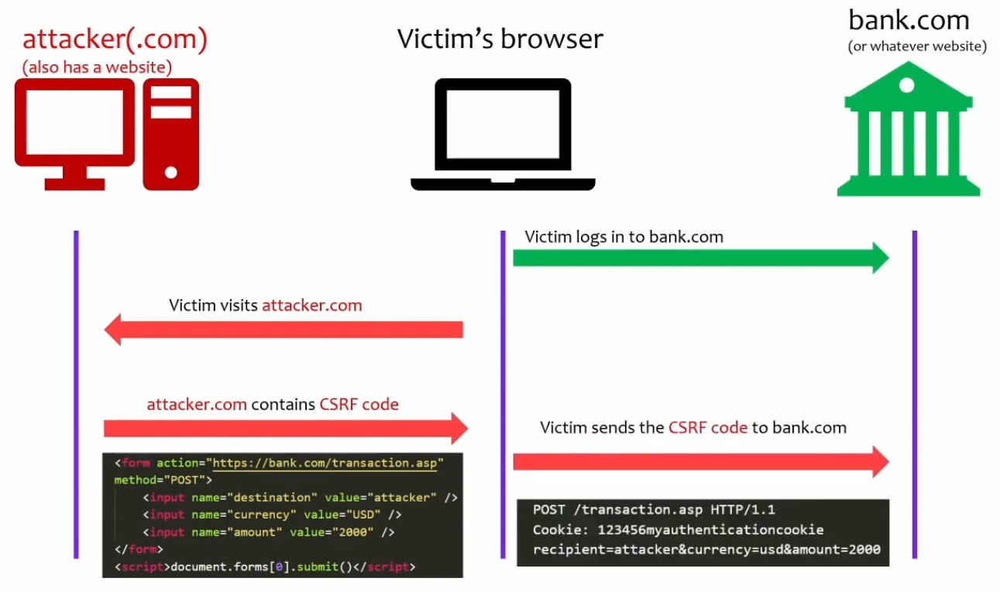

- Below attacks have one thing in common: **session management**
- A session is an arbitrary piece of information, usually a randomly generated sequence of characters, that is stored both in the web app app and in the user's browser and used as a unique "name badge" to keep track of a user and make sure their actions are being recorded, whenever necessary, in between different HTTP requests.
	- The need for this stems from HTTP's being **stateless** by design
	- Any kind of app state has to be developed separately
- Sessions allow you to authenticate just once - they're the reason the web app "remembers" us for as long as we're using it, or until the app itself decides to renew the session
	- Then we can store products in a shopping card, score points in a web-based game, and so on
	- Required for any persistence or state whatsoever, including things like profile settings (which can then be stored in the database in between sessions)
- Sessions keep us from seeing someone else's shopping cart or reading someone else's emails
- Sessions **must be protected**! If someone else has your session ID, there may be nothing stopping them from accessing what should only be available to you
	- For this reason, whenever sensitive data is concerned, a session ID shouldn't be the only point of trust between an app and a user, and other "factors" should be used as well, such as the last IP a user logged in from - otherwise it's a single point of failure

### Managing sessions: cookies!

- HTTP is **stateless**, storing state isn't part of the protocol's design
	- One request has absolutely nothing to do with the next request
- So where do we store it? Well, in a **cookie**, of course!
- The workflow is quite simple:
	1. User successfully logs in
	2. A cookie is created on the app's side
	3. It's sent back to the user in the following response
	4. It's persisted in the user's browser
	5. User requests another page, the request includes the cookie
	6. The website compares it vs what's stored for that user
	7. If everything matches, the user is allowed to proceed further
	8. If no cookie, the app throws an error and redirects user to some default location with no more access
	- Multiple cookies can belong to the same session
- Persistence levels for cookies:
	- Non-persistent (only exists in the browser's internal storage, which is temporary)
	- Persistent (saved on disk for future use, will stay there until wiped or overwritten). An example is when a web app asks if it should remember your login info for the next visit

### Cookies have to be secured

- **Treat cookies like passwords**
- Encrypt them in transit
- Encrypt them at rest - this is up to the developer as browsers store them in cleartext by default
- Attributes/headers for further security:
	- **`Secure`**: an HTTP header that tells the browser to only ever send cookies over HTTPS
	- **`HttpOnly`**: another header that ensures that cookies cannot be accessed by client-side scripts - mostly JS
	- **`SameSite`**: requires that the request and the cookie come from the same domain - helps against fake requests forged by attackers
	- **`Expiration`**: the longer we store cookies, the higher the risk of compromise. 

---

# Session-related attacks

### Session hijacking

- Taking over someone's session without them knowing
- The purpose is to impersonate that user as far as the resource is concerned, and send requests on their behalf
- There are various methods and issues that can allow this:
	- One common way is to just intercept all session info as part of a MitM attack
		- Intercepting traffic, repackaging it, sending it to the resource
	- Compromised browser: less common, just as dangerous
		- A browser that has been hacked can reveal everything it receives, including passwords and session information (man-in-the-browser)
	- Predictable session IDs
		- A bad algorithm
		- An ID that can be deduced from another ID
		- Lack of randomness/entropy
		- Taking over a session that hasn't even been established yet
	- Bad application programming
		- Exposing session info one way or another
- Mitigation:
	- Securing cookies (above)
	- Cookie expiration
	- Good programming practices, using good algorithms for generating session IDs
		- Don't just hash something that's sequential either - it can and will be cracked. If using hashing algorithms, make sure that which being hashed is also random.

### Cookie poisoning

- Attacker attempts to change the contents of a cookie after it's generated
	- Then send the altered cookie to a website in order to exploit a vuln
	- Code injection via malformed cookie
- Mitigation
	- Validate that input 
		- Validate the cookie also - it's a type of input
		- Make sure it contains only what's expected
		- Check integrity
	- Encryption at rest and in transit
	- Expiration - make sure logout functionality is there
		- And log them out occasionally anyway
		- No one boycotts an app just because they have to log in again
		- Clear cookies from the web server

### Cross-site Request Forgery (CSRF)

- Exploiting web apps that use cookies, but with a dash of social engineering
	- Attacker has to have performed some recon on the target to know what services they use so they can be targeted with CSRF
	- They can look for apps the victim uses for work, especially internal apps as they may lack in security
- An attacker forges a request to a valid resource where a user has a live session
- A necessary element is trcking the victim into clicking a link that will submit a request from the victim's browser, on the attacker's behalf, using the existing session
	- It can be done as a POST request (see below), so doing it via query strings isn't even necessary (although possible if the web app is silly enough to allow it)
	- And chances are that it will go through if the web app puts all its trust into the session the user has

- The last line in that code is submitting the form that was created by the attacker to the resource - it will be done the next time the victim visits the web app
- This attack can be used for a variety of applications
- Mitigation:
	- Browser side:
		- Not much we can do :-o
		- The browser just thinks it's a valid HTTP request
	- Web app side:
		- For stateful apps, use CSRF tokens
			- A random value stored in the server and sent back by client, embedded in forms using hidden fields; sent along with every request
			- Works on top of the session ID, can only ever come from the legitimate user
			- Tokens can be generated for the entire session or for every page the user visits (and on those sites the "back" button doesn't really work that well)
			- Obviously don't send these tokens within cookies!
		- For stateless apps, use double submission of cookies
			- If we can't store token info on the server, we can send the same large random number in a cookie AND in a hidden input field in any form
			- The server needs to have code that will check if there's a match between the two
			- Requires really strict security measures for cookies!
		- Domain/origin/referrer header
			- Checking if the request came from a valid website address (which does NOT happen as part of a CSRF attack)
			- Considered safer because you can't change these headers programmatically using JS - only the browser can change them
		- SameSite cookie attribute
			- Browser decides whether to send cookies that don't match the site they were made for
			- Modes: Lax, Strict, None
		- CAPTCHA
			- Warn the user they're about to execute a special request
			- Validating the user is a human
			- Attacker can't sit there all day and wait for you to visit the web app again and then synchronize their forged request perfectly; this happens programmatically, and there's no way to validate a CAPTCHA that way - it's for humans only!
		- Cookie protection
			- It helps, but it's not enough for anti-CSRF
			- HttpOnly, Secure, Path, expiration, etc

### Clickjacking

- "Stealing" a user's inputs on a web page
- Changing the structure of the web page in such a way as to have a transparent layer with inputs located exactly where the real inputs are
- Uses an `<iframe>`, aka inline frame
- And then they enter their credentials into the fake overlay form they can't see
- Code has to be injected into the web app - probably tricky
- Just start with CSRF
- Mitigation: 
	- Frame busting
		- `if (top !== self) { self.location = top.location; }`
		- Forces the page content to be the topmost element, disallowing these overlays
	- `X-Frame-Options` header decides if and what type of framed content is acceptable:
		- `DENY` prevents any site from framing content
		- `SAMEORIGIN`: prevents any site except the same page from framing content
		- `ALLOW-FROM`: permits framing only for certain pages

### Remote Code Execution (RCE) - thank you GPT!

Remote Code Execution (RCE) is a type of security vulnerability that allows an attacker to execute arbitrary commands or code on a target system over a network connection, typically without any form of authentication or user interaction.

Here's a simplified explanation: Let's imagine your computer is a house. Normally, you have control over what happens in your house. In a remote code execution attack, an attacker found a way to get into your house without your knowledge and started to control what happens inside, like turning on your TV, opening your fridge, etc. In computer terms, they could access data, install malware, create user accounts, or perform any action that the system's legitimate user could.

This vulnerability can exist due to several reasons, such as software bugs, system misconfigurations, or weak security controls. For example, a web application might have a bug that allows an attacker to manipulate inputs in a way that the server interprets as commands, which are then executed.

To mitigate the risk of RCE vulnerabilities, here are some strategies:

1. **Regular Patching and Updates:** Software vendors frequently release patches and updates to fix known vulnerabilities. Regularly updating and patching all software, including operating systems, applications, and libraries can significantly reduce the risk of RCE attacks.

2. **Secure Coding Practices:** Developers should follow secure coding practices such as input validation, output encoding, and use of parameterized queries to reduce the risk of RCE vulnerabilities in their code.

3. **Least Privilege Principle:** Systems and applications should run with the least privileges necessary to perform their functions. This can limit the potential impact of an RCE attack. Don't run your web server as `root`!

4. **Firewall and IDS/IPS:** A properly configured firewall and intrusion detection/prevention system can help identify and block RCE attacks.

5. **Security Scanning and Penetration Testing:** Regularly conducting security scanning and penetration testing can help identify and fix potential RCE vulnerabilities.

Remember, dealing with RCE vulnerabilities requires a multi-layered security approach that includes secure design and coding, regular updates and patches, use of security tools, and user education.

---

### Exam

As before, be able to talk about every major topic above: attacks, how they work, and how they can be mitigated.