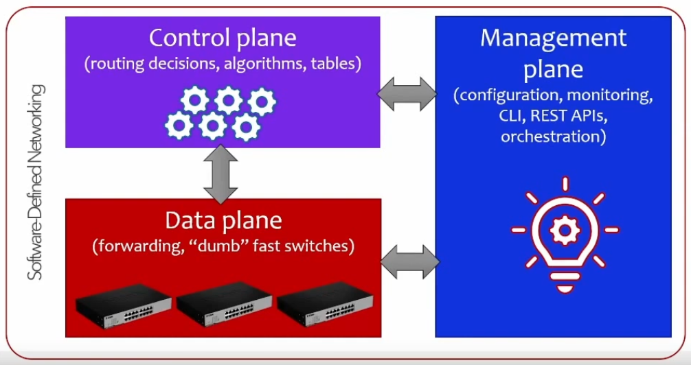
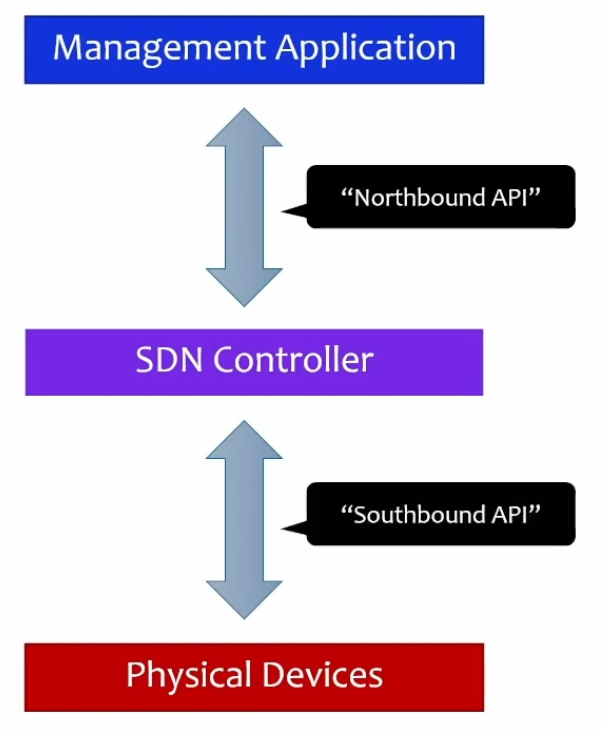
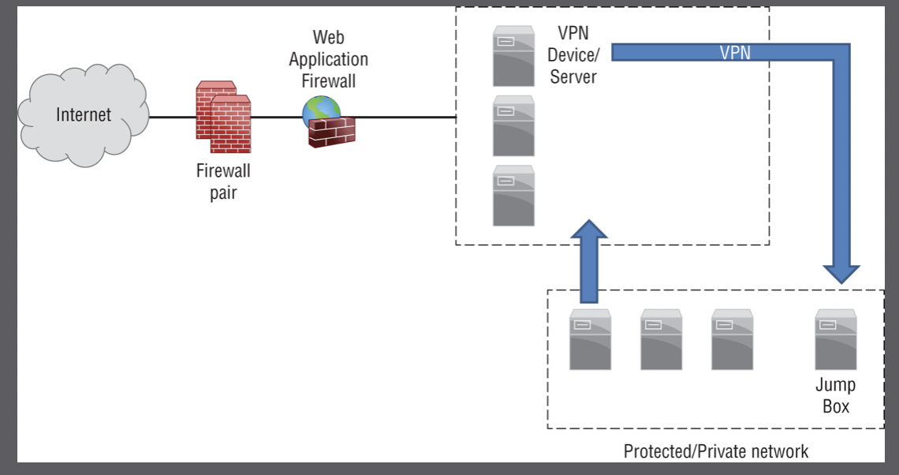

# Network architecture

- Networks move data from point A to point B - it's the backbone
- We need to look thoroughly at the way the network is designed in order to secure the entire path between those two points
- Network architecture therefore has a strong impact on security

### The physical network

- Devices we can see and touch
	- Switches
	- Routers
	- WAPs
	- Cables
- All of these are points of entry
- An attacker with physical access to our network can perform a wide variety of attacks
- Before we even have to think about security policies and firewall rules and everything else that's on the software side of things, we must take care of physical security
- We have to use **physical controls** in order to protect all the hardware:
	- Doors, locks, fences, guards, proper lighting, CCTV, etc.
	- Bollards, naturally
	- Controlling access to the premises
	- Don't forget about everything that's offsite: your employees and their devices which may hold confidential data
- We also need **logical controls**, built on top of physical:
	- Assumes that devices in use have physical access to the network, so this is at the stage where we have to decide whether to allow or deny logical access
	- Firewalls controlling traffic flow between network segments or systems
	- IDPS solutions
	- Content filtering and caching (proxies)
	- Network scanners to gather information about connected devices
	- Authentication, NAC, 802.1X - ensuring that only allowed devices/users can connect to the network, assessing the security state of devices that are allowed
	- UTM

---

### The virtual network

- A lot of infrastructure nowadays runs in a virtual environment
	- Not necessarily in a cloud - data centers also use a lot of virtualization
- Any piece of hardware or software that runs as a VM
- Apart from the hypervisor being an additional layer for virtualization (OS's run on top of it), most of the virtual infrastructure is not that different from the traditional/physical way of running things. The setup still includes:
	- Same networking protocols
		- IPv4, IPv6, ARP, DHCP, Layer 3 routes to navigate from one network to the next, virtual switches
	- Same OS's - virtualization allows us to run multiple OS's on the same host
	- Same networking devices (except they're virtualized)
		- Switches, routers, firewalls, traffic inspection devices, VPN endpoints, and more
	- Same security devices (also virtualized)

##### Things to consider in the virtual environment:
- VM escape attacks, which target hypervisor software and try to take control of other VMs
	- One compromised VM means others can get infected, and the attacker can pivot and take control over more of the infrastructure
	- Much worse implications when the VM is in the cloud - most of those infrastructures are shared between many other customers
	- At the moment, though, they're very hard to perform and are more of a theoretical risk, but 0-days may be lurking!
- East-west traffic between VMs - they have to communicate with each other while running on the same host machine
	- Most likely communicating over the internal switch (traffic doesn't physically leave that server)
	- But what if you had a bigger infrastructure with more servers and your VMs needed to talk to each other in between physical servers?
		- This traffic will pass through the physical network, which means physical networking devices, which means all risks that apply to the physical data center apply here as well
		- Secure this traffic!
- Attacks are much less visible in a VM environment - a lot of times it'll happen within the same physical host, so we won't be able to see malicious traffic traveling across the network
- May not be able to enforce the same security policies as for the physical network
- Misconfiguring security policies in a virtual environment is a recipe for disaster
	- Apply the least privilege/least function paradigm to communication between VMs, isolate different types of VMs on different hosts
- Prevent VM sprawl: keep track of VMs you run, get rid of the ones you no longer need, stay organized

---

### SDN: Software-Defined Networking

- Becoming more and more widespread in the real world
- Traditional networking puts the following aspects into the same device (switch/router):
	- Interface management
	- Routing decisions
	- Traffic forwarding
- SDN tries to change this approach for the sake of mitigating some management overhead issues and misconfiguration risks
	- And it tries to address those issues in virtual environments as well (no extra spending needed when setting up virtual networking devices)
	- But this can quickly grow out of proportion - VM sprawl
- SDN aims to abstract network implementation away in order to focus on the big picture while some intelligence within the SDN implementation takes care of the nitty-gritty 
- Centralized decision making rather than local on each networking device, and the "command center" (aka the **control plane**) is separate from the rest of the infrastructure
	- Networking devices simply follow commands issued to them and focus on their primary task: moving packets from point A to point B

- Control plane aka SDN controller: where policies and decisions are made, the brain of the SDN operation
- Data plane: where individual physical devices exist. They don't need any intelligence anymore now that the control plane takes care of it; they simply accept and follow commands and move traffic
- Management plane: ensures that administrators can monitor and check the status of everything happening
	- An interface that issues commands to the control plane
- This is more complicated, but SDN's main goal is addressing **management issues** and any issues that occur in **large-scale environments**
	- For instance, what if you need to create a VLAN on 100 switches? You can either spend months implementing it on every switch, or you can code this solution and deploy it in a couple of clicks, with instructions for each switch that will apply at the same time
	- SDN provides consistency and a solid high-level overview of everything happening in the network 
	- And if something bad happens, you can either get instantly notified in the management plane, or you can configure the control plane to automatically reconfigure the network around something that has failed
- **Orchestration**: 
	- Intelligence, routing policies, protocols, security policies, etc. all in a centralized place
	- Reconfiguring the network almost instantly whenever changes need to be made (rerouting traffic, adding a device) - in a few commands
	- Self-repairing infrastructure with just the right amount of redundancy
	- More in [45](https://github.com/ordsec/cysa-notes/blob/master/45%20Cloud%20automation%20and%20threats.md)
- Generally, SDN is traditional network device intelligence brought to the network-wide level via a control plane - and with more control/intelligence/overview/automation on top of that
- Anything built in a cloud environment is software-defined since it's always a virtual infrastructure
- The risk of human error is greatly reduced
- Much better insight into policies and traffic flows (control plane)
- But beware: the control plane is just another application running on the network and controlling it
	- It can be compromised just like any other app
	- It's a risk - take all necessary precautions against it
- Communication: physical devices <--> SDN controller <--> management application
	- All of this is done via API's

##### From Sybex
- Control planes can be in the form of an API
	- Allows for network monitoring and management from disparate devices
	- Can be facilitated through the [OpenFlow protocol](https://www.section.io/engineering-education/openflow-sdn/)
- API security and secure coding concepts apply to SDN
- **SDN-WAN** (software-defined wide-area networks): SDN-driven service model where providers employ SDN to provide network services
	- Blended infrastructures combining a variety of of technologies behind the scenes to deliver network connectivity to customers
	- Often provide encryption
	- Introduce some risks (SDN orchestration platform vulns, multivendor network related risks, availability and integrity risks as traffic flows through multiple paths)

---

### VPC: Virtual Private Cloud

- Can be thought of as a sort of network within a cloud environment 
- In reality, a logical compartment of resources, which are very well-organized - and kept separate - via the use of networks
- Most of infrastructure deployed in the cloud is network-oriented in some way
- Different cloud providers call them differently
	- Microsoft: Virtual network (VNet)
	- AWS: VPC
	- Oracle: Virtual Cloud Networks (VCN)
	- Google Cloud: VPC networks
- Elements of a VPC:
	- Subnets
	- Route tables
	- Internet gateways
	- DHCP
	- Endpoints
	- NAT gateways
- Security elements:
	- ACLs
	- Security groups
	- Firewall (rules, policies, etc.)
	- DNS firewall
	- VPN gateways/endpoints and site-to-site connections
- Again, we're focusing on a lot of traditional networking knowledge, but in a virtualized environment
	- But it's virtualized in the cloud rather than on premises

---

### VPN: Virtual Private Network

- A component of secure network design
- Secure data tunnel across a public infrastructure
- "Is this line secure?"
- A way to remotely access some resources as if you are in the same network
- Remote connectivity
	- Create a VPN endpoint in one place, connect to it from a completely different place, from anywhere
	- Your computer will then behave as if it's in the same network physically
- It's secure - **but not by default**
	- **Know the below for the exam**
	- By definition, a VPN does **not** assume an encrypted connection
	- It's a virtual private network - not a virtual encrypted network
	- Takes care of the isolation part, but not security
- **Normally** it's a protected tunnel through which data is sent
- Nobody else can read this data
- Use a VPN as part of a network design as such:

- Keep in mind that opening yourself up to VPN connection means increasing your attack surface
- A VPN endpoint accessible from the internet means it's accessible for attackers
- Make sure it's protected
	- Authenticate users/devices properly when they attempt connection
	- Consider MFA (most VPN clients support it)
	- Implement client posture checks before authentication using an agent
		- Including checking for a certificate installed on a device trying to connect - no cert, no connection

---

### Serverless architecture

- **FaaS**: Function as a Service
	- Function meaning a set of instructions written out as code that accepts an input and produces an output
- AWS Lambda: run code without thinking about servers
- Running code or dedicated functions without exposing any type of infrastructure
- A totally different security approach
	- FaaS functionality is a black box
	- Can't secure its insides 
	- Protect anything and everything that's under your control: the inputs and the outputs that these functions accept and produce
- Azure: Function App
- Google: Cloud Functions (under Serverless)

---

# Network segmentation

- Segmentation, in a nutshell, means keeping things apart
- Why would we wanna keep things apart in a network?
	- Management and performance
	- Don't keep all eggs in one basket
	- A huge network where all hosts can talk to each other will be slow and clumsy
	- We rely on broadcasts in any network - so in a network with 100 hosts all the ARP activity will be quite unwieldy
- Instead of having everybody on the same network, come up with some criteria by which you can separate the network into smaller groups
	- Roles
	- Departments
	- Restricted data/services
	- Many other ways
- Benefits:
	- More organized
	- More secure - if one host becomes compromised, attackers are limited to its segment
		- Can't jump the network edge 
		- A certain degree of containment is built in

### Air gapping

- A very basic type of segmentation
- Just slice it off entirely - no connection between segments
- It's basically an anti-network
- It's extremely inconvenient as all communication with a host or a segment is restricted
- But it's also VERY secure - can't be attacked when you're not even online
	- Or you can - but only via physical access
- Very tough to manage 
	- No management access means you have to connect to the air-gapped device/segment physically to do anything
- Data transfer has to happen via physical devices
- Use cases:
	- ICS/SCADA
	- Military
	- Prisons
	- Any system that wasn't designed, and therefore is unable to, implement security, and thus it has to be isolated
	- Protecting CA's
		- The root CA is kept offline - if it's compromised, an entire chunk of the internet becomes unsafe 

### Layer 2 & 3 segmentation

- Layer 2 (switches): VLANs, private VLANs, port security
	- A VLAN is a logical construct inside a switch that allows us to segment right in the switch
	- Hosts on one VLAN can talk to each other, but not to the ones on a different VLAN
- Layer 3+ (routers): subnets, traffic policies, ACLs
- When we're routing from one network to another, we can implement security policies
	- I.e. "I want this type of traffic allowed and that type of traffic to be denied"
	- This is similar to a firewall, which is basically like a router that connects different networks and can implement more advanced security policies (by looking at IP packets, their source/destination, also looking at the transport layer, which is TCP/UDP ports; NGFW's work at Layer 7 and look at application content within traffic, so you can for instance allow Facebook traffic but not Instagram traffic)

### DMZ

- Aka "screened subnet", which is what CompTIA now calls it
- A network segment where you place your publicly facing servers that belong to your local network
- A secure area preventing anything in the LAN from being compromised in case something in the DMZ is hacked into
- Disallowing internet traffic from entering the internal company network
- We can implement different security policies for the DMZ and for the LAN
	- Allow traffic from internet to DMZ
	- Deny traffic from internet to LAN
	- Deny most traffic from LAN to DMZ - except for management traffic using a jumpbox/bastion host (to maintain servers in the DMZ)
- Use a "junction box" type of firewall with three entry/exit points: from the internet, to the DMZ, to the LAN

### Jumpbox aka bastion host

- Dedicated machine, physical or virtual, created as the sole entry point to an isolated network segment
- Usually placed in the DMZ
- Needs to be accessible from the outside or through a VPN
- VPN concentrators often exist in the DMZ
- Reduces the attack surface, adds security/authentication mechanisms
- Frequently found in cloud environments where the entire infrastructure shouldn't be exposed to the outside world
	- Create a jumpbox and make everything go through it
	- Anybody needs to manage anything on the cloud network, they must go through the jumpbox

---

### Exam

Know all the different concepts in network architecture and network segmentation, be able to apply them to a given scenario. As far as SDN, be able to discuss it in detail, make sure you know its components (management/control/data planes) and its raison d'etre. Show knowledge of the cloud environment (VPC and its synonyms), how VPNs work, what a DMZ is and what a jumbox is.