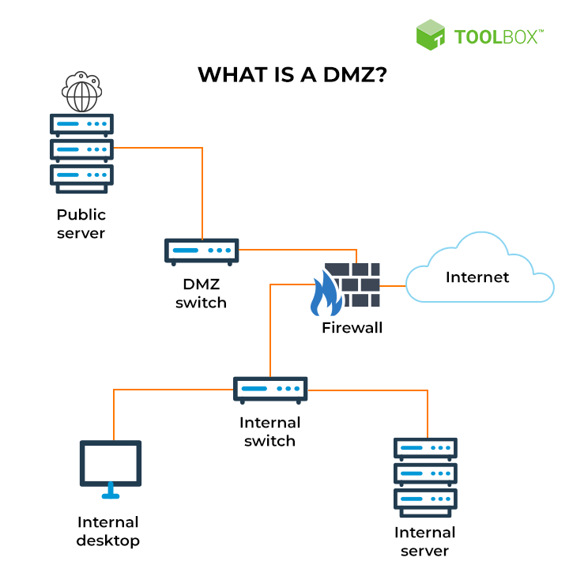

- The most famous network/host security device
- We don't use a firewall to block all traffic!
	- To block all traffic, you have to unplug the cable...
- Firewalls allow/block traffic based on pre-defined rules
- Complexity and depth of these rules and how much a firewall can inspect differs between various types of firewalls
- Lots of evolution since their inception!
	- So much that some vendors now advertise their firewalls as all-in-one security devices

### Firewall types (according to CompTIA)

- **Stateless** aka **packet-filtering**: looks at individual packets, but not at their context
	- Does not maintain a certain state
	- These are mostly a thing of the past as they don't scale well at all
- **Stateful**: keeps track of connections by looking at the source and destination port
	- A host on our LAN can access a resource on the internet, which means that traffic from LAN to the internet is allowed
	- But whenever a connection is initiated, the stateful firewall creates another rule and permit traffic **from** the resource being accessed **to** the host trying to access it, with the specific IP and port on that host
	- The stateful firewall knows the connection is initiated from the "inside" while the response comes from the "outside" and acts accordingly
	- In other words, the stateful FW keeps track of the whole context of every connection
	- Dynamic rules - but how does the FW know whether the response will come back and how long it'll take to do so? How long should the rule last for?
		- To determine this, the FW looks at layer 4 information and the 3-way handshake
		- The stateful connection within the FW is created as soon as the first SYN is sent to the outbound destination
		- The dynamic rule is alive for as long as the established TCP connection is alive
		- It'll wait for a FIN or a RST packet (or for the connection to time out for whatever reason) and then nuke the connection
	- These are built into routers as well
- **UTM (Unified Threat Management)**: stateful firewall functionality combined with other security functionality such as IDPS, AV, URL filtering (reputational or rule-based), sometimes even anti-spam and DLP
	- More of a marketing term rather than a technology
	- Usually when you buy a FW nowadays, you get some other stuff on top of it, so technically it's a UTM solution. 
	- No one makes pure FW's anymore - for an improved security posture in our day and age, you need stronger, smarter, and more diverse solutions, so companies try to provide them
- **Proxy firewall**: also not really a dedicated device, implemented as additional functionality on top of FW/UTM for specific applications 
	- Works as a kind of man-in-the-middle: terminates a connection in the firewall and initiates another connection, which then goes out to the interwebs and heads for the destination
	- This connection breakage allows the FW to look at the request in a lot of detail, sanitize it if needed, throw an alert if something weird is there like an unknown protocol or a prohibited destination, etc.
	- The response from the destination will also be proxied (connection is broken once again) to be inspected and also cached for later, therefore improving overall performance
- **NGFW (Next-Generation Firewall)**: combines stateful FW functionality with application-level security, looking inside application-level traffic
	- Also a marketing term - what's the generation after gonna be called?
	- Determines the content of the HTTP request and exactly what's returned with the response (payload, files, etc.); or what actual operations were performed on the FTP server; or what domains we're requesting via DNS
	- Application-aware - not just where you're going, but what you're doing there
	- Very granular - we can allow access to YouTube, but deny access to the comment section
	- Advanced mechanisms to fight APT's, some relying on ML; access to live reputation and threat feeds. An NGFW can therefore check the reputation of a resource you're trying to access and deny it if it's bad - down to certain elements of a web page such as links!
- Again, most firewalls available for purchase these days provide some type of combined functionality

# Firewall usage

### How do we incorporate a FW in the network?

- We can't just focus solely on perimeter security - there are lots of advanced threats out there
- The placement of the firewall really matters
- Think of it in terms of zones:
	- Internal (your LAN)
	- Outside (interwebs, where all the bad things live)
	- The DMZ (where everything publicly accessible and exposed to the interwebs resides: your web/email/DNS servers, VPN endpoints)
		- This allows the admin to create custom security rules to provide limited external access to only those parts of the network that need that external access
- There are two types of designs for this setup:

1. 

2. 

- The first one uses one FW through which the traffic to the DMZ and the intranet are routed
- The second one puts a firewall between the internet and the DMZ and another one between the DMZ and the intranet
	- But the trick about it is that these two firewalls will likely still be implemented as a single **physical** device - otherwise it becomes quite inefficient
	- The two separate firewalls inside are logical, meaning they're virtual contexts/domains, or virtualized instances of the same FW software running on the same box
		- Yes, we can have multiple FW's running on the same device as VM's or containers, and FW instances can be dedicated to specific services: one for VPN, one for managing DMZ policies, etc. It's pretty awesome!

### FW rules! 

- A FW rules.
- A FW *has* rules.
- These are called ACL's: Access Control Lists
- What type of traffic do we allow? What do we deny?
- An ACL is a list of entry, where every entry describes:
	- The type of traffic
	- An action to take when that type of traffic is detected by the FW

##### ACL filtering criteria
- By IP address - layer 3
	- Filter for a specific subnet, VLAN, internet source/destination
	- Also, deny illegitimate IP addresses on this level. For instance, we do not need to be receiving internet traffic from private IP addresses, or multicast traffic if there's no multicast on our network, or loopback traffic. All these (called "bogons") are used in attacks that involve IP spoofing. Read: [Bogon filtering](https://en.wikipedia.org/wiki/Bogon_filtering)
- By protocol - for instance, denying protocols from the outside that only belong to the internal network. We don't need DHCP, STP, or SMB traffic coming from out there
- By network application - FW needs application-level visibility, so that it can tell the difference between traffic from different apps that run on the same protocol or the same port
- By specific types of protocol fields such as flags or fragments. These can be part of exploits and they're often involved in FW evasion attempts

##### ACL actions
- Allow/accept - green light, go ahead
- Deny/reject - you shall not pass (sends a TCP RST or ICMP "unreachable")
	- This gives away info to the attacker, though - denied traffic means there's a security policy in place
- Drop - do nothing
	- Much less information from a port scan, but creates difficulties in terms of troubleshooting since you do need more information for that

### Implicit deny

- In general, this is what ACL's are based on
- Unless a certain type of traffic is explicitly allowed in the ACL, it is denied
- This is a whitelist type of approach
- Usually on the bottom of an ACL as rules are executed from top to bottom

### Applying FW rules

- In what direction do we apply an ACL?
	- Inbound aka **ingress filtering** - traffic that is about to enter the high-security area of the network
	- Outbound aka **egress filtering** - traffic that is about to leave that area
- Traditionally, we focus on ingress filtering - keeping the nasty stuff out and preventing it from entering our beautiful shiny network
- There are other things to block on the ingress side as well
	- Block incoming requests from internal or private, loopback, and multicast IP addresses
	- Block incoming requests from protocols that should only be used locally (ICMP, DHCP, OSPF, SMB, STP)
	- IPv6 traffic should only be allowed to authorized hosts/ports, or it should be blocked altogether
- With more advanced threats, egress filtering has become important also
	- What if malware has somehow entered and it wants to communicate back to the attacker? We have to contain the damage.
	- C2 comes to mind
- Other applications for egress filtering:
	- Also blocks access to malware sites (though it's not the only place we can do it)
	- Block domains/IP addresses based on reputation, which can rely on live feeds with this info
	- Block restricted locations on the internet that shouldn't be accessed from work (Phub, file sharing services, the local dispensary's website)
	- Block outside access from high-security networks - for any subnets/hosts that should not be facing the interwebs
		- ICS/SCADA airgapping

### Firewalking

- From an attacker's POV, a firewall is a barrier - but it lets some traffic in
- They can try and determine exactly what traffic is allowed
- Firewalking is a set of techniques for "testing" FW rules while mapping them from the outside and looking for "unpatched holes"
	- Hit the FW with various types of traffic, see what comes back
	- Relies on various things such as TCP flags, TTL (can be used to locate forwarded ports and/or additional devices behind the firewall), fragmentation, etc.
		- For TTL, an attacker can set it to a specific value to see when the packet is dropped (**EXAM**: ICMP informs the sender when TTL reaches 0 with the "Time Exceeded" message, which is number 11) - this can be helpful in mapping what's happening behind the FW
		- For instance, TTL 1 is the firewall and TTL 0 is something behind it - getting a "Time Exceeded" message means the attacker found a hole
		- These ICMP messages are very often neglected by admins

---

### Exam

Be able to discuss firewalls, their purpose, usage and ways of deployment. Know all types and how they're different, know how rules/ACL's work, and what implicit deny is.