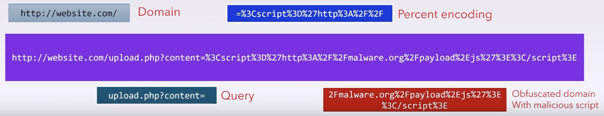

- A lot of apps are web apps, accessed through URLs
- We can look at URLs from two different standpoints:
	- As a company owner or anyone with some web presence, your website presents a certain attack surface, and part of that attack surface is the URL, which leads legitimate users and attackers to your publicly facing web server.
		- Bottom line: make sure your URLs can't be messed with. Analysis helps securing them
	- As a security practitioner, analysing URLs is useful when you're thinking about securing your on-prem network. The users on that network are connecting to the outside world, accessing remote locations identified by URLs. Identifying those locations that are malicious before users get a chance to access those locations is a great way to avoid getting successfully attacked (and the attacker only needs to be right once). 
		- Bottom line: make sure your users can't (or don't) mess with bad URLs. Analysis helps identifying them
- Another thing to remember is that malware relies on URLs for C2 traffic
	- Newer malware can rely on auto-generated URLs to bypass static IP/domain filtering rules that would block such traffic. Analysis is required here as well!

>**DGA**

**Domain Generation Algorithms**

This is a way of getting around static IP/domain blacklists through generating custom domain names, associating them with IP addresses, and registering them with dynamic DNS servers so they can reach their respective C2 centers at a different address every single time. These are known as "one-time domains". Scary stuff!

### More on DGA's

- [More details on Wikipedia](https://en.wikipedia.org/wiki/Domain_generation_algorithm)
- DGA's are much harder to identify - completely undetectable using static domain blacklists
- Malware code and attacker's C2 station run the same DGA algo
	- Dynamic DNS server is configured using providers that don't ask too many questions
- Communication takes place via these randomly generated domain names, which change at regular periods of time or based on some type of counter
- Domain names contain random characters, which makes them easier to identify, or they can use dictionaries for random combinations of words
- Domain can change on **each communication attempt**
	- And it can be combined with continuously changing IP addresses
	- Known as a "fast flux network" - it constantly changes its IP addressing scheme
- More on fast flux (not exam though)
	- **Single flux** continuously registers addresses as part of the A record for a DNS entry
		- Can help disguise malicious systems by leveraging the very short TTL for records and a round-robin DNS that points to different systems as the record is called
	- **Double flux** is more complex, but uses a similar technique to register and de-register DNS servers for the DNS zone, adding another layer of confusion when attempting to pin down malicious systems
	- Commonly used as part of botnets

### DGA mitigation

- Maybe the algorithm the hacker is using isn't that good? 
	- A "bad" algorithm has predictable patterns and sequences, resulting in too many domain names that basically can't be pronounced
	- DG may not sync that quickly, producing a lot of NXDOMAIN errors (non-existing domains) - but this isn't foolproof because this is generally a common error
- Blacklisting dynamic DNS domains with a bad reputation
- Whitelisting allowed domains - but good luck with that because you probably can't find and list every specific destination for this list without making a few "enemies" in your company
	- Some friendly folks at Cisco went into all the trouble so you don't have to, and created a free list of 1 million most popular "good" domains, known as the Cisco Umbrella 1 Million. It can be downloaded as a CSV or as a plugin for security orchestrators
	- Also there are DNS reputation check services such as [IPVoid](https://www.ipvoid.com/dns-reputation/) or [Cisco Talos IP & Domain Reputation Center](https://talosintelligence.com/reputation_center/)
	- Can whitelisting and reputation checks be automated? Hmmm...

---

# URL analysis

- URLs don't just contain the domain/resource you're trying to access
- They also encode data that can be submitted from the client to the web server
	- And it can potentially be malicious!

### URL components

- Domain
- Resource path (after the TLD and the slash)
- Resource information via a query string (after the `?`)
- Sometimes a URL can contain a `#`, which points a browser to a specific location on the page. These can also be abused

- In the example above, in addition to all the good things, we have an attempt at RFI from a malicious domain using an encoded path

### Sandbox URL analysis

- Analysis that happens before you try to access the URL
- Don't touch the URL, don't send a request to it, just find out everything you can by looking at it
- Resolve percent encoding - Cyberchef can help
- Check for redirects - can it bring the user to a completely different web resource?
- Assemble any scripts that may be included in the URL, check the code
- Run a reputation check
- DNS TTL - the time that the DNS server should keep the record of a specific domain or DNS entry in its cache. Expressed in seconds. Once it runs out, the request has to be made again. 
	- When it's short, it may be suspicious - small TTL means the domain name or IP address can change frequently
	- And it is short for dynamic DNS servers, which are not necessarily bad per se, so DNS TTL Is a secondary metric, not a primary one

### The HTTP protocol

- Client-server, ports 80 and 443 (for HTTPS)
- Request-based: HTTP method, resource (URL), headers, body
- Methods: GET, POST, PUT, DELETE, HEAD - last three are not needed for most purposes
- The response, when successful, displays a web page, which is basically a set of files that come back from the server
- Behind the response, there is a response code: 200 for OK, 3xx for redirects and other related things, 4xx for client errors (the famous 404), 5xx for server errors
- **Know this basic stuff for the exam**

### Percent encoding

- We can submit anything, even binary data (executable files, no less), to the server via the URL
- It can all be submitted using **percent encoding** within the URL (also referred to as URL encoding)
- Use cases:
	- URL obfuscation - most users won't know what all those percent signs mean
	- Script embedding - again, if you send a link like this to an average user, they likely won't suspect anything
	- Decoding exploits on the server side if there's a corresponding vulnerability; i.e. the vulnerability is in the server's decoding process. For instance, a server may not manage memory properly, so it's not impossible to craft a BOF exploit using just the URL
	- Recursive re-encoding - running multiple iterations of encoding something in the URL
- Good characters: `a-z A-Z 0-9 - . _ ~`
- Reserved characters: `/ ? # [ ] @ ! $ & ' ( ) * + , ; =`
- Unsafe characters: whitespace and `\ < > { }`
	- At the minimum, those should always be sanitized out of the requested URL on the server side
- References:
	- [W3C](https://www.w3schools.com/tags/ref_urlencode.asp)
	- [Wikipedia](https://en.wikipedia.org/wiki/URL_encoding)

---

### Exam

Be able to discuss various aspects of URL analysis. Know the concepts behind DGA's, what components there are in a URL, be familiar with details about the HTTP protocol, recognize and be able to decode percent encoding, in your head. Just kidding.