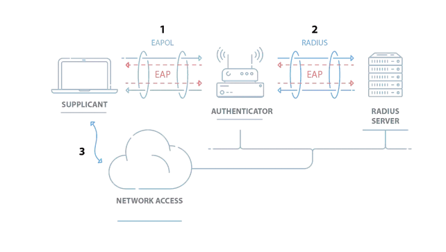

- You do lock your door when you leave your house, right?
- NAC is the same concept - except for a network
- It's a broad topic, with many vendors providing many ways of implementing it
- Sometimes referred to as NAP (Network Access Prevention) or **port security**, which was coined by Cisco and is used for their switches
- Security measures below are aimed at preventing **rogue devices** - but also many other bad things

### Network device best security practices

- Use ACL's to restrict access to designated host devices (limited number of laptops/desktops that can access network device management areas, access only from certain places)
- Monitor how many designated interfaces you have, limit that number
- No internet access to remote management - either via LAN, or remotely through VPN

### Physical security

- Port security is about the physical security of your network
	- Deciding whether someone plugging a cable to your ethernet port can actually use the network
- A simple fact that's often overlooked is that a malicious actor can theoretically plug in to one of your ports, and all of your fancy security measures will be worth zilch 
- Implement these fairly basic controls:
	- Locks on cabinets, server rooms, data rooms, anything with an Ethernet port that's not meant to be public
	- Apply least function to your ports, disable unused ones - but this does NOT substitute physical controls! If an attacker can get in there, they'll simply unplug an existing link and plug their own.
	- Protect cable runs - or at least don't leave them exposed

### Technical security

- Controls you can apply logically
- Pre-admission and post-admission access control (checking systems before or after connecting to network)
- Port security, **MAC filtering**: which MAC addresses are allowed to send traffic on each switch port?
	- Simple, but not highly secure as MAC addresses can be spoofed pretty much by anyone; there's also a lot of administrative overhead here
- NAC / NAP / **802.1X** / **port-based authentication**
	- A protocol that is meant to provide authentication for users AND devices
	- Port-based authentication means that a device trying to connect to a switch or a wireless AP will be asked by the said switch/AP for some authentication credentials before allowing the user to send traffic on that port

### More on 802.1X

- This protocol introduces the following entities:
	- **Supplicant**: the user (the requester, the one who asks for access)
	- **Authenticator**: the network access device (switch, WAP, VPN endpoint)
	- **Authentication server**: the server that processes the supplicant's authentication credentials. This is usually a RADIUS server
- This relies on the **EAPoL** (EAP over LAN) protocol, which allows for a variety of authentication methods
- By default, 802.1X accepts only EAPoL traffic between the user and the authentication device until the user has authenticated for full network use
	- Some management traffic (ICMP, STP) is also allowed, but that's it
- [Some great info about 802.1X and its process](https://www.securew2.com/blog/complete-guide-to-ios-802-1x)

0. HTTP (or any other) traffic isn't accepted by the authenticator just yet - the supplicant must authenticate first
1. Supplicant (aka user) sends valid credentials to the authenticator using EAPoL
2. The authenticator doesn't know if the creds are valid or not since the switch doesn't store that data - so it forwards the creds to the AAA server via RADIUS, encrypted
3. The AAA server validates the creds against whatever directory service is in use: LDAP, AD/Kerberos, etc.
4. AAA server replies back to the authenticator via RADIUS and says whether the user is allowed in or not
5. If everything is okay, the user is informed by the authenticator that authentication is successful
	- And if it isn't, the port is configured to continue blocking all traffic from the user. Additional attempts may or may not be allowed, depending on configuration. EAPoL is still allowed, but in accordance with the overall security policy (which contains account lockouts and so forth)
6. All traffic is now permitted through a specific port on the switch to which the supplicant is connected to. The port is configured with a customized access list according to the result of the authentication process. The user is recognized and given access to whatever resources they are authorized to use (a certain VLAN, for instance), and a specific security policy is applied to that user, all through that port.
7. The switch now accepts all traffic from the user and forwards it to its proper destination.

- Note that credentials in this context are not limited to just username and password
- EAP (Extensible Authentication Protocol) is a wrapper - it encapsulates a whole bunch of different authentication methods
	- Usernames and passwords
	- MFA
	- Certificates
	- Even a SIM card in your phone (EAP-SIM)

### Additional checks

- We can use the 802.1X flow to implement additional security policies and perform extra checks:
	- Health check & posture validation
	- Is it a company device or a personal one?
	- OS patch level - is it up to date?
	- Same for all software that needs to run for work purposes
	- Antivirus installed and up to date?
	- Membership: which AD group do you belong to, if applicable? Which subnet are you supposed to connect to?
	- Location - where are you connecting from? This can be based on the network type (public or private), GeoIP, sometimes GPS
	- Time of day, correlated with location (check for impossible travel time)
- For some internal checks, we need to use an agent, which will report back to the "control center" with the status of the device that's trying to get access
- Remediation options for when checks are not passed:
	- Deny access, allow further attempts (how many? how soon?)
	- Place a partially failed device in a restricted VLAN (a "quarantine zone") for remediation procedures such as updates
- Never a bad idea to run these checks regularly and not trust a device that has once authenticated for too long (trust but verify)
- Example: [Cisco AnyConnect](https://www.cisco.com/c/en/us/td/docs/security/vpn_client/anyconnect/anyconnect40/administration/guide/b_AnyConnect_Administrator_Guide_4-0/configure-posture.html) - assesses an endpoint's security posture compliance after a user is validated

--- 

### Exam

Know what port security/NAC/NAP are, be familiar with the 802.1X workflow (and the roles of the three entities) and how EAPoL fits in, remember about physical port security and all its aspects. Be able to provide examples of posture validation methods.

---

### GPT explains: NAC vs ACL

**Network Access Control (NAC)** and **Access Control Lists (ACL)** are two security measures that help regulate who or what can access networks and resources within those networks. While they share some similarities, they serve distinct functions and are applied in different contexts.

**NAC - Network Access Control:**

Network Access Control is a comprehensive solution that enforces policy on a network to prevent unauthorized access. NAC controls access to the network by not allowing devices to join unless they meet predefined security rules or policies. These rules can involve the status of antivirus software, system updates, and many other parameters.

*Use Cases for NAC:*

- Controlling access to a network based on the device's compliance with security policies.
- Enforcing policies such as requiring up-to-date antivirus software, system patches, and other security measures on a device before it can access the network.
- Managing guest access to a network. For example, a company may want to allow visitors to access the internet but not internal resources.

**ACL - Access Control List:**

An Access Control List is a table that an operating system or network device uses to control access. It contains a list of permissions associated with a specific object, such as a file or network router. Each entry in an ACL specifies a subject and an operation. For instance, it might allow one IP address to access another IP address using a specific protocol.

*Use Cases for ACL:*

- Regulating which users or devices can access a specific network resource.
- Controlling traffic flow on a network. For example, an ACL on a router might be used to prevent traffic from certain IP addresses from reaching certain network segments.
- Securing sensitive files or resources by specifying which users or processes can access them.

**Comparison:**

While both NAC and ACL control access, NAC is primarily used for determining whether devices can join a network based on their compliance with security policies, while ACLs are used to control what a device or user can do once they have accessed a network or system.

For instance, a NAC solution might prevent a device with outdated antivirus software from joining a network, while an ACL might prevent a user on the network from accessing a specific file or server. Hence, NAC can be thought of as a first line of defense (controlling "network admission"), while ACLs provide more granular control over resources ("access control").

#### Example scenario

Acme, Inc. allows its visiting business partners from CompTIA to use an available Ethernet port in their conference room to establish a VPN connection back to the CompTIA internal network. The CompTIA employees should obtain internet access from the *Ethernet port* in the conference room, but nowhere else in the building. Additionally, if any of the Acme employees use the same Ethernet port in the conference room, they should access Acme's secure internal network. Which of the following technologies would allow you to configure this port and support both requirements? (NAC, ACL, a couple others.)

NAC is the answer here, not ACL. NAC uses a set of protocols to define and implement a policy that describes how to secure access to network nodes whenever a device initially attempts to access the network. NAC can utilize an automatic remediation process by fixing non-compliant hosts before allowing network access. Network Access Control can control access to a network with policies, including pre-admission endpoint security policy checks and post-admission controls over where users and devices can go on a network and what they can do. In this scenario, implementing NAC can identify which machines are known and trusted Acme assets and provide them with access to the secure internal network. NAC could also determine unknown machines (assumed to be those of CompTIA employees) and provide them with direct internet access only by placing them onto a guest network or VLAN.

