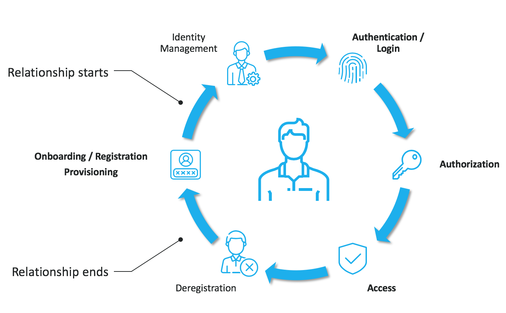
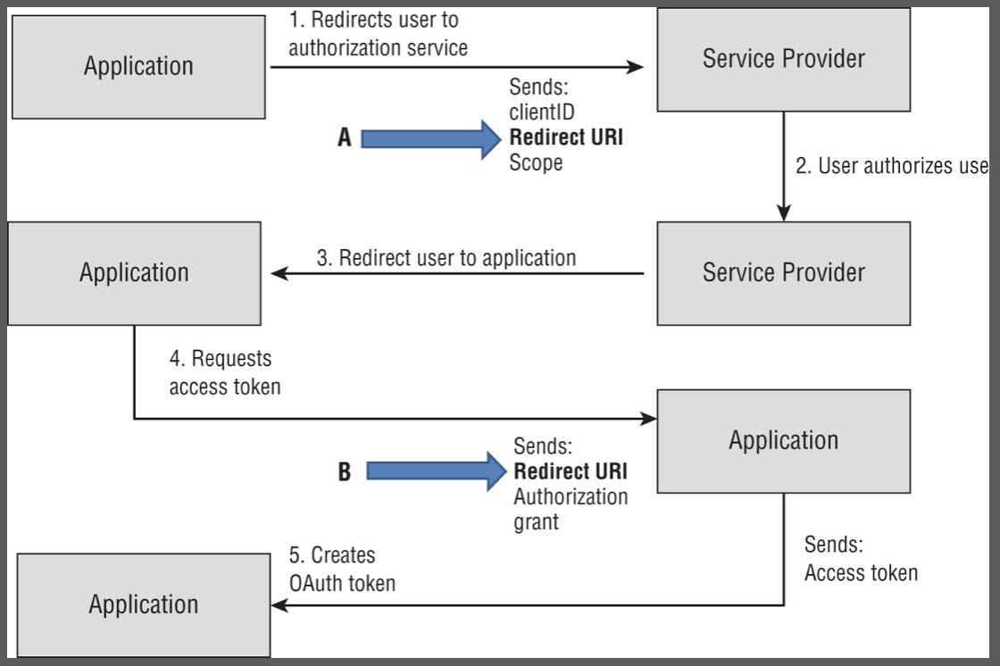

- Every org has a lot of applications, VMs, internal services, cloud services. There are also a lot of users, and each one needs to have permissions assigned
- How do we keep track of all this in an organized fashion?
- The answer is **IAM: Identity and Access Management**

### What it is

- An identity is a collection of user information, creds, rights, roles, group memberships, and other attributes. An identity is one of the most critical assets in any org
- It's a set of claims made about an individual for another party to consider
- IAM is a framework that basically creates order out of the huge mess of user accounts, devices, and permissions inside of an org
- IAM also enables workflows: how do we add new users? How do we offboard them? How do we audit them? 
- Applies to on-prem and cloud environments, and IAM is especially important for cloud environments because even more precision and granularity of control is needed

### Account types

- Not all accounts are born equal! 
- **User accounts**
	- Personnel accounts
	- They're the most risky - regular users can be pretty careless with their credentials/permissions
- **Endpoint accounts**
	- Devices on the network
	- Can be managed through MAC addresses, but in an environment with a lot of devices (including personal) and a low risk appetite, a better idea is to use certificates for devices. This means a lot of administrative overhead, though
- **Server accounts**
	- Especially mission-critical ones
	- Need certificates to prove that users and other devices can trust them
-  **Software accounts**
	- Can be identified by digital certs - these prove that the software comes from a legitimate vendor; certs also uniquely identify each software component
	- This is a good solution when you need a more strict control over what apps your users can install and run
	- Code signing - this is why the OS will occasionally ask the user whether they want to continue with the installation of a piece of software as its legitimacy can't be established (no cert)
- **Roles**
	- Identities, sets of permissions that apply to multiple assets
	- Instead of assigning it to an individual user or app, we can define a role that characterizes what a group of users/apps should be allowed to do
		- Apply permissions to the role, then assign it to entities

### IAM system responsibilities

- Store and keep track of accounts
- Onboarding and offboarding (creating and disabling/deleting accounts)
	- Applies to people who have a digital identity in the org
- Day-to-day management tasks
	- Password resets, support tickets, cert renewals, updating permissions and group memberships
	- Auditing - the IAM system has to keep track of who does what, especially for privileged users as they have a lot of power
- Scanning for threats - ideally
	- Mainly identity-based threats
		- Compromise
		- Account sharing
		- Weak passwords
		- Brute force attempts
- Maintaining compliance - especially with regulations that have to do with personal data

### Two big problems

- These are the two problematic account types:
	- `root`/Administrator users - lots of privileges (you could even say it's too many)
		- Keep an eye on these, log everything they do
		- Great power, great responsibility
	- Shared accounts
		- Whether it's guest accounts used by more than 1 person or a "let me just use your employee account real quick" type of situation
		- No identity to speak of, accounting is not possible - no way to tie a specific person to actions performed with a shared account
			- Loss of non-repudiation as well
		- Just don't allow these

### Password policies

- A password policy is a guideline that tells users how to protect their credentials
- Account and password compromise is one of the most widely used attack vectors
	- Users can be careless not only about how they choose their passwords, but also how they store them
- These policies regulate password length, complexity, expiration
- [NIST SP 800-63B: Digital Identity Guidelines](https://nvlpubs.nist.gov/nistpubs/SpecialPublications/NIST.SP.800-63b.pdf) - actually advises against some of the more common password policies
	- Complexity restrictions: users should be able to use any character, and it's a poor security practice to list what characters are allowed because it helps attackers narrow it down
	- Password expiration: users should decide for themselves how often to change their passwords. Making password changes mandatory leads to poor security practices regarding complexity/entropy (i.e. most people will change from password123 to password1234 as a very rough example)
	- No more password hints or security questions - these help attackers more than they help users
		- [Anatomy of a password disaster](https://nakedsecurity.sophos.com/2013/11/04/anatomy-of-a-password-disaster-adobes-giant-sized-cryptographic-blunder/) - an article about the huge Adobe breach that happened because of password hints
- Password policies can be enforced by the OS - we don't have to rely solely on the users
	- Group policies and such
	- Does not protect from password reuse and poor complexity
- Some things can't be enforced - so do a good job *recommending* those things
	- Aspects such as password reuse and using password managers can only be driven home with proper user awareness training

### Mitigating password reuse

- One person can have hundreds of online accounts
- Managing them is difficult, remembering a separate password for each is impossible
- Most people would therefore reuse passwords - it's a very logical and natural thing to do, unfortunately
	- Or use very similar passwords
- There are technologies that can help with this
- **SSO**: authenticate once, gain broad access to many resources
	- Seen in Windows domain settings (AD) - Kerberos. Once the user is authenticated inside of the domain, they can access everything they're authorized for
	- Pro: one password to remember, very convenient
	- Con: it's just one password, and passwords are inherently insecure. Convenience reduces security
- **MFA**: not just a user/pass pair, but also a key card, a certificate, a retina scan, gait analysis, and so on. 
	- An extra layer of security on top of your (supposedly strong) password. Relies on at least two of the following factors:
		- Something you know
		- Something you have
		- Something you are
		- Something you can do
		- Someone you know
		- Where you are
		- Behaviour analysis (happens after authentication as well) - is the user breaking their routine in any way? Time of day, location, device, user-agent, etc.
	- A password and a PIN is not MFA - make sure you choose from different factor categories

### Privilege management and access control

- Privileges are tied to the authorization function
- Now that we know who you are, what exactly are you allowed to do?
- Policies that describe technical controls that enforce what an account can do
	- **Least privilege**: a user shouldn't be able to do or access anything outside of what they need to do their work
	- **Separation of duties**: balancing responsibilities against the risk of insider threats; not giving too much power to a single person to perform a certain task, but rather splitting the task between two people
		- Lower chance that someone may act out of malicious intent

##### Implementations of access control
- **DAC - Discretionary Access Control**
	- Implemented on most operating systems
	- The creator of a resource is its initial owner
	- The owner can assign access to others **at the owner's discretion**
	- Read/write/execute permissions for files/folders/drives/etc.
	- Downside: centralized permission management becomes very difficult to implement
		- Separation of duties is also difficult to implement as it can be bypassed by the owner
- **MAC - Mandatory Access Control**
	- **Non-discretionary** - enforced by the system
	- Focuses on clearance levels and labels 
	- Each object receives a clearance level - and it can only be accessed by a user at or above that level
	- **Confidential < Secret < Top Secret**
	- Compartments can be used as well: subjects can only access objects within their respective compartment
	- Widely used in the military because it's centrally managed and because everything follows the chain of command
	- Examples: SELinux, AppArmor implement MAC on Linux systems
- **RBAC - Role-Based Access Control**
	- Discretion from DAC is transferred to the admins
	- Privileges are assigned for groups based on users' roles
	- Members of a group automatically inherit all appropriate privileges
	- Group memberships are governed by admins and cannot be changed by regular users
	- Example: group membership on Windows/Linux
	- RBAC permissions overwrite individual permissions!
- **ABAC - Attribute-Based Access Control**
	- The most granular type of access control
	- Based on multiple subject and object attributes, or compiled sets of attributes
	- Example: ABAC can be implemented in a NGFW that allows access based on **attributes** such as IP address, what kind of user you are, which group you belong to, your geolocation, the protocol you're using, and your user-agent type
- **Rule-based AC** (we do not know the abbreviation for this ;-)
	- Uses a set of rules implemented by an admin
	- ACL's are associated with each object
	- Rules are checked against the appropriate ACL when access is requested
- **Exam**: DAC and rule-based AC are not mentioned, but it's worth knowing them

### Directory services and federation

- So how do we organize all this info? Users, identities, permissions, etc.
- **Directory services**
	- Basically an IAM database 
	- AD stores information about objects and manages authentication and authorization by looking at users, their rules, and any policies that may be in place, and giving a yes/no verdict when a user tries to authenticate and access something
	- Can be queried (it's a AAA database after all)
	- Protocols are usually RADIUS, TACACS+, LDAP, Kerberos
		- TACACS+ has encryption flaws, should only be used on isolated networks
		- RADIUS uses UDP (1645 or 1812 for authentication, 1646 or 1813 for accounting), can use TCP as well; uses client-server model; inherent password security isn't very strong, which is why IPSec or EAP are implemented in addition
		- TACACS+ and RADIUS are designed to operate on trusted networks, Kerberos is for untrusted (but has its own weaknesses - see 23)
		- Do not use NTLM in Windows domains - it's outdated and insecure!
	- LDAP hierarchy: DC (Domain Controller) -> OU's (Organizational Units such as HR, sales, security) -> CN's (Common Names, sub-entries under each OU)
	- Others include OpenLDAP, Apache DS, OpenDS, RedHat Directory, OpenDJ
		- OpenLDAP is a fairly common choice, uses Salted SHA (SSHA) for password storage
	- Commercial solutions: Oracle's Internet Directory, Microsoft's AD, IBM's Security Directory Server, CA Directory
	- **Security**:
		- Enabling and requiring TLS for all LDAP communications (LDAP doesn't have security built in); LDAPS is port 389
		- Special attention must be paid to secure password storage
		- Password-based authentication, disabling dangerous LDAP communication modes (anonymous, unauthenticated)
		- LDAP server replication for better availability
		- ACL's for LDAP, limiting access to specific objects and overall rules for how entries are created, modified, and deleted
		- Validate all related user input - [LDAP injection](https://cheatsheetseries.owasp.org/cheatsheets/LDAP_Injection_Prevention_Cheat_Sheet.html) is a common attack!
- **Federation**
	- Extending authentication across more than one company/service via SSO
	- Can interconnect IAM services
	- Used when you have people in one org that needs access to another org's systems, and they need to do it using the same account
		- Using a Windows domain account to access a cloud app
	- **Federation == trust**
	- The trust is mutual between your own domain and an outside service
	- SSO experience is provided based on that trust, without the outside service requiring a copy of your local directory
		- The application we're trying to access is the **Service Provider (SP)** aka **Relying Party (RP)** - we're trying to access a service, and the application provides that service
		- The entity that validates our access based on our SSO credentials is the **Identity Provider (IdP)**
		- The SP has to trust the IdP
	- So federation is pretty much the same as SSO
		- One difference is that with SSO, once the user authenticates, a unique hash will be shared between the two systems as a means to authenticate transparently, i.e. only two parties are involved
		- Whereas with federation, the entire authentication process is handled by the IdP; other systems trust that IdP with handling authentication **on their behalf**
	- Federation caveat: password reset/recovery may no longer be allowed because the IdP, being a 3rd party, doesn't actually know anything about the user's credentials aside from whether they're valid or not. Users and admins have to be aware of this through user training
- **Shared authentication**: similar to SSO, allow an identity to be reused on multiple sites while relying on authentication via a single IdP - the difference is that such systems require a user to enter creds when authenticating to each site (SSO is a single login)
	- Reduces password fatigue
	- Users are informed about what types of data are released to the relying party

### SAML, OAuth, OpenID

- We deal with these every day, for instance when signing into an app using our Google credentials
	- The app we're accessing is the SP
	- Google (or Apple, or FB) is the IdP
- **SAML - Security Assertion Markup Language**
	- XML-based framework
	- Used for exchanging security information: authentication, permissions, attributes
	- Allows SSO and federation
	- Relies on a trust relationship between the SP and the IdP
	- SAML info is communicated based on **assertions**. An assertion is basically a message of a certain type
		- Authentication assertions (used to validate the actual user's identity)
		- Attribute assertions (to provide more info about the user, such as group membership)
		- Authorization assertions (the user's level of access, what they can do)
			- Example: when an app asks you if it can access your profile, post on your behalf, etc.
- **OAuth - Open Authorization**
	- Standard protocol used for delegated **authorization** (it's not about who you are, it's about what you can do)
	- A 3rd-party app (aka the client) accesses resources from a resource server (such as an API) on behalf of a user (aka the resource owner)
	- The user grants the client an access token, which the client can use to request stuff from the resource server
	- The token is issued by an authorization server, which verifies the identity and consent of the user
	- Most recent version: OAuth 2.0, or OAuth2
		- Defines four roles: resource owner, client, resource server, authorization server
		- Defines four grant types: authorization code, implicit, resource owner password credentials, client credentials
		- These are used for different scenarios
- **OpenID Connect**
	- An extention of OAuth2 that adds an identity layer to the authorization framework
	- This is about **authentication**
	- A client can verify the identity of the user and obtain basic profile info
	- User logs into an IdP (such as Google or FB) using OpenID Connect
	- The IdP returns an ID token (which is a JWT) to the client - it contains info about the user such as their name, email, and profile pic
	- The client can request an access token and a refresh token from the IdP to be used to access other resources
- **OAuth2 vs OpenID Connect**
	- The main difference is that OAuth is concerned with authorization and OpenID is **also** concerned with authentication
	- Authorization: granting access to resources
	- Authentication: verifying the identity of a user
	- OAuth does not provide a standard way to obtain user information - OpenID does
	- OAuth relies on access tokens (strings that can only be validated by the resource owner) while OpenID relies on ID tokens which are self-contained and can be validated by the client
	- OAuth is more flexible and can be used for various types of applications - OpenID is more specific and **used for SSO and social logins**
- Once again...
	- ==OpenID and SAML are industry standards for federated authentication, where one account with an IdP can log you into various sites (relying parties)==
	- ==OAuth controls authorization to a protected resource such as an application or a set of files; used by Google/Microsoft/FB to allow users to share elements of their identity while authenticating via the original IdP==
	- ==OAuth can be used simultaneously with OpenID or SAML; OpenID Connect is an authentication layer built using the OAuth protocol==
- Example situations:
	- OAuth 2.0: you've signed up for a new app and agreed to let it automatically source new contacts via Facebook or your phone contacts - this is secure delegated access, i.e. the app takes actions to access resources from a different server on behalf of the user
	- OpenID Connect: you've used your Google account to sign into YouTube, or your Facebook account to sign into an online shopping cart. Google or Facebook serve as IdP's here and access other websites without the need for a dedicated set of creds
	- SAML: you've logged into your company's intranet, and this set of creds allows you to access numerous additional services such as Salesforce, Box, Workday, etc. - without having to authenticate into each. An IdP is also involved here - this is the service where you sign in.
- **This is tricky stuff - study it!**

### ADFS (from Sybex book)

- **Active Directory Federation Services**
- Microsoft's answer to federation
- Authentication and identity info is provided as *claims* to 3rd-party partner sites
- Partner sites use *trust policies* to match claims to those supported by a service
- Those claims are used to make authorization decisions
- Can be used with Azure AD
- [More here](https://learn.microsoft.com/en-us/windows-server/identity/ad-fs/technical-reference/understanding-key-ad-fs-concepts)

### IAM monitoring and logging

- This is about **accounting** (third A in AAA) - logging all user actions
	- When and how they logged in
	- How long was the session
	- What did they access
	- When did they change something
	- etc.
	- Very useful for correlation
	- Needs lots of disk space and time to analyse
- We need to quickly react to unauthorized/compromised accounts and other incidents
- **Exam!** **Manual review**: reviewing accounts and permissions by hand
	- Useful and sometimes necessary as part of access control schemes
	- Can require a significant amount of effort and time
	- Not necessarily error-proof
	- The best bet is to have a combination of manual and automated reviews
- Reviews should be performed periodically and when users change roles/departments, or leave - and when new users arrive
- Privilege creep: when users changing departments and moving up in the company "just so happen to" retain too many privileges - and over time they pretty much attain superuser powers
	- No malicious intent here, just a lack of proper accounting and auditing

---

### Exam

Be able to discuss all aspects of IAM: account types, password policies, federation/SSO, access control models, accounting, etc. Know the difference between OAuth/OpenID/SAML and be able to apply them to given scenarios. As far as SSO, understand the general concept - the objectives don't mention specific technologies, but it's still quite important to understand them.

---

# From the Sybex book

### Identity-based security

- Identity lifecycle - a core concept
- All of the below should be done securely

### Threats to IAM

- IAM threats have to do with a few areas such as threats to underlying AAA systems, account lifecycle, and accounts themselves
- Identity-related attack surface examples:
	- Personnel-based: training and awareness, insider attacks, phishing, social engineering
	- Endpoints have a role in attacks on identities: local exploits for capturing creds, screen capturing, keylogging, attacks on password storage
	- Server-based: targeting systems that run identity services and servers that send identity and authentication data to AAA services
	- Applications and services that interact with identity systems
	- Roles, rights, and permissions associated with users and groups
	- **Exam**: consider identity security issues from each of these viewpoints, think about controls that can be implemented at each point

### AAA systems attacks

- Targeting software via vulns and misconfigurations
- Protocols can be targeted
- DoS attacks on underlying systems

##### LDAP attacks
- Targeting unencrypted LDAP traffic
- Harvesting and modifying directory info through broken access control
- LDAP injection (exploiting web apps that build LDAP queries from user input)
- DoS attacks disrupting authentication services that rely on LDAP
- Mitigation:
	- Careful design and implementation of LDAP systems
	- LDAPS
	- User input validation
	- Redundancy

##### OAuth, OpenID, OpenID Connect
- Attacks based on open redirects (unvalidated redirects and forwards where untrusted user input can be set to the relying web app, which results in users getting redirected to malicious sites)
- OAuth flow for reference:

- Poor session management, reliance on central shared secrets, inadvertent use of plaintext OAuth sessions create attack vectors
- For OpenID, protocol vulnerabilities can be attacked
- OpenID Connect offers some protections for encryption and signing, but they have to be implemented correctly

##### Kerberos
- Admin account attacks
- Pass-the-ticket (impersonation of legitimate users)
- Pass-the-key (reusing a secret key to acquire tickets)
- See 23 for the rest

##### RADIUS
- Session replay of server responses 
- Targeting the shared secret if not secured well
- DoS attacks preventing authentication
- Credential-based attacks, brute-forcing the shared secret if a password is known
- Remediation:
	- Using secure protocols to tunnel RADIUS data: TLS, EAP, IPSec

##### AD
- Malware-based attacks attempting credential capturing
- Credential theft via phishing
- PrivEsc
- Attacks based on service accounts and privilege creep
- Attacking accounts that have admin rights but shouldn't have them, improperly maintained admin accounts
- Attacks against weak protocols in Windows domains: NTLMv1, LANMAN, NetBIOS, unsigned LDAP, SMB

##### Attacks against account creation, provisioning, deprovisioning
- Between creation and disablement, accounts can be attacked: social engineering, phishing, etc.
- Unused accounts are a target
- Improperly deprovisioned accounts
- Privilege creep

### Defense

- Identity is a useful control layer - consider it a security layer in architecture designs
- **Exam**: privesc, impersonation, MitM, session hijacking, rootkits are all mentioned, and IAM techniques can be employed against these attacks:
	- Session management and securing sessions properly to prevent impersonation and session hijacking
	- End-to-end encryption against MitM
	- Patching and proper configurations against privesc
	- User awareness training, MFA against social engineering and account compromise
	- Antimalware, heuristic detection, patching, layered security - all against rootkits, this is tricky stuff
- Adopt a defense-in-depth mindset when thinking about securing IAAA
	- Layered approach
	- Make sure only valid accounts are created (no duplicates, everything should be added to a central management system)
	- Consistent provisioning and rights management, based on roles, least privilege, etc.
	- Track the employee's changes of roles, make sure rights and privileges are adjusted correctly
	- Secure account termination
	- Think about the whole CIA triad. Availability in this case has to do with making sure centralized IAM systems being redundant
- Centralized authentication and authorization management, combined with logging and auditing, to prevent and detect attacks
- SIEM: behavioural analysis, policy-based monitoring

### IDaaS

- Identity as a Service
- Cloud-hosted services providing such functionality as
	- Identity lifecycle management (creation, provisioning, privilege management, termination) for systems, services, other cloud services
	- Directory services (LDAP, AD, etc.)
	- Access management (authentication, authorization)
	- SSO support via SAML, OAuth, etc.
	- Privileged account management
	- Reporting and auditing for oversight