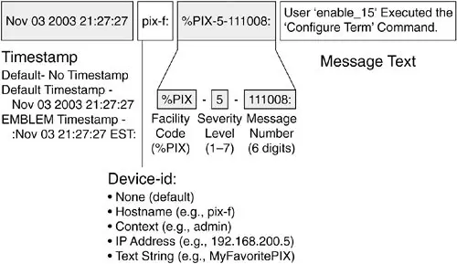

- Logs are super important, quite obviously, and we have to be aware of all systems that generate them in our environment

### Event logs

- Generated by OS's when a variety of things happen
- There are a few categories of event logs
- Windows event categories: 
	- Application: generated by apps and services, e.g. when a service can't start, or it crashes, or there are related errors
	- Security: events that deal with authentication, privileged access, login attempts, etc.
	- System: events that have to do with OS internals, device components, drivers, hardware errors/failures, etc.
	- Setup: events generated as a result of installing something 
	- Forwarded: events that don't have to do with the system in question but come from a different system
- Windows alert severity:
	- Information: just an FYI, a process completed successfully, etc.
	- Warning: events that may cause concern but are not an emergency
	- Error: important problems, worth looking into right away
	- Audit success or failure: security only, user or device passed or failed a security policy such as a login attempt
- Linux logs:
	- Stored by default in `/var/log`
	- Distros with `systemd` use `journalctl` for log access - they're stored in binary format
- MacOS logs:
	- "Console" app - just an interface to view logs
	- Also text logs, just like Linux
- So how do we use this info?
- **Log analysis** is what happens now, with the following aspects:
	- **Correlating** different events, connecting the dots, getting the bigger picture
	- Looking for **config changes**. Asking questions from the standpoint of change management. Was this supposed to happen? Did we expect this? 
	- Looking at the **timeline**. Any gaps? Missing logs can be an IOC. Attacks usually unfold over the course of at least minutes if not hours, so if an attacker cleaned up after themselves, it'll be obvious, especially if logs are generated multiple times a minute or even a second
	- **Trend analysis**: how do certain stats change? Any deviations from our systems' baselines?

### Syslog

- Old but real useful! 
- **UDP 514** - no acknowledgement of transmission
- Works with pretty much any network device out there
- Designed to work in a client-server environment
	- Client generates log data, packages it, sends it to a log collection device over the network
- Standard for logging in data center hardware
- Cross-platform, although mostly designed for Linux systems, so doesn't come packaged with Windows (possible to install tho)
- Big surprise: doesn't have security built in
- Newer versions add security and work on TCP (1468)
	- TLS for confidentiality, MD5/SHA for integrity
- Great for **archiving logs** (including archiving logs offsite - **exam!!**)
- Makes it more difficult for the attacker to cover their traces since all logs are sent off elsewhere
- Syslog entry structure:
	- Header: timestamp, IP address the entry came from
	- Facility: entity that created the entry (kernel, email service, etc.)
		- 0-23
		- Not standardized for all vendors
	- Severity:
		- 0-7, worst to best
		- 0 is emergency
		- 7 is debug
	- Message: what happened, using words



### Firewall logs

- Often the most important type of log
- Firewalls track all connections: who's sending, who's receiving, what are the protocols/ports, etc. 
- If the FW is configured with NAT, the FW can tell us which internal devices are involved in a security incident because we can pinpoint the actual IP address
- Log traffic permitted or dropped
- Offer statistics as well: how much traffic goes through the network (inbound and outbound), top protocols used, address translation logs for tracing internal hosts, number of protocol anomalies, layer 7 info if it's an NGFW solution
- Centralized storage of logs is highly recommended (plus backups and such)
- Not everybody uses the same logging format
- Sometimes OS's or appliances don't generate logs by default - has to be enabled

### Proxy logs

- Usually web traffic and related connections (HTTP)
- Two types of proxies
- Collecting logs from both types is very important for security purposes

##### Forward proxies
- Used for outbound traffic, help identify traffic destinations
- What websites the users are accessing, what are the contents of requests and replies
- Able to identify malicious traffic, if any (usually C2 since it's outbound)
- User's HTTP request is intercepted and checked, useful when traffic must comply with strict security policies
- Two subtypes:
	- Transparent: able to catch traffic without any configuration on the client side
	- Non-transparent: client must be configured with the proxy's address
- Look for:
	- Target host IP, hostname, what was requested
	- Amount of content requested - might help indicate a compromise or match a known malicious package
	- HTTP request method and payload
	- Unusual user-agents and protocol versions to identify apps, malware, other targets

##### Reverse proxies
- Used for inbound traffic, listen for requests coming from the outside, intercept them and forward them to an internal server in our network
- Usually sold and marketed as load balancers because they usually operate with a cluster of servers for a specific website/app
- Look for malicious requests, possible to detect DoS

### WAF logs

- A WAF scans application-level web requests for intrusion attempts ("normal" firewalls look at TCP/IP traffic)
- Logs suspicious or malicious attempts for:
	- Malformed inputs
	- SQLi
	- BOF
	- Brute force logins (or too many login attempts)
	- XML/JSON/script injection
	- XSS, CSRF
	- ...and more - signatures exist for pretty much any attack since the scope is limited to the web app and technologies it uses

### IDS/IPS logs

- An IDPS uses pre-defined rules to match suspicious traffic, basically an analysis engine
- Placed behind the firewall, so anything that has already been ok'd by the FW
- Look for signatures that might indicate an attack: malformed packet headers, BOFs, abnormal sequences of packets, etc.
- No longer a dedicated device or piece of software these days, usually packaged with all-in-one solutions like NGFW or UTM
- Can generate a lot of logs! Especially IDS since it can only throw alerts
- Rule tweaking is required - IDS/IPS needs to know what's acceptable
- "IPS without eyes is useless" - someone has to monitor this type of system
- Alerts usually ingested by a SIEM
- **Snort** is a very well-known IDS/IPS solution, its engine often embedded in commercial IPS sollutions
	- Others are Zeek and Security Onion
- Be able to identify a Snort rule, here's an example signature:

```python
alert tcp $EXTERNAL_NET any -> $HOME_NET143 (msg: "PROTOCOL-IMAP logon brute force attempt"; flow: to_server,established,no_stream; content: "LOGON"; fast_pattern: only; detection_filter: track by_dst, count 30, seconds 30; metadata: ruleset community, service imap; reference: url, attack.mitre.org/techniques/T1110; classtype: suspicious-logon; sid: 2273; rev: 12;)
```

- What's happening here:
	- Designed to detect IMAP brute force attempts 
	- `"LOGON"` keyword is matched
	- Detection is tracked by specific destination, i.e. matches all packets that come from the same destination
	- Throw alert if we detect at least 30 attempts in the first 30 seconds
	- Ruleset belongs to the community package (free access to those)
	- Service is IMAP
	- [ATT&CK T1110](https://attack.mitre.org/techniques/T1110/) is referenced
	- Class is "suspicious logon"
	- Signature identifier is 2273, revision 12
- Logs will contain:
	- What rule was triggered
	- Info about traffic that was captured and analyzed to trigger the rule
	- Often some more data about what's happening at L7

---

### Exam

Be able to discuss the importance of analyzing logs, be aware of all sources logs come from. Recognize Snort rules and read them at least roughly. Log sources from the exam objectives:
- Event logs
- Syslog
- Firewall logs
- WAF logs
- Proxy logs
- IDPS logs