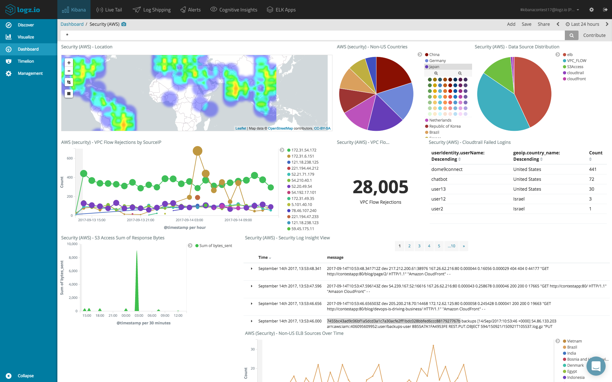

- **Security Information and Event Management**
- Honestly a technological marvel :)
- The center for all monitoring
- The idea is that a single event is usually not enough to know if a security incident is happening, and we need to **correlate** a number of events to build the bigger picture

### What it is

- A centralized location for logs and alerts
- But not an archive! Don't just dump everything there
- All necessary logs are sent to it for **normalization** and analysis
- Analysis is performed using ML, baselines, pattern matching, etc.; looks for deviations from "the normal"
- Correlation of logs from many different sources, not just log entries from the same source
- High-level overview of the security posture, and you can dig into anything for deeper investigation
- Solutions:
	- Splunk
	- Elastic aka ELK stack: Elasticsearch, Logstash, Kibana, Beats
	- ArcSight (checks for compliance as well)
	- IBM QRadar
	- AlienVault - open-source alternative to commercial SIEM products, has a free version alongside a paid one
	- graylog

### SIEM alerts

- It's a box that generates alerts - but are they valid? False positives/negatives? How do we know?
- A SIEM must be set up properly - has to provide valid alerts when they happen and ignore what can be ignored
- Alerts should be fired for suspicious events or sets of conditions - these are known as **use cases**. Examples: suspicious logons/traffic/use of privileged accounts, etc.
- Use cases are defined by:
	- Data sources (logs/alerts ingested into the SIEM)
	- Query strings to correlate things ("find me all logon attempts on all domain hosts performed by user `johndoe42069` in the last 96 hours")
	- Action triggered by the event
- **Exam**: **known-bad IP addresses**
	- Source: IP reputation lists containing addresses with suspected malicious behaviour
	- Manual identification
	- Entire netblocks can be blacklisted by orgs because of one address' malicious behaviour, but it's not always a good practice
	- Because of VPN/proxy/cloud services, attackers can pretty easily source an address that won't be so easy to block

### SIEM dashboard

- Instead of 1000 words...



- Where alerts are represented as all sorts of widgets for stats and quick reference

### Use case matching

- When a matching event is found, the SIEM should capture the following, at least:
	- When the event started, when it stopped
	- Parties involved: people and/or devices
	- What exactly happened
	- Where the event happened (which devices generated the event data)
	- Where the event originated (inside, outside, which system)

### SIEM data sources

- SIEMs can collect data from the following:
	- Agents on hosts/servers - a small piece of software from the SIEM manufacturer that is installed on a host/server and used to collect info and send it to the SIEM; has to be configured for what needs sending
	- Built-in listeners or collectors - instead of installing an agent, configure the device to send (or push) data directly to the SIEM appliance using a standard that already exists, e.g. Syslog, SNMP, Netflow
	- Sensors for network traffic, which means intercepting traffic using a dedicated device and sending a copy to the SIEM. Relies on SPAN/port mirroring or a TAP

### Normalization

- Bringing disparate data from multiple sources to a consistent format that can be analyzed
- Once normalized, data is stored 
- Goal: having consistency and making all events look the same
- Problem: there are hundreds of vendors, appliances, standards, and formats out there
	- Some logs can come in binary format, or CSV, or TSV
	- Others come in serialized format such as XML or JSON
	- Differences in character encoding
	- Windows and Linux newline characters are different
	- SNMP Management Information Base (MIB) - these come from different vendors and are completely different themselves
- Solutions:
	- The genius of SIEM developers
	- Vendor-specific plugins for format normalization
- Don't forget **timestamp normalization**
	- Devices may not have clocks perfectly in sync, or they can be in different time zones
	- Timing is very important when correlating information
	- NTP is needed for proper clock setup
	- Timestamps can be rewritten in the SIEM itself so that time of receipt is registered - good for consistency

### Analysis and detection

- We've collected and normalized data - time to reap the benefits
- There are a few types of analysis

##### Rule-matching
- The simplest type of correlation
- Looking for specific matches in our data with pre-defined signatures
- `if` this, `then` this, `else` that - static approach
- Fast, deterministic
- Pretty useless against unknown threats - no signatures for those, so they'll be ignored

##### Heuristic rule-matching
- Can still use rules and matches, but with heuristic algorithms applied
- Not just a specific set of data points for `if-then-else` - also looking at things that are similar enough to be a close match
- Basically a little more permissive
- Use past incidents and past results with this kind of heuristic matching to facilitate machine learning
- SIEM starts with fixed rules and then refines them further based on every incident detected in the past - smarter, more fine-tuned for each match

##### Behavioural analysis
- Build a baseline, define what's "normal"
- Continuous recording of everything happening isn't required
- Instead, build a statistical model - this requires human intervention for fine-tuning (SIEM needs to know what a false positive and a false negative is)

##### Anomaly analysis
- Look for a well-known expected outcome/behaviour for a protocol or application
- Only works in environments where very strict rules can be enforced or have been established
- For instance, looking at traffic for a certain protocol and searching for deviations from this protocol's RFC
- If there is a deviation, as long as the RFC is followed stricly at all times, then this must be an IOC

##### Trend analysis
- Looking at historical patterns, trying to predict what the future might look like
- These predictions must be trusted - otherwise there's not much use

### SIEM rules

- SIEM solutions are not one-size-fits-all! Avoid rules that would create too many false positives
- Start from a pre-defined set of rules out of the box
- This is usually not sufficient, and customization is required for the SIEM to fit a specific environment as each environment is unique
- A rule is a statement that matches certain conditions by:
	- Numerical values (=, <, >, >=, <=)
	- String comparison (is a specific string present in an event?)
	- Set membership (events that belong to any specific category or come from devices that belong to one)
	- Unified `AND`/`OR` operations - combine results
- Sometimes similar to SQL queries:
	- `select <field> where <condition> sort by <field>;`
- **String searching** - filtering text information in logs
	- Doing it manually is a very important skill
- Regular expressions - **might be on the exam (evaluating something)**
- Understand and be able to recognize what's below, learn more using a regex cheatsheet

```
[...] matches a single instance of char in brackets
+ match one or more occurrences
* match zero or more occurrence
? match one or zero occurrences
{} match a number of times, e.g. {3}, {3,}, {3-10}
(...) define a matching group of whatever the expression inside the parens matches, can be further references by \1 for the first one, \2 for the second one, etc.
| logical "or" operator
^ match start of line (anchor, boundary)
$ match end of line (anchor, boundary)
```

##### Command-line utilities for log analysis and string searching
- Linux:
	- `grep` to search for a value or a regex
		- `-c` to count the number of occurrences
		- `-i` for case-insensitive
		- `-n` to show matching line and line number
		- `-v` to show all lines that don't match the string
		- `-r` to read all files under each directory recursively
		- `-e` to use a certain pattern (one or more) for a search
		- `man grep` for more
		- [Huge massive `grep` tutorial](https://ostechnix.com/the-grep-command-tutorial-with-examples-for-beginners/)
	- `cut` for returning a specific part of every string in a file where there's a lot of repetition
		- Can return a specific character or set of characters or a region of every string using a delimiter
	- `sort`
	- Use piping to direct the output of one command into another - makes for very powerful commands!
	- `head` and `tail`
	- `awk` or `gawk` for extracting data from files or strings
- Windows:
	- `wmic` for querying event logs
	- `Get-EventLog` in PowerShell

---

### Exam

Know what a SIEM does and how it does it; be familiar with related concepts such as normalization, rule matching, string searching, and various types of analysis; know where data can be sourced by a SIEM and how it's done. Know Linux and Windows CLI utils for log analysis and string searching.

---

# From the Sybex book

### SOAR

- Security Orchestration, Automation, and Response
- Relies on a stack of security tools to collect data from a variety of security sources and then automatically respond
- SIEM's have a lot of these capabilities, but SOAR takes it a step further by complementing SIEM solutions with extra tools
- Three major components:
	- **Threat and vulnerability management**: threat management tools, vuln scanners, also workflow, reporting, and collaboration tools to support all this
	- **Security incident response**: IR suites providing the tools to manage incidents from start to finish
	- **Security Operations Automation**: orchestration and workflow tools fit into this category; also reporting, policy, and process management tools; see 45 for more info on orchestration as a concept
- Adds a layer of workflow management
	- SOAR deployments ingest SIEM alerts and other data, then apply workflows and automation to them
- SOAR integrates with a broader range of tools
- SIEM vendors usually also offer SOAR solutions: Splunk, Rapid7, IBM (QRadar)
- SOAR-specific tools such as [ServiceNow](https://www.servicenow.com/products/itsm.html)
- **Exam**: know what SOAR is, but technical questions are unlikely

### Threat feed combination (thank you GPT!)

Threat feed combination refers to the process of aggregating and integrating multiple threat intelligence feeds into a single system or framework. The goal of this is to provide a more comprehensive picture of the threat landscape and improve the ability to detect, prevent, and respond to cybersecurity threats.

Threat intelligence feeds are sources of data provided by cybersecurity firms, organizations, or open-source initiatives that contain information about known threats, vulnerabilities, Indicators of Compromise (IoCs), and Tactics, Techniques, and Procedures (TTPs) used by threat actors.

Here's a bit more detail about how threat feed combination works:

1. **Aggregation:** Multiple threat feeds are collected from various sources. These can be public or private feeds, free or paid, and may come in different formats.

2. **Normalization:** Because different feeds might use different formats or structures for their data, the feeds are normalized, meaning they're transformed into a common format that can be easily processed and analyzed.

3. **De-duplication:** Redundant or duplicate data from different feeds is identified and removed to streamline the data and improve processing efficiency.

4. **Correlation:** The data from different feeds is correlated, identifying connections or relationships between different pieces of data. For example, an IP address found in one feed might be connected to a known malware hash found in another.

5. **Integration:** The aggregated, normalized, de-duplicated, and correlated data is then integrated into the organization's security systems, such as a Security Information and Event Management (SIEM) system, for use in threat detection and prevention.

By combining multiple threat feeds, organizations can gain a broader and more complete view of the threat landscape, making it easier to identify threats and respond more effectively. However, it's also important to ensure that the feeds being used are reliable and accurate to avoid false positives or other issues.