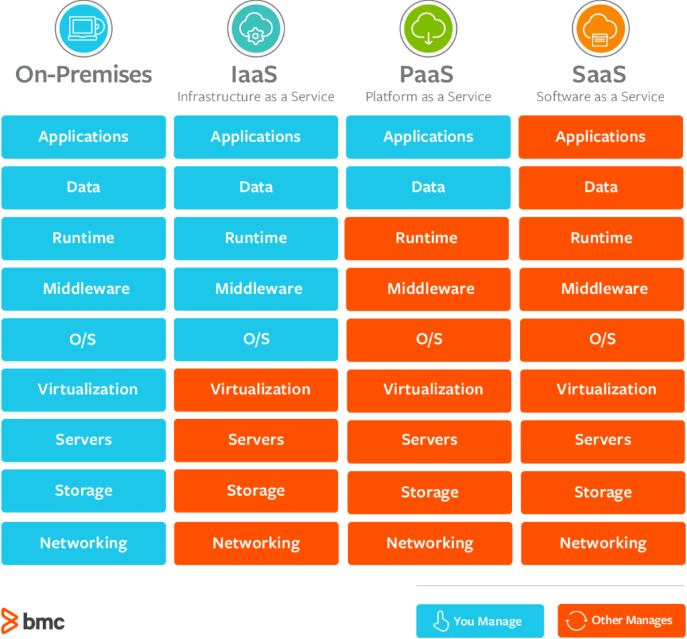

### Cloud models

##### Public cloud
- Purchased "as-a-service", no on-prem infrastructure
- Globally distributed infrastructure, using regions and zones, with a lot of data centers
- Resources customers can access are mostly **virtual**, no access to hardware (with some exceptions, e.g. when a provider allows you to rent physical racks/servers)
	- That includes not just VM's, but also SDN, software-defined storage, software-defined pretty much everything...
- Multi-tenant: resources are **shared** among customers, each customer isolated via virtualization and security policies - although breaches can happen, and for this reason public cloud services are not trusted by everyone
- Rent resources from the CSP, pay for how much and how long you've used
- There is a certain amount of data exposure risk - make sure the CSP provides confidentiality for data in transit and at rest. Where and how is data stored? Any country-specific regulations?
- Hardware, OS and virtualization layers handled by the CSP
- Apps, data, and security policies managed by the user
- Special categories:
	- Community cloud - a pool of virtualized resources that belongs to multiple orgs, used by those orgs and by external customers. Purposes: research, compliance. Disadvantage: unclear who's responsible for what
	- Multicloud - multiple cloud providers, with one handling email, another handling storage, another handling chat and video conferencing, and so on
- Example providers:
	- Azure
	- AWS
	- Google Cloud
	- Oracle

##### Private cloud
- Virtualized, elastic, self-service data center of any size
- Single tenancy: you're the only owner, the only user, and no one else can touch it
- Built by the the org that will be using it or by a third party for that org (can be managed by a third party also, if you trust them)
- You're fully responsible for all hardware and data
- Also responsible for security and maintaining compliance
- Very high cost - you have to build out the whole infrastructure and secure it! Mostly used by governments, banks, and anyone else who cares about utmost privacy
- CapEx (Capital Expenditure) - upfront investment
- Your security is "private", too - and it's not necessarily as good as CSP giants
- Excess unused capacity to support peak demand

##### Community cloud
- A middle ground
- It's a multitenant environment, but the tenants are limited to members of a specifically designated community, where membership is defined based on shared mission, similar security and compliance requirements, or other commonalities
- Example: [HathiTrust digital library](https://www.hathitrust.org/) - it's a consortium of libraries, and students and faculty of member institutions can all log into the community cloud service to access resources

##### Hybrid cloud
- Also a middle ground
- Some infrastructure runs in a public cloud, and some runs on premises
- Requires the use of tech that unifies the different cloud offerings into a single coherent platform
- Reasons to choose this approach:
	- Quick scalability of on-prem resources (e.g. letting an online store to dynamically increase its capacity when there's more traffic due to holiday shopping)
	- Ability to pick and choose specific services only - more convenient to purchase from a public cloud as opposed to being stored and maintained locally
	- Regulations and compliance may require you to keep some data on site rather than pushing it somewhere else for remote storage
- It's the best and the worst of two worlds
	- You'll face both cloud and on-prem threats at once
	- Management and monitoring of on-prem and cloud resources will be more difficult
	- Deployment is more decentralized
	- Much more difficult to demonstrate compliance with such a setup - requires a lot of coordination between the two clouds and ensuring there are no data leaks
- [Amazon Outposts](https://aws.amazon.com/outposts/) are racks of computer equipment you can rent to run stuff on-prem in combination with cloud
	- Equipment in the rack is maintained by AWS and provisioned by the customer
	- The physical rack + public cloud AWS services = a hybrid cloud setup

### Cloud service models

- What the CSP manages vs what you manage

- IaaS examples:
	- AWS EC2
	- Azure Virtual Machines
	- Linode
	- Digital Ocean
- PaaS examples:
	- Google App Engine
	- AWS Elastic Beanstalk
	- Heroku
	- OpenShift
	- Managed DB's: Oracle Database, MS SQL
- SaaS (aka apps on demand) examples:
	- Slack
	- Google Suite
	- MS OneDrive
	- Dropbox
- When comparing these, keep in mind that a lot of traditional security solutions are becoming available not just for on-prem, but also for cloud deployments
	- IAM, DLP, SIEM, FW, network/performance monitoring, etc. - management is located in the cloud, data collection from on-prem still applies

### CASB

- **Cloud Access Security Broker**
- An enterprise security policy addresses methods of managing roles, users, groups, devices, data in general
	- How can this be applied to the cloud environment?
	- That's what a CASB does!
- Controls access to cloud services, infrastructure, apps running, identities mapped inside the cloud environment; implements security policies
- Many CSP vendors (especially with SaaS solutions) means many different security policies, becomes a nightmare to manage - CASB helps organize it
- Two different approaches:
	- **Inline CASB**: physically or logically resides in the connection path between the user and the service using either a hardware appliance or an endpoint agent that routes requests through the CASB
		- Requires network/endpoint configuration
		- Advantage: seeing requests before they are sent to the cloud service, so anything that violates policy can be blocked
	- **API-based CASB**: do not interact directly with the user but rather *interact directly with the CSP through their API*
		- Direct access to the cloud service, no need for user device configuration
		- Does not allow the CASB to block requests that violate policy
		- Limited to monitoring user activity and reporting on or correcting policy violations *after the fact*
- CASB solution examples:
	- [One from Microsoft](https://learn.microsoft.com/en-us/defender-cloud-apps/what-is-defender-for-cloud-apps)
	- [One from Oracle](https://www.oracle.com/security/cloud-security/casb-cloud/)
	- [One from Cisco](https://www.cisco.com/c/en/us/products/security/cloudlock/index.html) - CASB functionality for multiple cloud vendors

##### So how does it *manage access to cloud resources*?
- Takes care of authentication to the cloud 
- Ensures that we can perform SSO between on-prem and cloud
- Match/sync/map users from on-prem to users in the cloud environment to make sure permissions and policies are consistent
- Scans devices for compliance
- Performs accounting by monitoring what users are doing and how they're using cloud resources
- Protects against data exfiltration by preventing access to sensitive data stored in the cloud 
- CASB functionality differs from vendor to vendor, but there are three generic modes of operation, from the cloud's point of view:
	- Forward proxy (as a virtual or physical appliance **on premises**) - intercepts all cloud requests as they leave the on-prem network, validates them before allowing or denying them, requires configuration on client devices
	- Reverse proxy - users make requests directly over the internet, proxy is located **in the cloud** as an entry point. Filters requests, doesn't require configuration on the client side, but the CSP has to be able to handle this kind of proxying in its environment
	- API-based - pretty much an out-of-band solution. No dedicated appliances, meant to integrate with your own security devices (FW, proxies), amount of integration depends on the complexity of the API and local devices' capabilities
	- All CSP's, especially public ones, allow access to their services via API so that it's possible to talk to cloud providers programmatically
		- Use case: a user account is disabled on the local network, CASB revokes that user's permissions through an API and revokes the user's permissions from the cloud environment as well
		- Good synchronization

### Cloud infrastructure security and tools

- In a cloud-centric environment, a lot of tools and techniques are the same as on prem
- A cloud OS and an on-prem OS aren't that different
- Most of the things we have to protect as cybersecurity specialists are on premises, but this is becoming less and less true nowadays as many companies move at least some of their services to a public cloud environment
	- When your data and users start living outside of your premises, protecting them and managing security risks inside the cloud becomes a whole new job
- Security in the cloud has to be at least partially dependent on the CSP - but we must understand exactly who's responsible for what because not every breach is the CSP's fault (in fact it's likely our fault)
- That said, the CSP does have to report results of security assessment back to us, the client
- **Trust, but verify!** We can assess the security of the cloud environment ourselves by using...
	- [ScoutSuite](https://github.com/nccgroup/ScoutSuite) - free, open-source multicloud auditing tool, connects to public CSPs' API's, collects data and compiles a detailed report of its findings pertaining to the CSP's security posture
		- Probes the service configuration, searches for potential security issues
	- [Prowler](https://github.com/prowler-cloud/prowler) - configuration testing tool, similar to ScoutSuite in purpose 
		- AWS only, evaluates the security posture against the [CIS benchmark](https://www.cisecurity.org/)
		- Also runs specific scans for regulations such as HIPAA/GDPR
	- [Pacu](https://rhinosecuritylabs.com/aws/pacu-open-source-aws-exploitation-framework/), the open-source AWS exploitation framework! Modular, similar to Metasploit, extensible with plug-ins. **Exercise caution, talk to the CSP before deploying it!**
	- CSP's offer their own tools for scanning, for instance [AWS Inspector](https://aws.amazon.com/inspector/)
- Be careful with all these tools in general, make sure everything is kosher with the CSP because from their standpoint the usage of these tools may not be dissimilar to getting attacked. You may be scanning your own cloud environment, but in all technicality you are attacking somebody else's infrastructure, and you will NOT win a lawsuit against Amazon :)

### Cloud digital forensics

- Traditional forensic methods may not fully apply to the cloud because most resources are virtualized - no access to the underlying hardware, can't remove drives and image them, etc.
- No visibility into where data is actually stored and where the traffic flow goes to
- The on-demand model raises the volatility of virtual resources - these can be created and destroyed very quickly
- Chain of custody? Nah, son.
- Solution to all this: **involve the CSP**, and preferably this should be covered by the contract 
	- Our hands are tied without CSP's support 

---

### Exam

Know the different types of cloud infrastructures (public/private/hybrid) and what cloud service models there are (SaaS, IaaS, PaaS). Be aware of shared responsibility when it comes to clouds. Know what a CASB is and what it does, in detail; also know the benefits and dangers of cloud infrastructure assessments and what the challenges of cloud digital forensics are.

---

# From the Sybex book

### Cloud computing

- Per NIST:

>***Cloud computing** is a model for enabling ubiquitous, convenient, on-demand network access to a shared pool of configurable computing resources (e.g., networks, servers, storage, applications, and services) that can be rapidly provisioned and released with minimal management effort or service provider interaction*.

- To break it down:
	- Cloud computing is ubiquitous and convenient, designed for quick and easy delivery of services to customers, and these services can be accessed from anywhere
	- On-demand nature, customer requests are fulfilled immediately
	- Shared pool or resources via the **multitenancy** approach (one physical resource, many customers), isolation has to be implemented by the CSP
	- Highly configurable
	- Rapidly provisioned and rapidly destroyed when no longer needed
	- Requires minimal management effort (more effort is needed the deeper you go aaS, meaning IaaS needs more effort), CSP takes more responsibility, which means less overhead for the customer
- Benefits:
	- Disruptive innovation
	- Agility and elasticity
	- Scalability
	- Cost effectiveness
	- Security

### FaaS and serverless

- Devs write functions in common languages and configure the FaaS platform to execute (or "trigger") those functions in response to events
- These functions are discrete units of code that are easily scaled to millions or even billions of executions per day
- Amazon Lambda offers support for Python, Node, C#, Ruby, Go, and PowerShell, runtime API can be used for other languages
- Abstract the infrastructure from developers completely, billing is for computational power and memory consumed during function executions (so you better write them well)
- FaaS security:
	- Address the functions like any other code - same type of controls as for software development
	- Additionally, controls that apply to cloud computing also apply here: access control and permissions, monitoring, resource management

### Cloud security

- In some ways, it's quite similar to on-prem cybersecurity: we're taking care of the CIA of our data and implementing strong access controls and other mechanisms that protect the CIA
	- No matter where the data is
- Differences vs on-prem:
	- **Shared responsibility model**: cloud customers must divide responsibilities between one or more services providers and their own cyber teams; this is relevant for each model (see service models above)
		- Tricky to draw the line sometimes
	- In SaaS, the CSP takes on almost all security responsibility - customer has shared control over the data and configuring access controls around that data
	- This division of responsibilities has to be clearly documented, especially in situations where compliance is required. Example: orgs working under PCI DSS have to work with the CSP to document specific controls and responsibilities and establish who does what under PCI DSS requirements. CSP's are usually familiar with this stuff and have appropriate documentation and mappings of controls to common compliance frameworks
- SOC integration
	- We have to ensure that cloud providers offer sufficient visibility by allowing us to view as many logs as possible and letting us monitor things
	- The SOC must have the ability to access logs through existing security tools
- SaaS / PaaS: security is primarily tackled through contractual obligations, also IAM
- IaaS: traditional security concerns around OS configuration, management, patching; secure installation of services and apps; least function
	- CSP's offer additional security-oriented services that can replace or supplement tools we might use on prem
	- Audit and assessment results can be provided upon request, often under an NDA
- VPC: typically exists on a private subnet, may have additional security for intersystem communications
- In general, when choosing cloud vs on prem, review options for each environment depending on your needs and what some relevant threats are
- Third-party security audits: SSAE-16 Type 1 and 2

### DevOps approach

- Unifies software development and technology operations
- Cloud enables DevOps by offering IaC capabilities through their API's
- We must understand how to secure these API's (encryption, securing keys, etc. - see 46)

### Cloud vs on-premises security solutions (courtesy of GPT)

**Cloud Security Solutions:**

1. **Ease of Use and Scalability:** Cloud security solutions are typically easier to scale as they don't require additional hardware to handle increased usage or capacity.

2. **Managed Security:** Many cloud providers offer managed security services, reducing the workload of internal IT teams.

3. **Cost:** Cloud solutions often have a lower upfront cost, as they typically follow a subscription-based model (pay-as-you-go) versus large initial investment in hardware and software.

4. **Automatic Updates:** Cloud security services often include automatic updates, ensuring you always have the latest security features and updates.

5. **Geographical Distribution:** Cloud services can provide security benefits through geographical distribution, reducing the risk associated with physical disasters.

However, with cloud solutions, your security is, to some extent, in the hands of a third-party provider. Data privacy and compliance may also be more complex in a cloud environment due to data residency issues.

**On-Premises Security Solutions:**

1. **Control:** With on-premises solutions, you have complete control over your security infrastructure.

2. **Customizability:** On-premises solutions can be highly customized to meet specific requirements of the organization.

3. **Compliance and Data Sovereignty:** Keeping data on-premises can simplify compliance with regulations about data storage and transmission.

4. **Physical Access:** On-premises solutions offer more control over who has physical access to servers, storage, and network devices.

However, on-premises solutions require a larger upfront investment in hardware and software. They may also require more specialized IT personnel to manage and maintain the security systems. Updates to security features may not be as frequent or automatic as with cloud solutions.

In reality, many businesses use a hybrid approach, taking advantage of the benefits of both cloud and on-premises solutions, depending on their specific needs and circumstances.