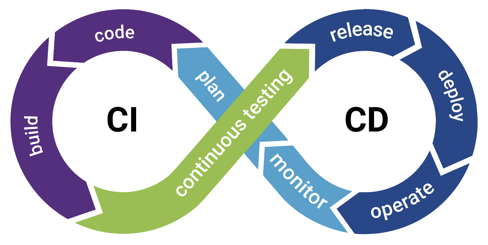

- Continuous Integration, Continuous Delivery/Deployment
- Infrastructure as Code

### CI/CD

- When you develop your code properly, it'll pass through the following stages:
	- **Development**: code is written with some preliminary testing, it's also synced up to a VCS such as GitHub for proper versioning, tracking changes, etc.
	- **Testing & Integration**: code from multiple devs is put together with the focus on testing to see how well it works. This process can be manual or automated
	- **Staging**: basically pre-production, seeing how the application behaves in an environment that is exactly the same as the prod but without being accessed by many users. Basically like screening a movie for a test audience. UAT (User Acceptance Testing) is performed at this stage, focusing on usability, features, and reliability
	- **Production**: the app is ready to go and it's released for the world to use

##### Development methodologies refresher
- Waterfall: go through the above stages in sequence, one is not started until the previous one is finished, pretty unrealistic and *sooo* last-century
- Agile: release features ASAP, focus on functionality and performance, bugs can be identified in production. Reacting to and patching these bugs happens as quickly as possible, and the overall approach to **integration** is **continuous** and **delivery** is fast - and that's CI/CD for ya!
- It goes in a continuous loop that involves all four development stages from above, and each cycle is called an iteration

- CI/CD tools:
	- [Jenkins](https://www.jenkins.io)
	- [Travis](https://www.travis-ci.com/)
	- [GitLab](https://about.gitlab.com/)

### DevOps

- Development + Operations
- A movement focused on increasing collaboration between the devs and the infrastructure team (operations)
	- vs traditional where responsibilities are siloed and separated by expertise, advantages are few but disadvantages are many (e.g. understanding of business requirements is limited, wasteful designs, clear hand-offs from development to operations are required and reduces agility, overhead is increased due to transitions, time to requirement satisfaction is increased)
	- Unified process where devs and ops peoplle work together in an agile approach to software development, testing and release becomes automated and collaborative, orgs are enabled to move from lengthy release management processes to dozens of updates a day
- The line between these two roles is becoming more blurred: devs can deploy their own infrastructure for testing (Docker, Terraform config scripts), and operations folks can manage the cloud infrastructure as well as the automation that builds it, which is often described as code
- It's a pretty massive realm - just take a look at the [periodic table of DevOps](https://digital.ai/learn/devops-periodic-table/), which lists a huge variety different sub-genres and technologies

### DevSecOps

- ...and then all the security people showed up
- This especially pertains to software development - security is important at every step of the way
- Protecting DevOps environments with their cool automation tools and lightning-fast development speed
- Security at the development and deployment stages, but also security solutions that play best with automation and scripting and generally benefit from the devs' expertise when it comes to detection and alerting
- What security practitioners do:
	- Threat analysis
	- Communications, planning, testing, providing feedback
	- Ongoing improvement and awareness responsibilities
	- Strong understanding of the org's risk tolerance
	- Awareness of what the rest of the DevSecOps team is doing
	- Provide automated testing and integrated security tooling such as scanning, updates, configuration management

### IaC

- This is all about automating the management of an infrastructure: provisioning, deprovisioning
- Featured in all IaaS environments (AWS, Azure, GCP)
- One of the key enabling technologies behind the DevOps movement, crucial advantage of cloud computing solutions
- Can be a feature offered by a CSP or a functionality enabled by a 3rd-party cloud management platform, which is done via API's
- Actions available to ops teams through the CSP's web interface are usually all available for implementation as code
- Expressed using YAML and JSON
- Creating and managing cloud resources using code (in the form of configuration files)
- Actually treating configs the same way code is treated
- A few advantages:
	- Avoiding typos and mistakes
	- Increasing reusability
	- Versioning, rollbacks in case of an issue, code reviews that validate configs, unit tests
	- Fast, **predictable** (a very important point - deployment using IaC is consistent and works the same every time), ready for orchestration, encourages standardization, saves time spent by ops team to create infrastructure components
	- The likelihood of configuration errors is reduced via the use of templates
	- Mitigates the issue of "configuration drift", which is basically a lack of consistency created by systems that are manually customized or messed with in some way after everything is installed. These systems are referred to as "snowflake systems", and this inconsistency between them creates bugs and issues that take a lot of resources to fix. IaC brings the entire infrastructure to a compliant state - all instances that should be identical are indeed identical
	- Infrastructure code is auditable - so you audit the code instead of the whole infrastructure, and this includes security policies, permissions, access control. Everything can be in one configuration file
	- This paradigm addresses a cultural disconnect between developers and IT operations workers (aka **DevOps**). Developers can use IaC to deploy environments using code on any available resource, including their own workstations/laptops. It's an automation of human effort

##### "Pets vs Cattle", a very sad and cynical IaC concept
- Pets:
	- Each have a name
	- Are nurtured individually
	- Are brought back to health when sick
	- Are more like snowflake systems
- Cattle:
	- A cow is a cow when you run a big farm - no names
	- Numbers matter
	- Replaced, not healed :(
	- Are more like containers - deployed and re-deployed through automation
- There's even [an article about it](https://cloudscaling.com/blog/cloud-computing/the-history-of-pets-vs-cattle/)

- Cloud environments work extremely well with IaC and prefer to destroy and re-create a resource rather than to dig around it trying to figure out what's going on
- Consistency is key

---

### Exam

Be familiar with CI/CD and the four stages of software development. Know the difference between waterfall and agile, and how CI/CD is a natural outcome of agile. Discuss the benefits of IaC, know about the \[rather unfortunate] "pets vs cattle" analogy and the importance of DevOps and DevSecOps. How are all these things changing the way we build, test, and ship applications? 