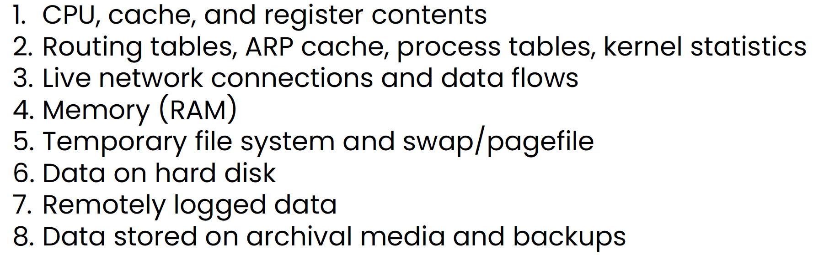

- **Forensics**: discovering and collecting crime evidence that could be accepted in the court of law. 
- Digital forensics: everything that's on the digital, computer-based side of things. Everything that can't be put in a plastic bag.

### Forensics concerns

- How did a security incident happen, what was the root cause?
- Determining whether a crime took place or not
- Collecting incriminatory evidence if a crime did indeed happen
- Determining whether sensitive data was exposed, stolen, or destroyed
- Obtaining proof that the company was legally compliant before a breach occurred
	- Useful for insurance purposes and legal exposure ("we've taken all precautions, but it still happened")
	- Prove that you've been exercising due diligence, look real good

### Forensic procedures

- Some general steps (from Sybex):
	1. Determine what you're trying to find out. Whether it's a compromised system, some actions taken by malware, or investigating unauthorized changes, we need a problem statement that puts what we're doing into specific terms
	2. Outline relevant locations and types of data, which exists in many forms. Format, accessibility, and volatility are important
	3. Document and review the plan
	4. Acquire and preserve evidence, make copies, create the chain of custody
	5. Perform initial analysis, document all actions, systems, data you're working with, and of course all findings
	6. Use the initial analysis to guide further work and deeper investigation, map out the data and systems involved, review where initial analysis pointed to additional info, document everything that's missing
	7. Report on your findings
- No room for interpretation here when it comes to handling forensics properly
- The procedure follows a few phases

##### Identification
- Securing the crime scene, making sure it's safe. People first! If someone's life is in danger, take care of that before anything else
- Identifying the scope of what type of digital evidence we're looking for

##### Collection
- Do we have all necessary authorizations to collect evidence?
- Collection must be conducted using the right tools and following the right protocols - otherwise it's inadmissible

##### Analysis
- Starts with making copies of everything you've gathered - **never** work on the original
- Disk images have to be hashed to prove that the integrity of contents was not compromised
- Collect any memory dumps that might still be available
	- If there's a computer in the crime scene that is still powered on, it has to be switched off by pulling the plug so that memory contents are not erased
- Start thinking about the **chain of custody**, which tracks every entity whose hands the evidence passed through, how it was handled, how it was stored, etc. It gets updated every time the evidence changes ownership
	- There must not be a single moment where the evidence can be tampered with
	- Evidence bags, tamper-proof seals for any physical equipment

##### Reporting
- What methods and tools were used in the investigation
- What was found as a result

### Legal hold

- Any information that might be relevant to a court case has to be properly preserved, so it can be held by the law enforcement for the duration of the investigation, including what contains that information
- Taking stuff "as evidence"
- Orgs and their cybersecurity personnel have to make sure someone with strong legal knowledge is appointed as the contact for the forensics/IR team so that everybody is aware of legal instructions that must be followed

### Chain of custody

- Keeping track of how evidence is handled
- Who has handled it
- All in order, with a timeline, highly detailed, documented in a special form, updated every time the evidence changes hands
- There can be no gaps in this narrative - ever
- All the way from acquisition to presentation in court
- The purpose is to prove that the integrity of evidence has been preserved from the moment it was collected
- [Sample CoC form](https://view.officeapps.live.com/op/view.aspx?src=https%3A%2F%2Fwww.nist.gov%2Fsystem%2Ffiles%2Fdocuments%2F2017%2F04%2F28%2FSample-Chain-of-Custody-Form.docx&wdOrigin=BROWSELINK)
- Sometimes it has to be preserved for years - not all investigations wrap up quickly... The process is much older than digital forensics

---

## Endpoint forensics

- Most security incidents involve a certain endpoint that was compromised
- All data must be collected from this endpoint as a clean physical copy
- This **data acquisition** has to follow the **order of volatility**
	- Some data can be lost when the computer is powered off
	- Other data can only be gathered when the computer is powered off
	- We must begin data acquisition with what's most volatile, i.e. most likely to be lost
	- This isn't simple

- The Windows Registry mostly exists on the disk, but parts of it are stored in memory
- Collect free space as well - it may not be free after all since deleting files from a drive really only means severing pointers that once pointed to those files
- Look for remote logging and monitoring (usually applies to business settings) - it's all pertinent
- Collect all info about physical system configuration and network topology
- Look for archival media: backup tapes, external drives, NAS, etc.

##### Tools of the trade
- [EnCase](https://www.opentext.com/products/encase-forensic) - case management, used for various types of investigations, has components for digital evidence management (aka eDiscovery), can analyze networks and endpoints
- [FTK (Forensics ToolKit)](https://www.exterro.com/)
- [The Sleuth Kit](https://sleuthkit.org/) - for Linux, open-source collection of tools for disk imaging, analyzing files, etc.
	- Its GUI version is called **Autopsy**, available for Windows

### Forensic workstations

- We need something to run the above tools on - it must be a specialized computer that's solely dedicated for forensic investigations
- Must be under very strict control, hardened, isolated, sometimes completely air-gapped
- Have above-average specs allowing fast processing of large amounts of data, lots of storage space as well, wide variety of connectors (supporting as many storage device types as possible)
- Oftentimes come equipped with a **write blocker** - a small hardware device mounted between the computer and a peripheral storage device that disables all write operations to the external device. This is a must-have for imaging drives as their integrity must be 100% completely preserved, so we can't allow the workstation's OS to write anything to the device that's being imaged

### Memory acquisition

- The memory is the most valuable source of information - if its contents can be obtained, they might show exactly what was happening at the time the crime was committed
- It also stores cryptographic keys and passwords, likely in cleartext because data usually has to be decrypted while in use
- Of course this all relies on data actually being in use. If it's not in use, it's won't be in the memory
- Methods include:
	- Live acquisition - requires a special tool that copies the contents of the memory as the system is running. This tool must run with kernel privileges for a proper capture, so it must be already installed, enabled, and running in memory
		- [Memoryze from FireEye](https://fireeye.market/apps?query=memoryze)
		- [F-Response TACTICAL](https://f-response.com/software/tac)
		- [MAGNET RAM Capture](https://www.magnetforensics.com/resources/magnet-ram-capture)
		- Some of these are free!
		- **Careful!** This can easily be considered tampering (the system in question is still live), which makes collected evidence inadmissible
	- Crash dump capture - grabbing data from memory dumps created when a fatal system error (BSOD, kernel panic 😱). Previous dumps may be found on the disk
	- If hibernation is enabled, try to obtain the hibernation file, which stores the system state (including everything in memory) at the time it's put into hibernation and is persisted on the disk
	- Page file acquitision - another extension of the memory, also stored on the hard drive. This is where apps page information from the memory when no more data can be stored there. This will only provide a partial insight since the rest of the stuff is still in the memory. Page files are somewhat volatile, but not as bad as RAM itself
- Once you've captured the memory - good for you if so! - the data still needs to be analyzed
- It's in a binary format - we can't read it right away
- Tools are needed
	- [Volatility](https://www.volatilityfoundation.org/) is the go-to here, it's free, it's available as a Docker container, and it's very smart. Recovers lots of different data from memory dumps: OS info, running processes, network connections, and much more

### Disk image acquisition

- Here, the original contents of the drive can be safely preserved
- Imaging is usually performed bit by bit, covering the entire drive, including all free space which may not be free, also including alternate data streams (can be used to hide data in an NTFS file system)
- Live acquisition is gonna take a lot longer than with memory, and the contents might change during the imaging process
- Static acquisition is possible here since disk data is persisted and not thrown out after system shutdown
	- But an unexpected shutdown can trigger anti-forensic mechanisms if they're in place
	- Pulling the plug is an option, but it runs a risk of corrupting data
- Write blockers are necessary for imaging
- Imaging utilities also needed for the process to be performed correctly. Note that different tools provide different output formats for what's extracted from drives, including proprietary formats that can only be opened by one tool
- Some forensic tools can directly import virtual disk files created by virtualization software (`.vmdk`, for instance), so performing forensics on VM's is very much possible.
- Everything we're doing must be admissible in court, so **hashing** a drive that's being taken as evidence is a crucial part of the process. A checksum has to be calculated from the original, and each copy of that drive must create a checksum that'll match the "master" hash exactly. SHA or MD5 algorithms are totally fine to use for this.
- Tools for hashing drives include:
	- `certutil` on Windows
		- `certutil -hashfile C:\path\to\file <HashAlgorithm>`
	- On Linux there are algorithm-specific commands: `md5sum`, `sha256sum`, etc.
- **File carving** is an important technique for extracting data from a disk or an image when there's no explicit file information available
	- Similar to file recovery tools that attempt to reconstruct accidentally deleted files on a hard drive
	- Made possible by how file systems on HDD's and SSD's store data - the smallest unit on a disk (a **sector**) can range from 512 to 4,096 bytes, but only the disk knows about the sectors, and the file system cannot reference each sector individually. What it can do is address groups of sectors called **blocks** or **clusters**. In NTFS, the default block size is 4,096 bytes (known as the **allocation unit size** on Windows), and whenever a file is created on a disk, it's created in a new block across one or more sectors. Larger files take up more than one block, but if a file is much smaller than a block, it will still reserve the same fixed block size on the drive. Looking at the properties of a really small file, we can see two entries: Size and Size on disk. While the size may be a few hundred bytes, the size on disk will always be 4.00KB or 4,096 bytes - that's how much space the file actually occupies on disk, i.e. a whole allocation unit. Now the FS needs to keep track of which files belong to which blocks. This info is stored in a table, which is called the **Master File Table** in NTFS. Deleting a file means removing the reference information from this table. Corresponding blocks and sectors are not cleared from the disk - they're simply made available for something else. That's why deleting a multi-gigabyte file happens instantly, but writing it takes much more time. In fact, overwriting a file doesn't mean the same blocks are used, which means that deleted or replaced file contents can remain on the disk indefinitely. 
	- *So...* what carving tools to is look for useful content in those unallocated regions of drives and try to piece that info together in an attempt to rebuild deleted data.
	- Pretty simple! :D

---

### Network forensics

- Capturing traffic from a host or a network segment
	- For a host, use some sort of a packet capture tool like `tcpdump` or Wireshark
	- For a network segment, use port mirroring, SPAN, TAP, etc., whatever is appropriate
	- Sniffing is usually done behind the firewall

### Cloud forensics

- This type of forensics has to be planned for in advance
	- Examine all relevant agreements with the CSP, be in touch with them to discuss all post-incident activity and evidence collection in case something goes awry
	- Know what you can and cannot gather, and how you can gather it
	- Determine what legal recourse you have with the cloud vendor
	- Identify data you need and whether it's available via methods under your and your org's control
	- Work with the vendor to identify a course of action is you don't control the data
- Forensic investigations on cloud services is very challenging if not impossible
- Shared tenant models, various regions - your data can be anywhere, and it's much more volatile than on prem
- More likely than not the CSP will have to participate in the investigation
- Chain of custody is also more tricky

### Mobile device forensics

- **Tricky**.
- Device locks are pretty much omnipresent
- Encryption is too
- But cloud backups can provide some insight
- Use a Faraday cage against remote wipes - cuts off all wireless communication
- Extract call data, work with the cell carrier if necessary
- Geolocation history can be backed up in the cloud

### Virtualization forensics

- Easier than physical computers - hypervisor software can read the memory inside VM's it's managing
- IR evidentiary requirements are typically less than those for a legal case
- Disk data is already in an image format
- Downside: this type of storage can be highly fragmented due to thin allocation of virtual machines, which means allocating storage space as needed, piecemeal. Space doesn't get pre-allocated in large amounts
	- This is another thing to keep in mind for file carving practices where VM's are concerned
- Understand limitations of what your capture and copying methods can do
- Consider the virtualization environment itself - what if it's part of your investigation?

### Container forensics

- Containers are very common
- Forensics can create some unique issues
- Containers are designed to be disposable - they're deployed and destroyed via automation, and most of the time there's very little reason to keep a "broken" container around
- Ephemeral nature - artifacts can be easily lost, so treat them as highly volatile
- Inter-container environment is also tricky - SDN's also change frequently, security contexts are dynamically modified
- **Plan ahead** to capture the data you may need

---

### Exam

Lots of stuff to know here: all aspects of digital forensics, the overall procedure, what the chain of custody is, what legal hold is. Be able to discuss all of the above subcategories of digital forensics, remember the order of volatility (it likely will come up), how data can be acquired from memory and from disk drives. Write blockers are important to remember about. Explain what file carving is and what it relies on. 

This is not a huge exam topic, but there might be a few questions on this subject.