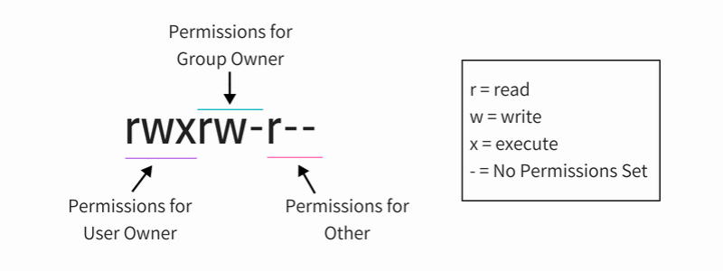
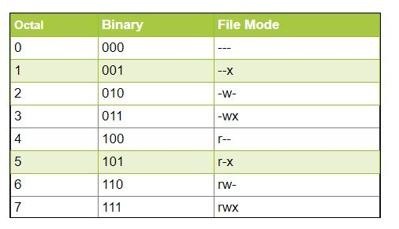

- Focusing on controls that protect **data**, nothing else
- Policies and procedures are in place, sure, but attackers don't abide these
- We need actual defenses, and they have to be up to speed with all the cyberattack trends

# Technical controls

- Here we're referring to things like systems, hardware, software, appliances (physical and virtual), and specific configurations that improve the security of our environment, network, users, and data
- Minimising exposure, reducing the attack surface, making it so that it's not worth it for most attackers to go after us - doing all this with the help of technical controls

### Access control

- First and foremost, we have to regulate the way data is accessed
- This is usually done via the use of ACL's
	- ACL's are implemented in software. In a nutshell, it's simply a list of who is allowed access to a resource and what permissions they have: can they only read files, or can they alter or delete them? 
	- Each record in an ACL is called an **entry**, or an ACE (Access Control Entry)
- ACL's and ACE's can be configured in various areas of the infrastructure:
	- Network: routers, switches, firewalls
	- Files and folders: access control is implemented in the file system (read, write, execute, etc.). Applies in a similar manner to databases, except in a more granular fashion - it can be down to which SQL statements someone is allowed to run, what tables/rows they can access, and what permissions they have
	- **Least privilege** applies here big time! Users must get just enough access and nothing more than that
		- Manage this properly, prevent "privilege creep", etc.
- **Context-based authentication** and ACL's (sorta like multi-factor)
	- Not just who accesses what, but also where they are, what time of day, do they have a certificate, etc. Security posture of the device is also looked at
	- NGFW solutions offer this type of functionality
	- User roles and group memberships
	- IP address and/or reputation, whether the remote IP is known for malicious activity (part of a botnet perhaps?)
	- Time of day
	- Location-based info: IP location, GPS, etc.
	- Frequency of access, can be combined with behavioural data (typing speed, browsing habits, etc. - see 37 for UEBA)
	- Device-based: what kind of device, what user-agent, other device info such as IP, time zone, screen resolution, cookies and their settings, installed fonts, language, etc.

### File system permissions

- This happens at the file system level, and it's different for Windows and Linux

##### Windows
- View them in the right click -> Properties window -> Security tab, and this can be done for any drive, folder, or file
- Types of permissions:
	- Full control (allows the owner to change file permissions in addition to everything else)
	- Modify (read, write, delete)
	- Read only (open files, list folders)
	- Read & execute (view and run executable files - **this includes scripts**)
	- Write (add files/subfolders, write to any file)
	- List folder contents (only inherited by folders, obviously)
- In `cmd`, we can use `icacls <file or folder>` to view permissions:
	- `N` - no access
	- `F` - full control
	- `R` - read
	- `RX` - read and execute
	- `M` - modify
	- `W` - write
	- `D` - delete
	- It can list all the possible permission combinations as well if you run `icacls` by itself
	- Inheritance also described, for instance `(I)` stands for "permission inherited from parent container" (i.e. parent folder)
- Use the `attrib` command to change a file's read/write attribute or set the archive attribute

##### Linux
- Three basic permissions, three special permissions
	- `r` - read
	- `w` - write
	- `x` - execute (this includes **navigating/`cd`'ing into a folder**!)
	- Special permissions include [SUID, SGID, sticky bit](https://www.redhat.com/sysadmin/suid-sgid-sticky-bit)
- These permissions apply to three types of entities
	- `u` - user
	- `g` - group
	- `o` - others / the rest of the world
- Permissions are described the following way (use `ls -l` in terminal to see it):

- Each entry will be prefixed with `-` or `d` for "directory"
- And this is how Linux permissions work as numbers:

- Use `chmod` to change permissions using numbers from above or the `[u|g|o] [+|-] [r|w|x]` structure, such as `chmod g-x /path/to/file.sh` - now the group can't execute it
- Use `chown` to change the owner of the file

### Encryption controls

- Ensuring **confidentiality** and also integrity as a side effect
- It's best to assume that encrypted data can be viewed by anyone - so if it falls in the hands of bad actors, given that it's encrypted properly with a good algorithm, the real contents will never be revealed
- **Data at rest** - encryption when data exists in any type of storage 
- **Data in transit** - encryption as data travels across the wire or the wireless signal
	- aka traffic encryption
	- TLS, IPSec, MACSec (for L2)
- **Data in use** - when data is loaded into memory and is being used by an app
	- Has to be decrypted at this stage in order to be properly used, even if it's just for 2 milliseconds
	- Solutions exist that address these requirements, for instance [Intel SGX](https://www.intel.com/content/www/us/en/developer/tools/software-guard-extensions/overview.html) - stands for Software Guard Extensions, attempts to encrypt memory contents even as they're being used by applications
- Encryption strength is an important metric, and some algorithms are more secure than others
	- Check periodically to make sure that your encryption algorithms haven't fallen from grace
- Legal requirements for encryption also exist, they usually address a minimum key length or a minimum algorithm version that must be used

### DLP

- A technical control to ensure that sensitive data has no way of leaving the company
- The DLP process must start with **classification** - the org has to know what data is sensitive
	- And then know what type of sensitive data it is: PII, financial info, etc.
- Then, monitor each and every outgoing channel to make sure there's no leakage
	- Email, web uploads, personal mail, physical mail, mobile device related vectors, IM, social media, physical peripheral devices, cloud uploads
	- Think of these channels as an attack surface - can it be reduced somehow?

### De-identification controls

- Altering data slightly in order to allow it to be shared publicly without affecting the underlying privacy
- A few methods to achieve this, some reversible, others not reversible - think about what method is best for a specific situation
- **Data masking** aka **anonymization**
	- Replaces data entirely or partially with symbols such as XXX-XX-XXXX or ###-##-#### for SSN's
	- Masking a password as it's being entered (against shoulder surfing)
	- **Cannot be reversed** - only use when masked data does not need to be used
- **Tokenization**
	- Replaces data with a randomly generated string that looks the same, or binary data
	- The token is stored **along with the original data**, but in a separate database
	- The token itself is unreadable by itself, but together with the original data it acts as a key to unlock sensitive fields
	- The process is less CPU-intensive than encryption
	- Works very well for legal purposes
	- A major use case is contactless CC payments via NFC - your credit card number is never sent, but instead it's a tokenized version that gets verified in a really clever way
- **Aggregation** aka **banding**
	- Replaces some specific data with a vague, broad range (instead of storing your age, it'll store a range like 30-45)
	- Storing just the city or the zip code instead of a specific address
- De-identification attacks exist - they aim at reversing these techniques
	- Correlating incomplete sets of data to determine the original data
	- You may not be able to get all of it, but by putting enough pieces together you can draw more specific conclusions about the data

### Geographic access requirements

- Limiting access by authorized user to certain locations
- Part of context-based authentication - see under [[#Access control]]

### DRM (Digital Rights Management)

- Movies, music, videogames
- It's a method of controlling the distribution of data among its consumers
	- There's no DLP and no pure encryption in this case - people need to be able to stream movies
	- If it's encrypted, we have to ship it along with the key - the key can be obscured in some way, but it's always there
- DRM aims to mitigate the risk of **unauthorized distribution** (aka pirating) or copyright infringement
- Several methods:
	- Authorized players - content locked to a specific type of device such as a Blu-Ray or a TV or a game console. The device must authenticate itself, otherwise the media can't be used
	- Authorized viewers - you can only stream Netflix media on Netflix, as long as you're authenticated and subscribed to the service
	- Social DRM aka watermarking - a watermark is embedded in an attempt to discourage unauthorized distribution. All copies will have the watermark as long as there's no way to get rid of it
	- Online checks - used mostly with software products and games. You can only use such content while online because it has to "call home" every once in a while to check in with the vendor server and validate the running instance. A technology called **Denuvo** is used for videogames - the game is shipped without a key piece of code necessary to run it, and that piece of code gets downloaded specifically for your current machine when you authenticate it online. It's tough to break and very annoying - you can't play the game if you're offline for some reason.

---

### Exam recap so far...

Know what ACL's and ACE's are, be very familiar with the different types of file permissions on Windows and Linux and how they are managed; be able to discuss various types of technical controls for data security such as Encryption, DLP, de-identification (masking, tokenization, banding), and DRM

---
---

# Non-technical controls

- Cybersecurity is not always about technical solutions
- We have to stay open-minded for other solutions also
- Sometimes non-technical solutions open up new and better ways to implement the technical ones
- And we have to know these for the exam too :)

### Governance

- Protecting data using policies and procedures
- Proper governance has to be applied to the entire data lifecycle:
	- **Classification**: what type of data we're working with, how sensitive it is, especially when it's first created or collected
	- **Access control**: securing data when it's stored, read above
	- **Data dissemination**: addressing the management of data when it's being distributed (so this concerns data in transit and data in use)
	- **Retention or destruction**: what do we do when the data is no longer needed? If it needs to be stored, then how and for how long? If it's time to get rid of it, how do we do it securely?

##### Classification
- How sensitive is the data we're trying to protect?
- Applies to existing and new data as well as IP
- Ways to classify IP:
	- Public
	- Private
	- Restricted
	- Confidential (only shared under an NDA, though this can be applied to restricted or even private)
- Ways to classify data using military terms:
	- Unclassified
	- Classified
	- Confidential
	- Secret
	- Top secret
- "Confidential" / "Top secret" have such a high impact on the company/org/country that, if compromised, the outcome will be catastrophic
- Classification must be reviewed periodically, two of the reasons being:
	- The data might change what jurisdiction it's under - regional/state/country laws that apply can change
	- Data loses its might and sensitivity over time, e.g. the list of salaries from 1998 isn't very sensitive in 2023 

### Data types

- What type of information is stored?
- Controls can depend on the data type and classification
- Requirements stem from regulations: PII, PHI, financial data - distinct regulations apply to each
- These types are usually built into DLP solutions (which, as we know, rely on classification and typing)
	- For instance, the Microsoft 365 DLP solution covers 70+ types of sensitive data. Microsoft offers [documentation that lists a lot of different sensitive data types](https://learn.microsoft.com/en-us/microsoft-365/compliance/sensitive-information-type-entity-definitions?view=o365-worldwide)
		- Not just the US, but the rest of the world also
		- Includes very specific definitions and detection mechanisms
- Data types include non-digital media as well - remember that we have to protect data written on paper as well

### Data ownership

- As far as governance is concerned, this aspect is just as important as classification and types
- Who is responsible for a piece of information?
- Like, who exactly? Not just a department, but a specific person
- Ownership policies define various **roles**:
	- **Data owner**
		- Responsible for the CIA of the data
		- The ultimate authority, executive power
		- Labels data, determines how sensitive it is
		- Usually upper-level management, C-suite, etc.
		- In really big companies, the org can be the owner (so not just a single person, but a group of people specifically appointed to represent the org as the owner)
	- **Data steward**
		- Focused on data quality
		- Handles labelling and classification
		- Ensure proper collection and storage (e.g. minimization, de-identification, formats, etc.)
	- **Data custodian**
		- Manages all systems that store the data
		- The technical role
		- Enforces access control and encryption - so technical controls
		- Ensures all necessary redundancy is in place for the purposes of data storage: primarily backups
	- **Privacy officer**
		- Handles - you guessed it - privacy
		- Ensures that all PII/PHI/financial data is handled correctly, in a secure fashion
		- This is a lot of responsibility with legal implications if mistakes are made

### Legal requirements 🥱

- These depend, first and foremost, on the nature of data, and also where that data is located physically - meaning what country/state/etc.
- Employees should follow legal requirements, but most employees are not trained on all of them, so legal counsel should be in place to ensure compliance with everything based on what kind of data it is and where it's located
- Affects data in transit as well: where it's stored, where does it go through, etc. - including how data is transferred between different cloud regions
- Some legal requirement frameworks to know:
	- **GDPR**: General Data Protection Regulation
		- Applies to the EU
		- Personal data cannot be collected, stored, or processed without the individual's consent
		- Any data breaches involving personal data must be communicated to all affected individuals and to the authorities in less than 72 hours
		- Many other regulations also
		- Applies to any data that is stored or travels through the EU
	- **SOX**: Sarbanes-Oxley Act
		- Requirements for storing documents about a company's finances and business operations
		- Does not apply to companies with a market cap of <$75,000,000
	- **[PCI DSS](https://www.csoonline.com/article/3566072/pci-dss-explained-requirements-fines-and-steps-to-compliance.html)**: Payment Card Industry Data Security Standard
		- A set of security controls to ensure proper handling of people's credit card data and secure credit card processing
		- Focuses on the what, not on the how, so plenty of freedom there
		- Requires vulnerability scans on a regular basis
		- Requires that qualified personnel is present to ensure IT security
		- Requires that encryption is ensures at rest and in transit
		- Cover remediation as soon as possible
	- **GLBA**: Graham-Leach-Bliley Act
		- Addresses the protection of an individual's financial information
		- Applies to financial institutions
	- **FISMA**: Federal Information Security Management Act
		- Applies to federal organizations, requires the implementation of security controls, monitoring, and having a risk assessment in place
	- **COSO**: Committee of Sponsoring Organizations of the Treadway Commission
		- Provides governance and guidance against fraud
	- **HIPAA**: Health Insurance Portability and Accountability Act
		- Governs the proper handling and storage of PHI for the entire healthcare industry in the US
		- Protecting medical files, records, generic health information, etc.

### Processing personal data

- There are three major aspects pertaining to data processing
- **Purpose limitation**: related to classification, means that data can only be used for certain purposes that are clearly specified and approved beforehand
	- Prevents abuse
	- Addresses access and usage
	- The "least function" concept applied to data handling
	- E.g. if you collect customer data, you're not allowed to run marketing campaigns using people's email addresses without their explicit consent (the "can we email you with marketing news and updates" checkbox)
- **Data minimisation**: only data that's absolutely necessary for business purposes can be collected, stored, and processed. Can't collect any more than that, must document evidence of why each data point is required
	- Also governs how data is handled in test environments: live data **cannot** be used in test environments, instead it should be seed data that's generated for these purposes and has nothing to do with real-life customers
- **Data sovereignty**: data is subject to the laws and governance structures of the nation where it's collected
	- Use professional advice here - this is tricky stuff with lots of subtleties, and mistakes can be made quite easily
	- Regulations can apply while in transit as well - meaning when data crosses certain countries on the wire, local regulations apply

### Data retention

- How long can we (or should we) hold on to data?
- One of the big reasons why companies invest into backup solutions is retention regulation standards
- **eDiscovery**
	- The process in which electronic data is located and secured with the intent of using it as evidence later on in a legal case, in the court of law

- Retention is also covered by policies and procedures, which depend on the data's purpose
	- A formalization of how much data should be kept, how, where, how long, what you have to do when it's time to destroy the data, etc.
	- Short-term: versioning for files and daily backups that are locally stored
	- Long-term: data that might be moved periodically to archived storage (aka cold storage) - not easily accessible, but it's there. Tape backups are still used for huge amounts of data

### Data sharing

- We'll have to share data at some point - either with other companies or with customers
- Not just the data is shared - also legal responsibility/accountability. We're responsible for how 3rd parties handle our data! 
	- If a 3rd party gets breached, we're in trouble - the data is ours! Also it's our reputation
- So how can we protect ourselves? 
- Agreements come into play here:
	- **SLA**: Service-Level Agreement
		- Usually signed between a service provider and a paying customer
		- Describes an agreed-upon level of service: what kind of availability we can expect, security requirements, processing requirements, how to recover in case of an incident
		- Important: all this has to be **measurable and quantifiable**. An ISP's SLA has to show what internet speed the customer can expect - if it's any less, the ISP is responsible for breaching the SLA
	- **NDA**: Non-Disclosure Agreement
		- Strictly about data sharing: what can be shared, what cannot be shared
		- Depends on the context
		- Lists legal consequences the signatory will face if in violation
		- Can be company-to-company or company-to-employee
		- Very often has to do with IP and company secrets
	- **MOU**: Memorandum of Understanding
		- A "gentleman's agreement" version of a contract
		- Not legally binding
		- Produced as a result of a kick-off meeting or an introduction
		- Lists high-level expectations from all parties involved
	- **ISA**: Interconnection Security Agreement
		- Applies to federal agencies that need to create a partnership with other, often privately owned companies
		- Describes how the interconnection of IT systems should happen, how it should be governmed, how data is protected
	- **Data sharing and use agreements**
		- Address regulations (GDPR/HIPAA/etc)
		- Describe how data should be subject to protection measures such as anonymisation, de-identification, etc.
		- Minimising risks of data disclosure

### Security vs Privacy vs Governance

- Don't mix these up!
- **Security**: data must be protected from unauthorized access; security controls in use/in transit/at rest fall under this term
	- Protecting data from malicious attacks
	- It's necessary for protecting data, but not always sufficient for privacy requirements
- **Privacy**: creating policies that ensure that personal information is being handled in an appropriate, secure manner
- **Governance**: addresses any type of clear guidance about what can and should be done to protect information

---

### Exam

Know the ideas behind non-technical controls for data security: governance, classification, data types, data protection roles. Be familiar with regulations and aspects of secure data processing such as purpose limitations, minimisation, and data sovereignty. Discuss data retention and data sharing, particularly what types of agreements there are that ensure that data sharing is handled safely. Remember the difference between security, privacy, and governance. All very dry stuff, but it's necessary for the exam.