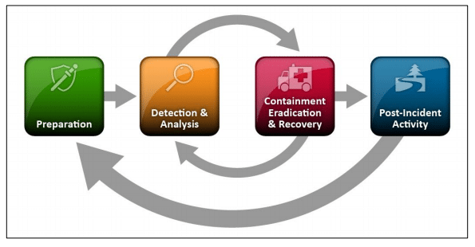
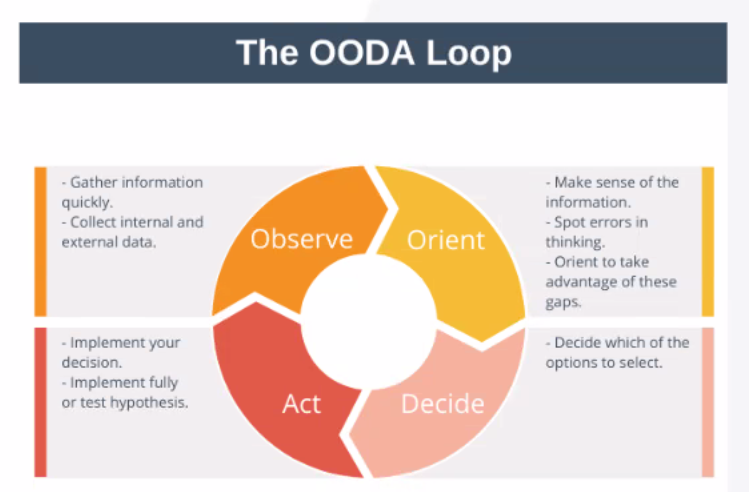

- We don't want this moment to come, and we take lots of measures to prevent it...
- But if it does happen, it's our moment to shine as cybersecurity analysts!
- [NIST SP 800-61](https://csrc.nist.gov/publications/detail/sp/800-61/rev-2/final) has a lot of info and guidelines for handling incidents

>**CSIRT**

**Computer Security Incident Response Team**

- In charge of responding to computer security incidents within an org
- Follow standardized response procedures, incorporating their subject matter expertise and professional judgment
- Depended upon to respond calmly and consistently if an incident occurs

### IR phases

- **Preparation**
	- "What if we had an incident?"
	- What should we do - have a well-defined incident response procedure
	- Hardening systems, setting up policies and procedures
	- **Documenting all procedures** so they can be easily followed under a lot of stress
		- Creating tools that may be useful for IR
		- Clear guidance for response teams that may be quickly read and interpreted while in crisis
		- [NIST incident handling checklist](https://learn.saylor.org/mod/book/view.php?id=29706&chapterid=5358)
	- Defining a call escalation list
	- **Training** the staff, building up awareness, **testing** existing IR procedures
	- Putting a CSIRT together and taking time to prepare it carefully, providing a good foundation of appropriate policies and procedures
	- Assembling all the hardware and software that's dedicated to IR and subsequent investigations
	- Make sure all devices that join the org's network can be accessed. If BYOD is in place, make sure there's a clause that allows the org to investigate personal devices in case of an incident - otherwise personnel can refuse, and there's nothing you can do!
	- An IR toolkit should include, at the minimum:
		- Digital forensic workstations
		- Backup devices
		- Laptops for data collection, analysis, reporting
		- Spare server and networking equipment
		- Blank removable media
		- Portable printer
		- Forensic and packet capture software
		- Bootable USB media with trusted copies of forensic tools
		- Office supplies, evidence collection materials
	- [Here's a good place to start](https://bok.ahima.org/PdfView?oid=76732)
- **Identification**
	- Aka **detection and analysis**
	- Determining whether an incident has indeed happened
	- What exactly happened, how bad was it?
	- Is it just an event, or is it a security incident?
	- It could be just some app crashing
	- Consider system process criticality - how critical are the assets affected by the incident?
	- Was the CIA of our data affected? Economic impact, sophistication - and if it's more sophisticated, then it may be more critical (APT's are out there)
	- Security event indicators, per NIST:
		- Alerts from IDPS, SIEM, AV, FW, file integrity monitors, etc.
		- Logs generated by OS and underlying systems, 
		- Publicly available information about new vulns and exploits in the wild
		- People from inside the org or external sources who report when something sketchy goes down
		- When any one of those sources indicates that an incident might be happening, analysts should shift directly into validation mode
	- Actions to improve the effectiveness of incident analysis, per NIST
		- Profile networks and systems to measure the characteristics of expected activity
		- Understand normal behaviour of users/systems/networks/apps
		- Create a logging policy - what must be logged by systems, apps, network devices
		- Perform event **correlation** to combine info from multiple sources
		- Sync clocks across servers, workstations, and network devices - NTP
		- Maintain an org-wide knowledge base of critical information about systems and applications
		- Capture network traffic as soon as an incident is suspected
		- Filter info to reduce clutter
		- Seek assistance from external sources
- **Containment**
	- **Exam**: this is an important topic. When faced with an incident, always isolate it and contain the damage as much as possible
	- Can be performed using segmentation - putting all affected devices in some type of quarantine network, but this could be very difficult to pull off during an attack. It does work better for SDN's though
	- **Isolation**: cutting off the systems from it networks completely, which helps stop the spread and cut the attacker off. Disabling a port or pulling the physical plug
	- **Segmentation** vs isolation: the former is a standard network practice that can **also** be applied as part of IR, isolation is only relevant to IR
- **Eradication**
	- Only proceed if the incident is contained
	- Removing the root cause of the incident
	- Anti-malware, anti-rootkits, verifying the integrity of affected files/databases
	- For some storage devices (HDD, SSD), eradication might involve secure erase, which might require **sanitisation**. It's performed using specialised utilities that write 0's and 1's over the entire drive, and can do multiple pass-throughs for higher security
		- SSD's are not so easily overwritten - they have built-in mechanisms that distribute writes to less used areas of the drive to improve its lifespan
	- If a drive full of sensitive data was compromised along with its firmware, it has to be destroyed in an irreversible way: shredding, degaussing, etc.
- **Recovery**
	- Restoring affected systems to their original level of functionality
	- Restore from backups, clean installation of some software, reimaging a system or a compromised host from a template image
	- Always verify that no functionality was left behind while in the recovery process - it has to be in the same state as it was before the incident
	- A very important step is making sure the incident doesn't occur again - so we're not just bringing systems back to the original state, we're bringing them back to a *better* original state
	- Patch vulnerabilities, update firewall/IDS/IPS rules, close ports, review all systems that were involved and understand why they were involved
	- If a system cannot be patched, investigate why. Don't leave it unpatched - bring in some mitigating controls, set up some type of segmentation or even air-gapping to limit exposure
	- Verify that all logs are being properly communicated to security monitoring systems
	- Manage **change control**
		- In crisis (containment, eradication, recovery), responders may have bypassed some normal procedures for change control and configuration management so as to respond more quickly and effectively
		- These processes are important! If possible, document all instances of going around them, then go back to adhering to these processes when the storm has passed
- **Lessons learned**
	- Aka **post-incident activities**
	- Write the summary report (aka after-action report): what went right, what went wrong, who attacked us, were they from the outside or the inside, what data systems were affected; when did it happen; etc. based on the "who, what, when, where, why" paradigm. 
	- Perform **evidence retention** if required by law, make everything crystal clear in terms of what happens from the legal perspective
		- Identify internal and external evidence retention reqs
		- If the incident can result in civil litigation or criminal prosecution, the team should consult attorneys prior to discarding any evidence
		- In general, be a hoarder when it comes to evidence - it can be discarded later
		- If no likelihood that the evidence will be used in court, follow retention policies and regulations in place
	- How long did it take from identification to recovery, how long each stage took
		- Could we have done anything better in the process? Were our solutions the best, or was there something better? Any steps we took that inhibited the recovery? What information was needed sooner?
	- Provide details about everything we know about the attack
	- What were the missing defense mechanisms, what did we not pay enough attention to
	- Don't just point fingers - encourage improvement, make it an opportunity to learn and become better. User training based on everything that's known about the incident
	- Update the IR plan, make necessary changes, install controls - this loops back to the preparation stage
	- Generate new IOC's and new threat intel and take it all into account
	- Reporting, reporting, reporting - especially important for us cybersecurity analysts because we have to be able to speak to all stakeholders and explain what happened to technical and non-technical personnel equally well. Read the room!
	- Monitor all systems that were involved in the incident (and all other systems) using all this new knowledge

### The OODA loop

- How do we respond to an incident under pressure? 
- Respond, don't react
- Deep breaths, cool head, follow the procedure, eyes everywhere

- Inspired by the military
- Constant re-evaluation of our decisions
- Stay as proactive as possible, avoid paralysis by analysis

### Verizon DBIR (Data Breach Investigations Report)

- [Get familiar with it](https://www.verizon.com/business/resources/reports/dbir/) 
- Huge amount of very interesting stats in terms of successful attacks and data breaches

### Prioritization under pressure

1. Human life - the highest priority, always
2. Preventing the intrusion from continuing
3. Identifying the primary attack - what if it's a decoy and something else is happening?
4. Avoid alerting the attacker
5. Preserve as much evidence as possible

### Communication plan

- In general, it's on a need-to-know to prevent panic - i.e. **limiting communication** to trusted parties, putting controls in place to **prevent inadvertent release of information**
- Incident-related communication starts with the CSIRT
	- Needs to be a very well-defined team, with specifics on who's responsible for what
	- It should be the single point of contact with clients, stakeholders, the media, law enforcement, etc.
	- Need-to-know even within the team in case sensitive information is exposed - there's no need to spread it just because we're under attack
	- Keep in mind that adversaries may be on the inside, and they may be in contact with CSIRT
	- Especially make sure nothing gets leaked to the press
- Out-of-band communication - if our internal channels are compromised, we have to use **secure methods of communication** that cannot be intercepted or maliciously altered; this something else needs to be part of the IR plan. In fact, *assume* that our internal channels are compromised
- Preventing inadvertent disclosure, where targets of ongoing internal investigations become aware of said investigations because the info leaked somehow. An escalation list doesn't directly prevent this.

### External communication

- Outside parties may need to be informed in some cases (usually has to do with data)
	- Data theft - even if it's just suspected
	- Insider data exfiltration
	- Device theft/loss, especially if devices hold sensitive data
	- Misconfigurations leading to sensitive data disclosure
	- Integrity and availability breaches threatening destruction of the data, the system holding it, or the facility hosting it
- Depending on the magnitude of the data breach and/or **based on regulatory/legislative requirements**, outside parties have to be notified, and incident info may have to be disclosed:
	- Law enforcement
	- Information sharing partners such as ISACs, so that the community can be notified
	- Vendors - they might provide info that would be crucial for the response, also patches and troubleshooting advice
	- Direct clients
	- Partners, other similar orgs
	- Public and media communication can be necessitated by **reporting requirements**, but media coverage can also be voluntary or forced
	- Make sure local regulations are followed (how long until we have to inform about the breach) - [don't be like Uber](https://www.npr.org/2018/09/27/652119109/uber-pays-148-million-over-year-long-cover-up-of-data-breach)

### Response coordination

- We may need to involve other departments, and they'll have to communicate with the IR team
- Includes, but is not limited, to **internal** entities such as:
	- **Senior leadership** - they have to know how the incident affects the business
	- **Legal** - what's our exposure, any compliance breaches?
	- IT/networking - they maintain the infrastructure, can provide valuable insight into what's actually happening
	- **HR** - for people involved in the incident, especially if company PII is involved or if there's a risk of contracts being breached (SLA's and such)
		- HR also has to inform the rest of the employees about the incident and how it affects them, when the time is right
		- Ensures that training is conducted for future prevention or minimization
		- Does anyone need to be disciplined? Fired? HR does this
	- Marketing/**PR** - we have to be in control of what info is shared as there are direct implications for the company's reputation
- **External**:
	- **Law enforcement**
	- **Regulatory bodies**

### Data involved in the incident

- **Factors contributing to data criticality**
- There are a few types of data we have to worry about and protect against public disclosure at all costs
- **PII**: full names, addresses, DOB, SSN, location, biometrics - anything that can identify a person
- **Sensitive Personal Information (SPI)**: doesn't necessarily identify a person, but it is linked to a person. Can put someone in danger if disclosed. Ethnicity, religion, political views, sexual orientation, etc.
- **PHI**
- **Financial information**
- **IP** - can even have national security implications in some cases
- **Corporate information** - not as crucial as IP, but might still include sensitive information about the company (business plans, customer list, leads, product development plans, financial operations, contracts, salaries, anything that can affect the stock price, anything that can help with social engineering)
- **High Value Assets (HVA)**: critical information systems; if the C, I, or A is affected or compromised, the business will face a dangerously high risk of closure; must be prioritized in the IR process
	- [CISA HVA documentation](https://www.cisa.gov/sites/default/files/publications/CISAInsights-Cyber-SecureHighValueAssets_S508C.pdf)

### Asset value vs financial value

- The asset value depends on how the data tied to that asset is classified (PII/PHI/IP, etc.)
- The financial value is cost of acquisition/repair/replacement and depreciation
- Prioritizing systems can be performed based on the criticality of data those systems handle, so more expensive gear may not get as high a priority as something with less financial value but containing highly sensitive data

### And finally...

- **Train your people!** The human factor often plays a crucial role in a successful attack. Encourage curiosity. This will only work in an environment where employees care about the company because they are treated well. Train them against any attacks that may involve them personally: phishing, social engineering; train them on security measures at their disposal
- **Test your IR plan**
	- Tabletop exercises
	- Walkthroughs
	- Pentests (black/gray/white box - don't forget about the RoE)
		- [NIST SP 800-115: best practices for pentesting](https://nvlpubs.nist.gov/nistpubs/Legacy/SP/nistspecialpublication800-115.pdf)
	- Red/blue team exercises
	- Drills
	- Simulations

---

### Exam

Know all phases of the incident response process and what's involved in each. Be able to apply them to a scenario. Know the OODA loop, have the right attitude towards IR. Be familiar with all aspects of the IR process: communication plan, external communication, response coordination, data involved, testing the IR plan.

---

# From the Sybex book

### Severity classification

- There can be lots of incidents, so it's important to have a standardized system of communicating the severity of each incident to management and stakeholders
- Two key measures to determine severity:
	- **Scope of impact**: depends on the degree of impairment an incident causes the org, the effort required to recover
	- **Types of data involved**
- **Functional impact**: what services are impacted and how, based on the criticality of the data (see [Data involved in the incident](https://github.com/ordsec/cysa-notes/blob/master/53%20Incident%20response%20phases%20and%20communication.md#data-involved-in-the-incident)). Four categories per NIST
	- None
	- Low - critical services still provided
	- Medium - can't provide a critical service to some users
	- High - can't provide one or more critical services to any users
- **Economic impact**, per NIST
	- None
	- Low - $10,000 or less
	- Medium - $10,000 to $500,000
	- High - $500,000 or more
	- This is not absolute - obviously for some corpos $500,000 is change stuck between couch cushions

### Recoverability effort

- Measuring the time services will be unavailable, aka **downtime**
- Can be expressed as a function of the amount of downtime experienced by the service or the time required to recover from the incident
- Refer to 52 for MTD, MTTR and such
- Per NIST, there are four recoverability effort categories:
	- Regular - time to recovery is predictable with existing resources
	- Supplemented - predictable with additional resources
	- Extended - unpredictable, need more resources and outside help
	- Not recoverable - RIP

